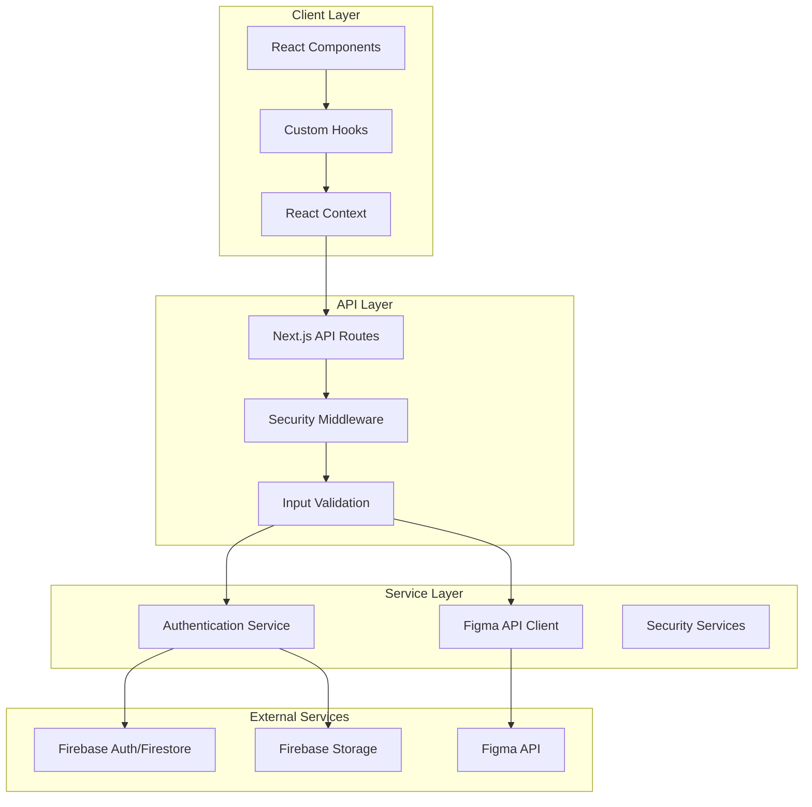
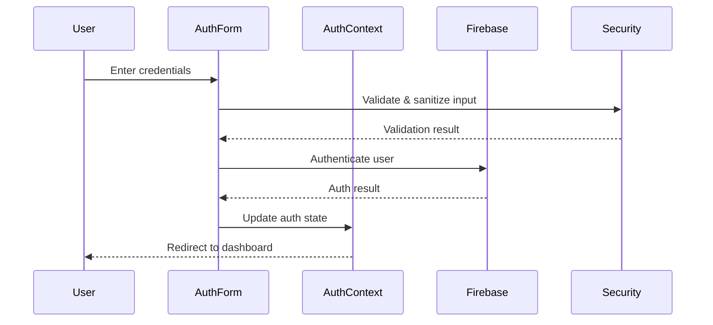
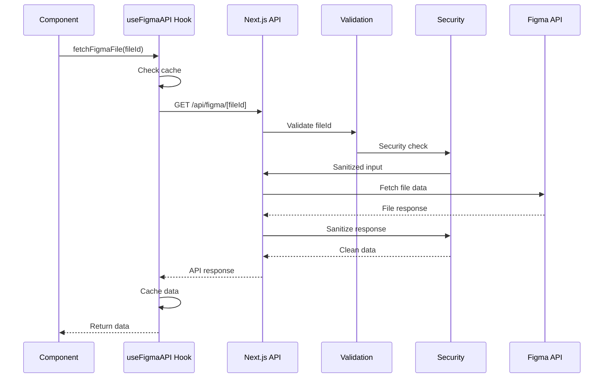
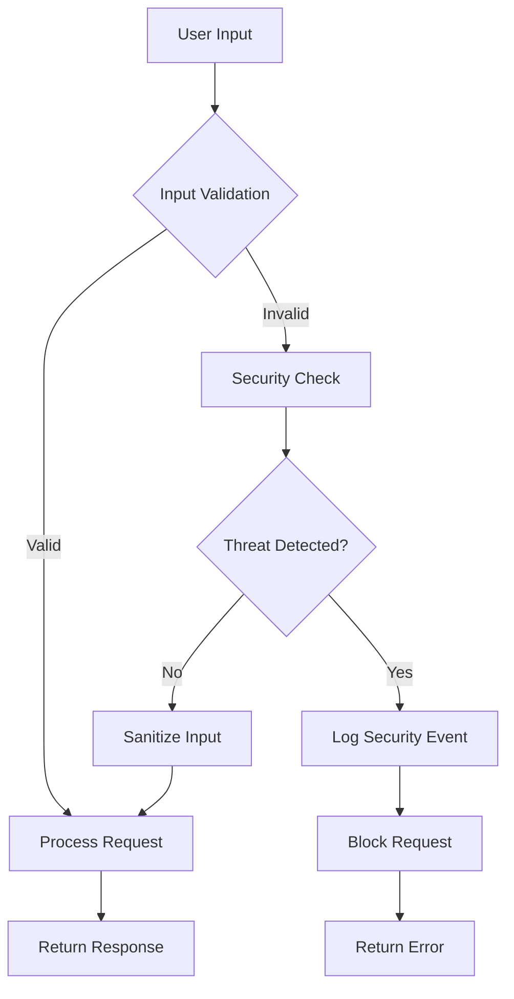

# Design Document

## Overview

This document provides a comprehensive design analysis of the AI Development Template project, a Next.js-based application with HeroUI components, Firebase authentication, and Figma API integration. The system is designed as a secure, scalable template for AI-powered service development with robust security measures and modern development practices.

## Architecture

### High-Level Architecture

The application follows a modern full-stack architecture with clear separation of concerns:



### Technology Stack

**Frontend:**

- Next.js 15.3.5 (App Router)
- React 19.1.0
- TypeScript 5.1.6
- HeroUI 2.8.1 (UI Components)
- Tailwind CSS 3.4.1
- Framer Motion 12.23.3 (Animations)

**Backend:**

- Next.js API Routes
- Firebase 11.10.0 (Authentication, Firestore, Storage)
- Axios 1.9.0 (HTTP Client)
- Zod 3.22.4 (Schema Validation)

**Security:**

- DOMPurify 3.2.6 (XSS Protection)
- Validator 13.15.15 (Input Validation)
- Custom Security Middleware
- CSRF Protection

**Development Tools:**

- Storybook 8.6.14
- ESLint 8.57.1
- Playwright 1.54.1
- Semgrep (Security Scanning)

## Components and Interfaces

### Core Components

#### 1. Authentication System

**AuthForm Component:**

```typescript
interface AuthFormProps {
  onSuccess?: () => void;
}
```

Features:

- Email/password authentication
- Google OAuth integration
- Real-time validation with Zod schemas
- XSS protection on all inputs
- Security event logging

**AuthProvider Context:**

```typescript
interface AuthContextType {
  user: User | null;
  loading: boolean;
  error: string | null;
  signOut: () => Promise<void>;
}
```

#### 2. Pomodoro Timer Component

**PomodoroTimer Component:**

```typescript
interface PomodoroTimerProps {
  className?: string;
}
```

Features:

- 25-minute work sessions with 5-minute breaks
- Visual progress indicator with CircularProgress
- Audio notifications
- Session counter
- Responsive design with HeroUI components

#### 3. API Integration

**Figma API Hook:**

```typescript
interface UseFigmaAPIResult {
  data: FigmaData | null;
  loading: boolean;
  error: ApiErrorInfo | null;
  rateLimitInfo: RateLimitInfo | null;
  fetchFigmaFile: (fileId: string, options?: FetchOptions) => Promise<void>;
  clearError: () => void;
  clearData: () => void;
  retry: () => Promise<void>;
}
```

### Security Architecture

#### Multi-Layer Security Implementation

1. **Input Validation Layer:**

   - Zod schema validation
   - Custom validators for specific formats
   - Type-safe validation results

2. **XSS Protection Layer:**

   - DOMPurify sanitization
   - HTML escaping
   - Script tag removal
   - Event handler filtering

3. **SQL Injection Protection:**

   - Pattern detection
   - Input sanitization
   - Suspicious input flagging

4. **CSRF Protection:**

   - Token generation and validation
   - Timing attack prevention

5. **API Security:**
   - Rate limiting
   - Security headers
   - Request/response sanitization

## Data Models

### Authentication Models

```typescript
// Firebase User (from Firebase SDK)
interface User {
  uid: string;
  email: string | null;
  displayName: string | null;
  photoURL: string | null;
  emailVerified: boolean;
}

// Authentication Result
interface AuthResult {
  success: boolean;
  user?: User;
  error?: string;
  code?: string;
}
```

### Figma API Models

```typescript
// Figma File Response
interface FigmaFileResponse {
  name: string;
  lastModified: string;
  version: string;
  document?: {
    id: string;
    name: string;
    type: string;
  };
  metadata: {
    timestamp: string;
    requestId: string;
    status: string;
  };
}

// API Error Response
interface ErrorResponse {
  error: string;
  code?: string;
  details?: unknown;
  timestamp: string;
  requestId?: string;
}
```

### Validation Models

```typescript
// Validation Error
interface ValidationError {
  field: string;
  message: string;
  code?: string;
}

// Validation Result
interface ValidationResult<T> {
  success: boolean;
  data?: T;
  errors?: ValidationError[];
}
```

### Security Models

```typescript
// Security Check Result
interface SecurityCheckResult {
  secure: boolean;
  issues: string[];
}

// Security Event Log
interface SecurityEvent {
  type: "XSS_ATTEMPT" | "SQL_INJECTION" | "CSRF_ATTACK" | "RATE_LIMIT_EXCEEDED";
  ip?: string;
  userAgent?: string;
  input?: string;
  timestamp?: Date;
}
```

## Data Flow Diagrams

### Authentication Flow



### Figma API Data Flow



### Security Event Flow



## Error Handling

### Error Hierarchy

1. **Validation Errors:**

   - Field-level validation failures
   - Schema validation errors
   - Type conversion errors

2. **Security Errors:**

   - XSS attempt detection
   - SQL injection attempts
   - CSRF token validation failures

3. **API Errors:**

   - Network failures
   - Rate limit exceeded
   - External service errors

4. **Authentication Errors:**
   - Invalid credentials
   - Email verification required
   - Account disabled

### Error Response Format

```typescript
interface StandardErrorResponse {
  error: string;
  code: string;
  details?: unknown;
  timestamp: string;
  requestId?: string;
  field?: string; // For validation errors
}
```

## Testing Strategy

### Testing Layers

1. **Unit Testing:**

   - Component testing with React Testing Library
   - Hook testing with custom test utilities
   - Utility function testing

2. **Integration Testing:**

   - API route testing
   - Authentication flow testing
   - Security middleware testing

3. **End-to-End Testing:**

   - Playwright for browser automation
   - User journey testing
   - Cross-browser compatibility

4. **Security Testing:**
   - Semgrep static analysis
   - Dependency vulnerability scanning
   - Input validation testing

### Test Configuration

**Storybook Integration:**

- Component documentation
- Visual regression testing
- Accessibility testing with addon-a11y
- Interactive component testing

**Security Testing:**

- Automated security scanning with npm scripts
- License compliance checking
- Secret detection in codebase
- Dependency audit automation

## Configuration Management

### Environment Variables

**Firebase Configuration:**

```typescript
interface FirebaseConfig {
  apiKey: string;
  authDomain: string;
  projectId: string;
  storageBucket: string;
  messagingSenderId: string;
  appId: string;
}
```

**Application Configuration:**

```typescript
interface AppConfig {
  nodeEnv: "development" | "production" | "test";
  port: number;
}
```

### Security Configuration

**Next.js Security Headers:**

- X-Frame-Options: DENY
- X-Content-Type-Options: nosniff
- X-XSS-Protection: 1; mode=block
- Strict-Transport-Security
- Content-Security-Policy
- Referrer-Policy

**CORS Configuration:**

- Origin validation
- Credential handling
- Method restrictions
- Header allowlists

## Performance Considerations

### Optimization Strategies

1. **Caching:**

   - API response caching (5-minute TTL)
   - Component-level memoization
   - Static asset optimization

2. **Code Splitting:**

   - Dynamic imports for large components
   - Route-based code splitting
   - Lazy loading of non-critical features

3. **Bundle Optimization:**

   - Tree shaking for unused code
   - SVG optimization with SVGR
   - Image optimization with Next.js

4. **API Optimization:**
   - Request deduplication
   - Rate limit handling
   - Retry mechanisms with exponential backoff

## Deployment Architecture

### Build Process

1. **Development:**

   - Hot reloading with Next.js dev server
   - TypeScript compilation
   - ESLint and Prettier integration

2. **Production Build:**

   - Static optimization
   - Bundle analysis
   - Security scanning
   - Environment validation

3. **Deployment Targets:**
   - Vercel (primary)
   - Firebase Hosting (alternative)
   - Docker containerization support

### CI/CD Pipeline

**Security Integration:**

- Automated security scanning
- Dependency vulnerability checks
- License compliance validation
- Secret detection

**Quality Assurance:**

- TypeScript type checking
- ESLint code quality checks
- Automated testing
- Build verification
