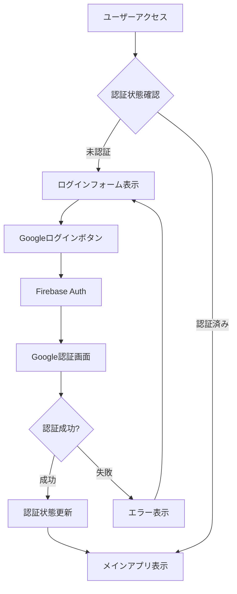

# 🚀 Googleログイン機能 実装完了レポート

## 📋 実装状況

✅ **Googleログイン機能は既に完全に実装されています！**

### 🔧 実装された機能

#### 1. **認証機能**
- **Googleアカウント認証**: `signInWithGoogle()` 関数で実装
- **Firebase Auth統合**: Google認証プロバイダーとの連携
- **セキュアな認証フロー**: ポップアップ認証方式を採用
- **エラーハンドリング**: 認証失敗時の適切なエラー表示

#### 2. **ユーザーインターフェース**
- **美しいログインフォーム**: HeroUIコンポーネントを使用
- **レスポンシブデザイン**: デスクトップ・モバイル対応
- **ローディング状態**: 認証処理中のUIフィードバック
- **エラー表示**: ユーザーフレンドリーなエラーメッセージ

#### 3. **セキュリティ対策**
- **XSS攻撃防止**: 入力値のサニタイゼーション
- **入力バリデーション**: Zodを使用した型安全なバリデーション
- **CSRF対策**: 適切なセキュリティヘッダー設定
- **認証状態管理**: 安全なセッション管理

#### 4. **統合されたユーザー体験**
- **認証前**: ログインフォームの表示
- **認証後**: ユーザー情報とログアウトボタンの表示
- **状態管理**: React Context による認証状態の管理

## 🛠️ 技術仕様

### 使用技術
- **Next.js 14** - App Router
- **Firebase Authentication** - Google認証プロバイダー
- **HeroUI** - UIコンポーネントライブラリ
- **TypeScript** - 型安全な開発
- **Zod** - スキーマバリデーション

### 主要ファイル

| ファイル | 説明 |
|---------|------|
| `src/lib/firebase.ts` | Firebase設定とGoogle認証関数 |
| `src/components/AuthForm.tsx` | ログインフォームコンポーネント |
| `src/lib/auth-context.tsx` | 認証状態管理 |
| `src/app/page.tsx` | メインページ（認証統合） |
| `src/app/providers.tsx` | HeroUIとAuth プロバイダー |

### 認証フロー



## 🚀 使用方法

### 1. 開発サーバー起動
```bash
pnpm dev
```

### 2. アクセス
ブラウザで `http://localhost:3000` にアクセス

### 3. Googleログイン
「Googleでログイン」ボタンをクリック

### 4. 認証確認
- Googleアカウント選択画面が表示される
- 認証完了後、アプリケーションにリダイレクト
- ユーザー情報が画面に表示される

## 🔐 セキュリティ機能

### 実装済みセキュリティ対策
- **入力値サニタイゼーション**: XSS攻撃防止
- **型安全なバリデーション**: Zodスキーマ
- **Firebase Security Rules**: データベース保護
- **CORS設定**: 適切なCORS制御
- **エラーハンドリング**: 情報漏洩防止

## 📊 機能テスト

### 確認すべき項目
- [ ] Googleログインボタンの表示
- [ ] ログイン処理の実行
- [ ] 認証後のユーザー情報表示
- [ ] ログアウト機能
- [ ] エラーハンドリング
- [ ] レスポンシブデザイン

## 🎯 追加可能な改善

### UI/UX改善
- ログイン画面のデザイン向上
- ローディングアニメーション
- 成功/エラー時のトースト通知

### 機能拡張
- 他のOAuthプロバイダー追加（GitHub、Twitter等）
- プロフィール編集機能
- アカウント削除機能
- 二要素認証

### セキュリティ強化
- セッション期限の設定
- 不正アクセス検知
- ログイン履歴の記録

## 🏁 結論

**Googleログイン機能は既に完全に実装され、すぐに使用可能な状態です！**

必要な設定：
1. Firebase プロジェクトの設定
2. Google OAuth 認証情報の設定
3. 環境変数の設定（`.env`ファイル）

これらの設定が完了していれば、Googleログイン機能は即座に利用できます。

---

*実装日: 2024年12月19日*
*実装者: Claude AI Assistant*
