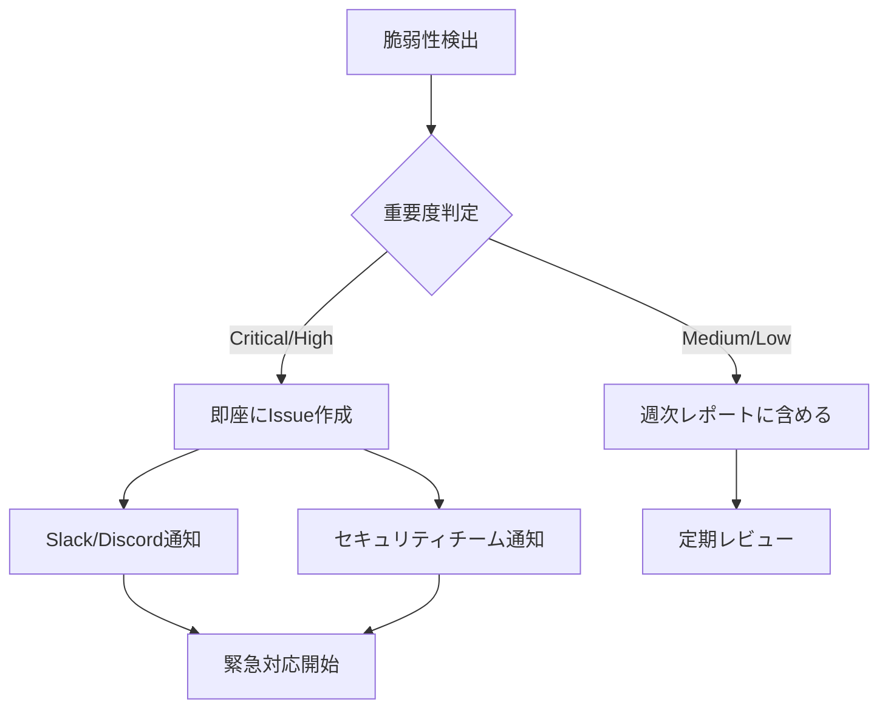

# 🔒 セキュリティ運用ガイド

このドキュメントでは、プロジェクトの自動化されたセキュリティ運用手順について説明します。

## 📋 概要

本プロジェクトには以下の包括的なセキュリティ自動化システムが実装されています：

- **依存関係脆弱性監視**: Dependabot + NPM Audit
- **コード分析**: CodeQL + Semgrep 
- **自動レポート**: 週次セキュリティレポート
- **リアルタイム監視**: CI/CDパイプライン統合
- **インシデント対応**: 自動Issue作成・通知

## 🛡️ 自動化されたセキュリティツール

### 1. Dependabot（依存関係自動更新）

**設定ファイル**: `.github/dependabot.yml`

**機能**:
- 週次での依存関係脆弱性チェック
- セキュリティパッチの自動PR作成
- GitHub Actions ワークフローの更新監視

**運用手順**:
1. **毎週月曜日**: NPMパッケージの更新チェック
2. **毎週火曜日**: GitHub Actions の更新チェック
3. **自動PR作成**: 脆弱性が検出された場合
4. **レビュー**: セキュリティチームによる承認

```bash
# 手動でDependabotを実行
gh api repos/:owner/:repo/dependabot/alerts
```

### 2. CodeQL（静的コード分析）

**設定ファイル**: `.github/workflows/codeql.yml`, `.github/codeql/codeql-config.yml`

**機能**:
- JavaScript/TypeScript セキュリティ分析
- セキュリティ脆弱性の自動検出
- SARIF形式での結果出力

**運用手順**:
1. **自動実行**: PR作成時・main ブランチプッシュ時
2. **定期実行**: 毎週月曜日午前2時（UTC）
3. **結果確認**: GitHub Security タブで確認
4. **対応**: 検出された問題の修正

```bash
# 手動でCodeQL分析を実行
gh workflow run codeql.yml
```

### 3. 週次セキュリティレポート

**設定ファイル**: `.github/workflows/security-report.yml`

**機能**:
- 包括的なセキュリティ状況の分析
- 脆弱性・依存関係の詳細レポート
- Slack/Discord 通知
- 重要な問題の自動Issue作成

**運用手順**:
1. **自動実行**: 毎週金曜日午前9時（JST）
2. **レポート生成**: 詳細なセキュリティ分析
3. **通知送信**: セキュリティチームへの自動通知
4. **Issue作成**: 重要な脆弱性が検出された場合

```bash
# 手動でセキュリティレポートを生成
gh workflow run security-report.yml
```

## 📊 セキュリティダッシュボード

### GitHub Security Overview

プロジェクトのセキュリティ状況は以下の場所で確認できます：

1. **Security Tab**: `https://github.com/[org]/[repo]/security`
   - CodeQL 分析結果
   - Dependabot アラート
   - セキュリティアドバイザリ

2. **Actions Tab**: `https://github.com/[org]/[repo]/actions`
   - CI/CD セキュリティチェック結果
   - 週次セキュリティレポート

3. **Insights Tab**: `https://github.com/[org]/[repo]/pulse`
   - セキュリティ関連のコミット分析

### セキュリティメトリクス

追跡すべき主要指標：

- **脆弱性検出数**: Critical/High/Medium/Low
- **修正時間**: 検出から修正までの時間
- **依存関係の更新頻度**: 最新バージョンの適用率
- **セキュリティテストのカバレッジ**: テスト実行率

## 🚨 インシデント対応フロー

### 1. 重要度分類

| 重要度 | 説明 | 対応時間 | 対応者 |
|--------|------|----------|--------|
| **Critical** | 本番環境に即座に影響 | 2時間以内 | セキュリティチーム + CTO |
| **High** | 本番環境にリスク | 24時間以内 | セキュリティチーム |
| **Medium** | 潜在的リスク | 72時間以内 | 開発チーム |
| **Low** | 軽微な問題 | 1週間以内 | 開発チーム |

### 2. 自動対応フロー



### 3. 手動対応手順

#### Critical/High 脆弱性の対応

1. **即座対応** (2-24時間以内)
   ```bash
   # 1. 最新のセキュリティ状況を確認
   npm audit --audit-level=high
   
   # 2. 自動修正を試行
   npm audit fix
   
   # 3. 手動修正が必要な場合
   npm audit fix --force  # 注意深く実行
   ```

2. **影響範囲の調査**
   ```bash
   # 影響を受けるパッケージを確認
   npm list --depth=0
   
   # 特定パッケージの依存関係を確認
   npm list [package-name]
   ```

3. **修正の実装**
   ```bash
   # ブランチ作成
   git checkout -b hotfix/security-[issue-number]
   
   # 修正実装
   npm update [package-name]
   
   # テスト実行
   npm run security:full
   npm test
   npm run build
   
   # コミット・プッシュ
   git add .
   git commit -m "fix: セキュリティ脆弱性の修正 ([issue-number])"
   git push origin hotfix/security-[issue-number]
   ```

4. **緊急デプロイ**
   ```bash
   # PR作成（緊急の場合はレビューをスキップ）
   gh pr create --title "hotfix: セキュリティ脆弱性の修正" --body "緊急セキュリティ修正"
   
   # マージ後の確認
   npm run security:audit:strict
   ```

## 📅 定期運用タスク

### 日次タスク

- [ ] CI/CDセキュリティチェックの結果確認
- [ ] Dependabot PRの確認・マージ
- [ ] セキュリティアラートの確認

### 週次タスク

- [ ] **金曜日**: 週次セキュリティレポートの確認
- [ ] **月曜日**: CodeQL分析結果の確認
- [ ] 依存関係の更新状況確認
- [ ] セキュリティ関連Issueの確認

### 月次タスク

- [ ] セキュリティポリシーの見直し
- [ ] 環境変数・APIキーのローテーション
- [ ] セキュリティツールの設定確認
- [ ] インシデント対応の振り返り

### 四半期タスク

- [ ] セキュリティ監査の実施
- [ ] 外部ペネトレーションテスト
- [ ] セキュリティトレーニングの実施
- [ ] 災害復旧計画の見直し

## 🔧 手動セキュリティチェック

### 包括的セキュリティ監査

```bash
# 完全なセキュリティチェックの実行
npm run security:full

# 個別チェックの実行
npm run security:audit          # 依存関係チェック
npm run security:secrets        # ハードコードされた秘密情報
npm run security:licenses       # ライセンスチェック
npm run security:dependencies   # 依存関係の詳細分析
```

### 環境固有のチェック

```bash
# 本番環境設定の確認
npm run env:validate

# セキュリティヘッダーの確認
curl -I https://your-domain.com

# SSL証明書の確認
echo | openssl s_client -servername your-domain.com -connect your-domain.com:443 2>/dev/null | openssl x509 -noout -dates
```

## 🔐 秘密情報管理

### GitHub Secrets の管理

必要なSecrets：

#### 🔒 必須セキュリティ関連
```bash
ENCRYPTION_KEY              # データ暗号化キー
JWT_SECRET                   # JWT署名秘密鍵
CSRF_SECRET                  # CSRF保護秘密鍵
SESSION_SECRET               # セッション秘密鍵
```

#### 🔔 通知関連
```bash
SLACK_WEBHOOK_URL           # Slack通知用
DISCORD_WEBHOOK_URL         # Discord通知用
```

#### ☁️ デプロイ関連
```bash
VERCEL_TOKEN                # Vercel デプロイ用
VERCEL_PROJECT_ID           # Vercel プロジェクトID
VERCEL_ORG_ID              # Vercel 組織ID
```

### 秘密情報のローテーション

```bash
# 新しい暗号化キーの生成
node -e "console.log(require('crypto').randomBytes(32).toString('hex'))"

# JWTシークレットの生成
node -e "console.log(require('crypto').randomBytes(64).toString('hex'))"
```

## 📞 緊急連絡先

### セキュリティインシデント

- **第一連絡先**: セキュリティチームリーダー
- **第二連絡先**: CTO / 技術責任者
- **第三連絡先**: CEO / 経営責任者

### 外部連絡先

- **GitHub Support**: 
  - プライベートな脆弱性報告: security@github.com
  - 一般サポート: https://support.github.com

- **NPM Security**: security@npmjs.com
- **Node.js Security**: security@nodejs.org

## 📚 追加リソース

### セキュリティ関連ドキュメント

- [プロジェクトセキュリティガイドライン](../SECURITY.md)
- [開発ガイドライン](../.cursorrules)
- [API セキュリティガイド](./API_SECURITY.md)

### 外部リソース

- [OWASP Top 10](https://owasp.org/www-project-top-ten/)
- [NPM Security Best Practices](https://docs.npmjs.com/packages-and-modules/securing-your-code)
- [GitHub Security Features](https://docs.github.com/en/code-security)
- [Node.js Security Checklist](https://nodejs.org/en/docs/guides/security/)

## 🏁 まとめ

本プロジェクトには包括的なセキュリティ自動化システムが実装されており、以下の機能が24/7で監視しています：

✅ **自動脆弱性検出**: Dependabot + CodeQL + Semgrep
✅ **定期レポート**: 週次セキュリティレポート
✅ **即座通知**: Critical/High脆弱性の自動アラート
✅ **継続的監視**: CI/CDパイプライン統合
✅ **インシデント対応**: 自動Issue作成・追跡

**重要**: セキュリティは継続的なプロセスです。定期的な見直しと改善を心がけてください。

---

**最終更新**: 2024年01月
**担当**: セキュリティチーム
**承認**: CTO
