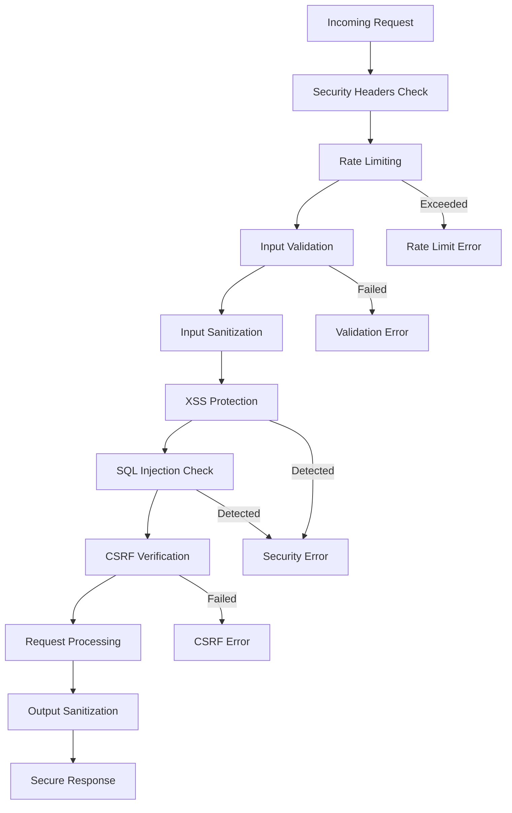

# Security and Rate Limiting Documentation

## Overview

This document provides comprehensive information about security measures and rate limiting implementations in the AI Development Template API. The API implements multiple layers of security protection and intelligent rate limiting to ensure secure and reliable operation.

## Table of Contents

1. [Security Architecture](#security-architecture)
2. [Input Validation and Sanitization](#input-validation-and-sanitization)
3. [XSS Protection](#xss-protection)
4. [SQL Injection Prevention](#sql-injection-prevention)
5. [CSRF Protection](#csrf-protection)
6. [Rate Limiting](#rate-limiting)
7. [Security Headers](#security-headers)
8. [Authentication and Authorization](#authentication-and-authorization)
9. [Security Event Logging](#security-event-logging)
10. [Best Practices](#best-practices)

## Security Architecture

The API implements a multi-layered security approach:



### Security Layers

1. **Network Layer**: HTTPS enforcement, security headers
2. **Application Layer**: Input validation, output sanitization
3. **Data Layer**: Parameterized queries, data encryption
4. **Monitoring Layer**: Security event logging, anomaly detection

## Input Validation and Sanitization

### Zod Schema Validation

All inputs are validated using Zod schemas before processing:

```typescript
// Common validation schemas with security constraints
export const commonSchemas = {
  // Email validation with security checks
  email: z
    .string()
    .min(1, "メールアドレスは必須です")
    .email("有効なメールアドレスを入力してください")
    .max(254, "メールアドレスが長すぎます")
    .refine(
      (email) => validator.isEmail(email),
      "メールアドレスの形式が無効です"
    )
    .refine(
      (email) => !email.includes("<"),
      "メールアドレスに無効な文字が含まれています"
    ),

  // Password with complexity requirements
  password: z
    .string()
    .min(8, "パスワードは8文字以上で入力してください")
    .max(128, "パスワードが長すぎます")
    .regex(
      /^(?=.*[a-z])(?=.*[A-Z])(?=.*\d).*$/,
      "パスワードは大文字、小文字、数字を含む必要があります"
    )
    .refine(
      (pwd) => !/<script|javascript:|on\w+=/i.test(pwd),
      "パスワードに無効な文字が含まれています"
    ),

  // Figma ID with strict format validation
  figmaFileId: z
    .string()
    .min(1, "ファイルIDは必須です")
    .regex(/^[A-Za-z0-9_-]+$/, "ファイルIDの形式が無効です")
    .max(100, "ファイルIDが長すぎます")
    .refine(
      (id) => !id.includes(".."),
      "パストラバーサル攻撃の可能性があります"
    ),

  // Safe text with XSS protection
  safeText: z
    .string()
    .max(1000, "テキストが長すぎます")
    .refine(
      (text) => !validator.contains(text, "<script"),
      "スクリプトタグは使用できません"
    )
    .refine(
      (text) => !validator.contains(text, "javascript:"),
      "JavaScriptプロトコルは使用できません"
    )
    .refine(
      (text) => !/<[^>]*on\w+\s*=/i.test(text),
      "イベントハンドラーは使用できません"
    ),
};
```

### Input Sanitization Pipeline

```typescript
interface SanitizationResult {
  sanitized: string;
  isSecure: boolean;
  issues: string[];
  originalLength: number;
  sanitizedLength: number;
}

class InputSanitizer {
  static sanitize(input: string): SanitizationResult {
    const original = input;
    const originalLength = input.length;
    let sanitized = input;
    const issues: string[] = [];

    // 1. Remove null bytes and control characters
    sanitized = sanitized.replace(/[\x00-\x08\x0B-\x0C\x0E-\x1F\x7F]/g, "");
    if (sanitized !== input) {
      issues.push("制御文字を除去しました");
    }

    // 2. HTML entity encoding for dangerous characters
    sanitized = sanitized
      .replace(/&/g, "&amp;")
      .replace(/</g, "&lt;")
      .replace(/>/g, "&gt;")
      .replace(/"/g, "&quot;")
      .replace(/'/g, "&#x27;")
      .replace(/\//g, "&#x2F;");

    // 3. Remove JavaScript protocols
    const jsProtocolRegex = /javascript:/gi;
    if (jsProtocolRegex.test(sanitized)) {
      sanitized = sanitized.replace(jsProtocolRegex, "");
      issues.push("JavaScriptプロトコルを除去しました");
    }

    // 4. Remove event handlers
    const eventHandlerRegex = /on\w+\s*=/gi;
    if (eventHandlerRegex.test(sanitized)) {
      sanitized = sanitized.replace(eventHandlerRegex, "");
      issues.push("イベントハンドラーを除去しました");
    }

    // 5. Normalize whitespace
    sanitized = sanitized.replace(/\s+/g, " ").trim();

    return {
      sanitized,
      isSecure: issues.length === 0,
      issues,
      originalLength,
      sanitizedLength: sanitized.length,
    };
  }
}
```

## XSS Protection

### XSS Detection and Prevention

```typescript
class XSSProtection {
  // XSS attack patterns
  private static readonly XSS_PATTERNS = [
    // Script tags
    /<script[^>]*>[\s\S]*?<\/script>/gi,
    /<script[^>]*>/gi,

    // JavaScript protocols
    /javascript:/gi,
    /vbscript:/gi,
    /data:text\/html/gi,

    // Event handlers
    /on\w+\s*=/gi,

    // HTML entities that could be dangerous
    /&#x?[0-9a-f]+;?/gi,

    // CSS expressions
    /expression\s*\(/gi,
    /-moz-binding/gi,

    // Meta refresh
    /<meta[^>]*http-equiv[^>]*refresh/gi,

    // Object/embed tags
    /<(object|embed|applet|iframe)[^>]*>/gi,

    // Form actions
    /<form[^>]*action[^>]*javascript:/gi,
  ];

  static detectXSS(input: string): { detected: boolean; patterns: string[] } {
    const detectedPatterns: string[] = [];

    for (const pattern of this.XSS_PATTERNS) {
      if (pattern.test(input)) {
        detectedPatterns.push(pattern.source);
      }
    }

    return {
      detected: detectedPatterns.length > 0,
      patterns: detectedPatterns,
    };
  }

  static filterXSS(input: string): string {
    if (typeof input !== "string") {
      return "";
    }

    let filtered = input;

    // Remove script tags completely
    filtered = filtered.replace(/<script[^>]*>[\s\S]*?<\/script>/gi, "");
    filtered = filtered.replace(/<script[^>]*>/gi, "");

    // Remove JavaScript protocols
    filtered = filtered.replace(/javascript:/gi, "");
    filtered = filtered.replace(/vbscript:/gi, "");

    // Remove event handlers
    filtered = filtered.replace(/on\w+\s*=/gi, "");

    // Remove dangerous HTML entities
    filtered = filtered.replace(/&#x?[0-9a-f]+;?/gi, "");

    // Remove CSS expressions
    filtered = filtered.replace(/expression\s*\(/gi, "");
    filtered = filtered.replace(/-moz-binding/gi, "");

    // Use DOMPurify for client-side (if available)
    if (typeof window !== "undefined" && window.DOMPurify) {
      filtered = window.DOMPurify.sanitize(filtered, {
        ALLOWED_TAGS: ["p", "br", "strong", "em", "u", "span"],
        ALLOWED_ATTR: ["class"],
        FORBID_SCRIPT: true,
        FORBID_TAGS: ["script", "object", "embed", "applet", "iframe"],
      });
    }

    return filtered;
  }

  static validateOutput(output: unknown): unknown {
    if (typeof output === "string") {
      return this.filterXSS(output);
    }

    if (Array.isArray(output)) {
      return output.map((item) => this.validateOutput(item));
    }

    if (output && typeof output === "object") {
      const sanitized: Record<string, unknown> = {};
      for (const [key, value] of Object.entries(output)) {
        sanitized[key] = this.validateOutput(value);
      }
      return sanitized;
    }

    return output;
  }
}
```

### Content Security Policy (CSP)

```typescript
// CSP configuration for enhanced XSS protection
const CSP_DIRECTIVES = {
  "default-src": ["'self'"],
  "script-src": ["'self'", "'unsafe-inline'", "https://trusted-cdn.com"],
  "style-src": ["'self'", "'unsafe-inline'"],
  "img-src": ["'self'", "data:", "https:"],
  "font-src": ["'self'", "https://fonts.gstatic.com"],
  "connect-src": ["'self'", "https://api.figma.com"],
  "frame-ancestors": ["'none'"],
  "base-uri": ["'self'"],
  "form-action": ["'self'"],
  "upgrade-insecure-requests": [],
};

function generateCSPHeader(): string {
  return Object.entries(CSP_DIRECTIVES)
    .map(([directive, sources]) => `${directive} ${sources.join(" ")}`)
    .join("; ");
}
```

## SQL Injection Prevention

### SQL Injection Detection

```typescript
class SQLInjectionProtection {
  // SQL injection patterns
  private static readonly SQL_PATTERNS = [
    // SQL keywords
    /(\b(SELECT|INSERT|UPDATE|DELETE|DROP|CREATE|ALTER|EXEC|UNION|SCRIPT)\b)/i,

    // Boolean-based injection
    /(\b(OR|AND)\s+\w+\s*=\s*\w+)/i,
    /(\b(OR|AND)\s+\d+\s*=\s*\d+)/i,
    /(\b(OR|AND)\s+['"]?\w+['"]?\s*=\s*['"]?\w+['"]?)/i,

    // Comment-based injection
    /(;|\-\-|\||\/\*|\*\/)/,

    // Function calls
    /(\b(CHAR|NCHAR|VARCHAR|NVARCHAR|ASCII|DECLARE|EXEC|EXECUTE)\b)/i,

    // System procedures
    /(\b(SP_|XP_|MS_)\w+)/i,

    // Union-based injection
    /\bUNION\b.*\bSELECT\b/i,

    // Time-based injection
    /\b(WAITFOR|DELAY|SLEEP|BENCHMARK)\b/i,

    // Error-based injection
    /\b(CAST|CONVERT|EXTRACTVALUE|UPDATEXML)\b/i,
  ];

  static detectSQLInjection(input: string): {
    detected: boolean;
    patterns: string[];
  } {
    const detectedPatterns: string[] = [];

    for (const pattern of this.SQL_PATTERNS) {
      if (pattern.test(input)) {
        detectedPatterns.push(pattern.source);
      }
    }

    return {
      detected: detectedPatterns.length > 0,
      patterns: detectedPatterns,
    };
  }

  static sanitizeForDatabase(input: string): string {
    if (typeof input !== "string") {
      return "";
    }

    // Remove dangerous characters
    let sanitized = input;

    // Remove SQL comment markers
    sanitized = sanitized.replace(/--/g, "");
    sanitized = sanitized.replace(/\/\*/g, "");
    sanitized = sanitized.replace(/\*\//g, "");

    // Remove semicolons (statement terminators)
    sanitized = sanitized.replace(/;/g, "");

    // Escape single quotes
    sanitized = sanitized.replace(/'/g, "''");

    // Remove null bytes
    sanitized = sanitized.replace(/\x00/g, "");

    return sanitized;
  }

  static validateDatabaseInput(input: string): {
    valid: boolean;
    issues: string[];
  } {
    const issues: string[] = [];

    // Check for SQL injection patterns
    const sqlCheck = this.detectSQLInjection(input);
    if (sqlCheck.detected) {
      issues.push("SQLインジェクションの可能性があります");
    }

    // Check for excessive length
    if (input.length > 10000) {
      issues.push("入力が長すぎます");
    }

    // Check for null bytes
    if (input.includes("\x00")) {
      issues.push("ヌルバイトが含まれています");
    }

    return {
      valid: issues.length === 0,
      issues,
    };
  }
}
```

## CSRF Protection

### CSRF Token Management

```typescript
class CSRFProtection {
  private static readonly TOKEN_LENGTH = 32;
  private static readonly TOKEN_EXPIRY = 3600000; // 1 hour

  // Generate cryptographically secure CSRF token
  static generateToken(): string {
    if (typeof window !== "undefined" && window.crypto) {
      // Browser environment
      const array = new Uint8Array(this.TOKEN_LENGTH);
      window.crypto.getRandomValues(array);
      return Array.from(array, (byte) =>
        byte.toString(16).padStart(2, "0")
      ).join("");
    } else {
      // Node.js environment
      const crypto = require("crypto");
      return crypto.randomBytes(this.TOKEN_LENGTH).toString("hex");
    }
  }

  // Validate CSRF token with timing attack protection
  static validateToken(token: string, expectedToken: string): boolean {
    if (!token || !expectedToken) {
      return false;
    }

    if (token.length !== expectedToken.length) {
      return false;
    }

    // Constant-time comparison to prevent timing attacks
    let result = 0;
    for (let i = 0; i < token.length; i++) {
      result |= token.charCodeAt(i) ^ expectedToken.charCodeAt(i);
    }

    return result === 0;
  }

  // Create CSRF token with expiry
  static createTokenWithExpiry(): { token: string; expiry: number } {
    const token = this.generateToken();
    const expiry = Date.now() + this.TOKEN_EXPIRY;

    return { token, expiry };
  }

  // Validate token with expiry check
  static validateTokenWithExpiry(
    token: string,
    expectedToken: string,
    expiry: number
  ): { valid: boolean; expired: boolean } {
    const expired = Date.now() > expiry;
    const valid = !expired && this.validateToken(token, expectedToken);

    return { valid, expired };
  }
}

// CSRF middleware for Express.js
function csrfMiddleware(req: Request, res: Response, next: NextFunction): void {
  // Skip CSRF for GET requests
  if (req.method === "GET") {
    return next();
  }

  const token = req.headers["x-csrf-token"] as string;
  const expectedToken = req.session?.csrfToken;
  const expiry = req.session?.csrfExpiry;

  if (!token || !expectedToken || !expiry) {
    return res.status(403).json({
      error: "CSRF token missing",
      code: "CSRF_ERROR",
      timestamp: new Date().toISOString(),
    });
  }

  const validation = CSRFProtection.validateTokenWithExpiry(
    token,
    expectedToken,
    expiry
  );

  if (!validation.valid) {
    const errorCode = validation.expired
      ? "CSRF_TOKEN_EXPIRED"
      : "CSRF_TOKEN_INVALID";
    return res.status(403).json({
      error: "CSRF validation failed",
      code: errorCode,
      timestamp: new Date().toISOString(),
    });
  }

  next();
}
```

## Rate Limiting

### Rate Limiting Implementation

```typescript
interface RateLimitConfig {
  windowMs: number; // Time window in milliseconds
  maxRequests: number; // Maximum requests per window
  skipSuccessfulRequests: boolean;
  skipFailedRequests: boolean;
  keyGenerator: (req: Request) => string;
}

interface RateLimitEntry {
  count: number;
  resetTime: number;
  firstRequest: number;
}

class RateLimiter {
  private store = new Map<string, RateLimitEntry>();
  private config: RateLimitConfig;

  constructor(config: Partial<RateLimitConfig> = {}) {
    this.config = {
      windowMs: 3600000, // 1 hour
      maxRequests: 100,
      skipSuccessfulRequests: false,
      skipFailedRequests: false,
      keyGenerator: (req) => req.ip || "unknown",
      ...config,
    };

    // Clean up expired entries periodically
    setInterval(() => this.cleanup(), this.config.windowMs / 4);
  }

  checkLimit(req: Request): {
    allowed: boolean;
    limit: number;
    remaining: number;
    resetTime: number;
  } {
    const key = this.config.keyGenerator(req);
    const now = Date.now();
    const windowStart = now - this.config.windowMs;

    let entry = this.store.get(key);

    // Create new entry if doesn't exist or is expired
    if (!entry || entry.resetTime <= now) {
      entry = {
        count: 0,
        resetTime: now + this.config.windowMs,
        firstRequest: now,
      };
      this.store.set(key, entry);
    }

    // Check if request should be counted
    const shouldCount =
      !this.config.skipSuccessfulRequests && !this.config.skipFailedRequests;

    if (shouldCount) {
      entry.count++;
    }

    const allowed = entry.count <= this.config.maxRequests;
    const remaining = Math.max(0, this.config.maxRequests - entry.count);

    return {
      allowed,
      limit: this.config.maxRequests,
      remaining,
      resetTime: Math.floor(entry.resetTime / 1000),
    };
  }

  private cleanup(): void {
    const now = Date.now();
    for (const [key, entry] of this.store.entries()) {
      if (entry.resetTime <= now) {
        this.store.delete(key);
      }
    }
  }
}

// Rate limiting middleware
function createRateLimitMiddleware(config?: Partial<RateLimitConfig>) {
  const limiter = new RateLimiter(config);

  return (req: Request, res: Response, next: NextFunction): void => {
    const result = limiter.checkLimit(req);

    // Set rate limit headers
    res.set({
      "X-Rate-Limit-Limit": result.limit.toString(),
      "X-Rate-Limit-Remaining": result.remaining.toString(),
      "X-Rate-Limit-Reset": result.resetTime.toString(),
    });

    if (!result.allowed) {
      return res.status(429).json({
        error: "Rate limit exceeded",
        code: "RATE_LIMIT_EXCEEDED",
        details: {
          limit: result.limit,
          remaining: result.remaining,
          resetTime: new Date(result.resetTime * 1000).toISOString(),
        },
        timestamp: new Date().toISOString(),
      });
    }

    next();
  };
}
```

### Adaptive Rate Limiting

```typescript
class AdaptiveRateLimiter {
  private baseLimits = new Map<string, number>();
  private errorRates = new Map<string, number>();
  private lastUpdate = new Map<string, number>();

  constructor(private baseLimit: number = 100) {}

  calculateDynamicLimit(key: string): number {
    const errorRate = this.errorRates.get(key) || 0;
    const baseLimit = this.baseLimits.get(key) || this.baseLimit;

    // Reduce limit based on error rate
    if (errorRate > 0.5) {
      return Math.floor(baseLimit * 0.1); // 90% reduction for high error rate
    } else if (errorRate > 0.2) {
      return Math.floor(baseLimit * 0.5); // 50% reduction for moderate error rate
    } else if (errorRate > 0.1) {
      return Math.floor(baseLimit * 0.8); // 20% reduction for low error rate
    }

    return baseLimit;
  }

  updateErrorRate(key: string, isError: boolean): void {
    const now = Date.now();
    const lastUpdate = this.lastUpdate.get(key) || now;
    const timeDiff = now - lastUpdate;

    // Update error rate with exponential decay
    const currentRate = this.errorRates.get(key) || 0;
    const decayFactor = Math.exp(-timeDiff / 300000); // 5-minute decay
    const newRate = currentRate * decayFactor + (isError ? 0.1 : 0);

    this.errorRates.set(key, Math.min(1, newRate));
    this.lastUpdate.set(key, now);
  }
}
```

## Security Headers

### Comprehensive Security Headers

```typescript
interface SecurityHeaders {
  "Content-Security-Policy": string;
  "X-Content-Type-Options": string;
  "X-Frame-Options": string;
  "X-XSS-Protection": string;
  "Strict-Transport-Security": string;
  "Referrer-Policy": string;
  "Permissions-Policy": string;
  "Cross-Origin-Embedder-Policy": string;
  "Cross-Origin-Opener-Policy": string;
  "Cross-Origin-Resource-Policy": string;
}

class SecurityHeaderManager {
  static generateSecurityHeaders(): SecurityHeaders {
    return {
      // Content Security Policy
      "Content-Security-Policy": [
        "default-src 'self'",
        "script-src 'self' 'unsafe-inline'",
        "style-src 'self' 'unsafe-inline'",
        "img-src 'self' data: https:",
        "font-src 'self' https://fonts.gstatic.com",
        "connect-src 'self' https://api.figma.com",
        "frame-ancestors 'none'",
        "base-uri 'self'",
        "form-action 'self'",
        "upgrade-insecure-requests",
      ].join("; "),

      // Prevent MIME type sniffing
      "X-Content-Type-Options": "nosniff",

      // Prevent clickjacking
      "X-Frame-Options": "DENY",

      // XSS protection (legacy browsers)
      "X-XSS-Protection": "1; mode=block",

      // HTTPS enforcement
      "Strict-Transport-Security":
        "max-age=31536000; includeSubDomains; preload",

      // Referrer policy
      "Referrer-Policy": "strict-origin-when-cross-origin",

      // Permissions policy
      "Permissions-Policy": [
        "camera=()",
        "microphone=()",
        "geolocation=()",
        "payment=()",
        "usb=()",
      ].join(", "),

      // Cross-origin policies
      "Cross-Origin-Embedder-Policy": "require-corp",
      "Cross-Origin-Opener-Policy": "same-origin",
      "Cross-Origin-Resource-Policy": "same-origin",
    };
  }

  static applyHeaders(res: Response): void {
    const headers = this.generateSecurityHeaders();
    Object.entries(headers).forEach(([key, value]) => {
      res.setHeader(key, value);
    });
  }
}
```

## Authentication and Authorization

### API Key Management

```typescript
interface ApiKeyInfo {
  key: string;
  name: string;
  permissions: string[];
  rateLimit: number;
  expiresAt?: Date;
  lastUsed?: Date;
}

class ApiKeyManager {
  private keys = new Map<string, ApiKeyInfo>();

  validateApiKey(key: string): {
    valid: boolean;
    info?: ApiKeyInfo;
    error?: string;
  } {
    const keyInfo = this.keys.get(key);

    if (!keyInfo) {
      return { valid: false, error: "Invalid API key" };
    }

    // Check expiration
    if (keyInfo.expiresAt && keyInfo.expiresAt < new Date()) {
      return { valid: false, error: "API key expired" };
    }

    // Update last used
    keyInfo.lastUsed = new Date();

    return { valid: true, info: keyInfo };
  }

  hasPermission(key: string, permission: string): boolean {
    const keyInfo = this.keys.get(key);
    return keyInfo?.permissions.includes(permission) || false;
  }

  getRateLimit(key: string): number {
    const keyInfo = this.keys.get(key);
    return keyInfo?.rateLimit || 100;
  }
}
```

### Webhook Signature Verification

```typescript
class WebhookSecurity {
  static verifySignature(
    payload: string | Buffer,
    signature: string,
    secret: string
  ): boolean {
    if (!signature || !secret) {
      return false;
    }

    const crypto = require("crypto");
    const hmac = crypto.createHmac("sha256", secret);

    if (typeof payload === "string") {
      hmac.update(payload, "utf8");
    } else {
      hmac.update(payload);
    }

    const expectedSignature = `sha256=${hmac.digest("hex")}`;

    // Constant-time comparison
    return crypto.timingSafeEqual(
      Buffer.from(signature),
      Buffer.from(expectedSignature)
    );
  }

  static extractSignature(header: string): string | null {
    const match = header.match(/sha256=([a-fA-F0-9]+)/);
    return match ? match[1] : null;
  }
}
```

## Security Event Logging

### Security Event Types

```typescript
interface SecurityEvent {
  id: string;
  timestamp: Date;
  type: SecurityEventType;
  severity: "LOW" | "MEDIUM" | "HIGH" | "CRITICAL";
  source: {
    ip: string;
    userAgent?: string;
    userId?: string;
    sessionId?: string;
  };
  details: {
    endpoint?: string;
    input?: string;
    action?: string;
    result?: string;
  };
  metadata: Record<string, unknown>;
}

enum SecurityEventType {
  XSS_ATTEMPT = "XSS_ATTEMPT",
  SQL_INJECTION = "SQL_INJECTION",
  CSRF_ATTACK = "CSRF_ATTACK",
  RATE_LIMIT_EXCEEDED = "RATE_LIMIT_EXCEEDED",
  INVALID_AUTH = "INVALID_AUTH",
  SUSPICIOUS_PATTERN = "SUSPICIOUS_PATTERN",
  BRUTE_FORCE = "BRUTE_FORCE",
  DATA_BREACH_ATTEMPT = "DATA_BREACH_ATTEMPT",
}

class SecurityEventLogger {
  private events: SecurityEvent[] = [];
  private maxEvents = 10000;

  logEvent(event: Omit<SecurityEvent, "id" | "timestamp">): void {
    const securityEvent: SecurityEvent = {
      id: this.generateEventId(),
      timestamp: new Date(),
      ...event,
    };

    this.events.push(securityEvent);

    // Maintain max events limit
    if (this.events.length > this.maxEvents) {
      this.events.shift();
    }

    // Log to console in development
    if (process.env.NODE_ENV === "development") {
      console.warn("[SECURITY EVENT]", securityEvent);
    }

    // Send to monitoring service in production
    if (process.env.NODE_ENV === "production") {
      this.sendToSecurityService(securityEvent);
    }

    // Trigger alerts for critical events
    if (securityEvent.severity === "CRITICAL") {
      this.triggerAlert(securityEvent);
    }
  }

  private generateEventId(): string {
    return `sec_${Date.now()}_${Math.random().toString(36).substr(2, 9)}`;
  }

  private sendToSecurityService(event: SecurityEvent): void {
    // Implementation depends on security monitoring service
    // Examples: Splunk, ELK Stack, DataDog Security, etc.
  }

  private triggerAlert(event: SecurityEvent): void {
    // Implementation for critical security alerts
    // Examples: PagerDuty, Slack notifications, email alerts
  }

  getEvents(filter?: Partial<SecurityEvent>): SecurityEvent[] {
    if (!filter) {
      return [...this.events];
    }

    return this.events.filter((event) => {
      return Object.entries(filter).every(([key, value]) => {
        return (event as any)[key] === value;
      });
    });
  }

  getEventsByTimeRange(start: Date, end: Date): SecurityEvent[] {
    return this.events.filter(
      (event) => event.timestamp >= start && event.timestamp <= end
    );
  }

  getEventStats(): Record<SecurityEventType, number> {
    const stats: Record<SecurityEventType, number> = {} as any;

    Object.values(SecurityEventType).forEach((type) => {
      stats[type] = 0;
    });

    this.events.forEach((event) => {
      stats[event.type]++;
    });

    return stats;
  }
}
```

## Best Practices

### Security Checklist

#### Input Validation

- ✅ Validate all inputs using Zod schemas
- ✅ Implement length limits on all string inputs
- ✅ Use allowlists for acceptable characters
- ✅ Validate data types and formats
- ✅ Sanitize inputs before processing

#### Output Encoding

- ✅ Encode all outputs for the target context
- ✅ Use context-aware encoding (HTML, URL, JavaScript)
- ✅ Implement recursive sanitization for nested objects
- ✅ Validate outputs before sending responses

#### Authentication & Authorization

- ✅ Use strong authentication mechanisms
- ✅ Implement proper session management
- ✅ Validate permissions for each request
- ✅ Use secure token generation and validation

#### Rate Limiting

- ✅ Implement per-IP rate limiting
- ✅ Use adaptive rate limiting based on error rates
- ✅ Provide clear rate limit information in headers
- ✅ Implement graceful degradation under load

#### Security Headers

- ✅ Implement comprehensive security headers
- ✅ Use Content Security Policy (CSP)
- ✅ Enable HTTPS enforcement
- ✅ Prevent clickjacking and MIME sniffing

#### Monitoring & Logging

- ✅ Log all security events
- ✅ Monitor for suspicious patterns
- ✅ Implement alerting for critical events
- ✅ Regular security audits and reviews

### Development Guidelines

```typescript
// Example of secure API endpoint implementation
export async function secureApiHandler(
  req: NextRequest
): Promise<NextResponse> {
  const requestId = generateRequestId();
  const startTime = Date.now();

  try {
    // 1. Apply security headers
    const headers = SecurityHeaderManager.generateSecurityHeaders();

    // 2. Rate limiting check
    const rateLimitResult = rateLimiter.checkLimit(req);
    if (!rateLimitResult.allowed) {
      securityLogger.logEvent({
        type: SecurityEventType.RATE_LIMIT_EXCEEDED,
        severity: "MEDIUM",
        source: { ip: getClientIP(req) },
        details: { endpoint: req.url },
        metadata: { requestId },
      });

      return NextResponse.json(createRateLimitError(rateLimitResult), {
        status: 429,
        headers,
      });
    }

    // 3. Input validation
    const validationResult = validateInput(req);
    if (!validationResult.success) {
      securityLogger.logEvent({
        type: SecurityEventType.SUSPICIOUS_PATTERN,
        severity: "LOW",
        source: { ip: getClientIP(req) },
        details: { endpoint: req.url, input: "validation_failed" },
        metadata: { requestId, errors: validationResult.errors },
      });

      return NextResponse.json(createValidationError(validationResult.errors), {
        status: 400,
        headers,
      });
    }

    // 4. Security checks
    const securityCheck = performSecurityChecks(validationResult.data);
    if (!securityCheck.secure) {
      securityLogger.logEvent({
        type: SecurityEventType.XSS_ATTEMPT,
        severity: "HIGH",
        source: { ip: getClientIP(req) },
        details: { endpoint: req.url, input: "security_violation" },
        metadata: { requestId, issues: securityCheck.issues },
      });

      return NextResponse.json(createSecurityError(securityCheck.issues), {
        status: 400,
        headers,
      });
    }

    // 5. Process request
    const result = await processRequest(validationResult.data);

    // 6. Sanitize output
    const sanitizedResult = XSSProtection.validateOutput(result);

    // 7. Add security headers and return response
    return NextResponse.json(sanitizedResult, {
      status: 200,
      headers: {
        ...headers,
        "X-Request-ID": requestId,
        "X-Response-Time": `${Date.now() - startTime}ms`,
      },
    });
  } catch (error) {
    // Log security event for unexpected errors
    securityLogger.logEvent({
      type: SecurityEventType.SUSPICIOUS_PATTERN,
      severity: "MEDIUM",
      source: { ip: getClientIP(req) },
      details: { endpoint: req.url, error: error.message },
      metadata: { requestId },
    });

    return NextResponse.json(createInternalError(requestId), { status: 500 });
  }
}
```

This comprehensive security and rate limiting documentation ensures that the AI Development Template API maintains the highest security standards while providing reliable service to legitimate users.
