# API Integration and Data Processing Flow Diagrams

## Overview

This document provides comprehensive flow diagrams for API integration and data processing in the AI Development Template. The application integrates with external APIs (primarily Figma API) through a robust architecture that includes data transformation, sanitization, caching, and error handling mechanisms.

## Table of Contents

1. [API Integration Architecture](#api-integration-architecture)
2. [Figma API Integration Flow](#figma-api-integration-flow)
3. [Data Transformation and Sanitization](#data-transformation-and-sanitization)
4. [Error Handling and Retry Mechanisms](#error-handling-and-retry-mechanisms)
5. [Caching Strategies](#caching-strategies)
6. [Data Persistence Flows](#data-persistence-flows)
7. [Security and Validation Flows](#security-and-validation-flows)
8. [Performance Optimization](#performance-optimization)

## API Integration Architecture

The API integration system is built with multiple layers for security, reliability, and performance:

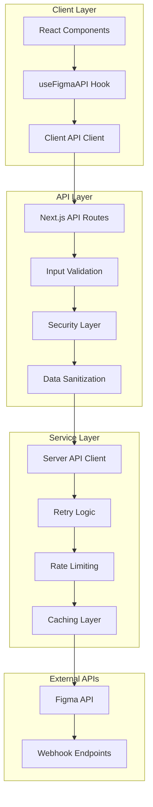
```mermaid
graph TB
    subgraph "Client Layer"
        Component[React Components]
        Hook[useFigmaAPI Hook]
        ClientAPI[Client API Client]
    end

    subgraph "API Layer"
        NextAPI[Next.js API Routes]
        Validation[Input Validation]
        Security[Security Layer]
        Sanitization[Data Sanitization]
    end

    subgraph "Service Layer"
        ServerAPI[Server API Client]
        RetryLogic[Retry Logic]
        RateLimit[Rate Limiting]
        Cache[Caching Layer]
    end

    subgraph "External APIs"
        FigmaAPI[Figma API]
        WebhookAPI[Webhook Endpoints]
    end

    Component --> Hook
    Hook --> ClientAPI
    ClientAPI --> NextAPI
    NextAPI --> Validation
    Validation --> Security
    Security --> Sanitization
    Sanitization --> ServerAPI
    ServerAPI --> RetryLogic
    RetryLogic --> RateLimit
    RateLimit --> Cache
    Cache --> FigmaAPI
    FigmaAPI --> WebhookAPI
```

## Figma API Integration Flow

### Complete Figma File Retrieval Flow

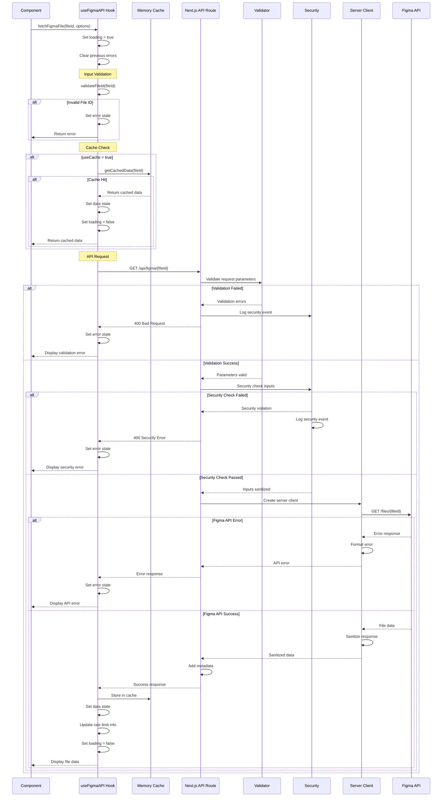
```mermaid
sequenceDiagram
    participant C as Component
    participant H as useFigmaAPI Hook
    participant Cache as Memory Cache
    participant API as Next.js API Route
    participant V as Validator
    participant S as Security
    participant SC as Server Client
    participant Figma as Figma API

    C->>H: fetchFigmaFile(fileId, options)
    H->>H: Set loading = true
    H->>H: Clear previous errors

    Note over H: Input Validation
    H->>H: validateFileId(fileId)
    alt Invalid File ID
        H->>H: Set error state
        H->>C: Return error
    end

    Note over H: Cache Check
    alt useCache = true
        H->>Cache: getCachedData(fileId)
        alt Cache Hit
            Cache-->>H: Return cached data
            H->>H: Set data state
            H->>H: Set loading = false
            H-->>C: Return cached data
        end
    end

    Note over H: API Request
    H->>API: GET /api/figma/{fileId}
    API->>V: Validate request parameters

    alt Validation Failed
        V-->>API: Validation errors
        API->>S: Log security event
        API-->>H: 400 Bad Request
        H->>H: Set error state
        H-->>C: Display validation error
    else Validation Success
        V-->>API: Parameters valid
        API->>S: Security check inputs

        alt Security Check Failed
            S-->>API: Security violation
            S->>S: Log security event
            API-->>H: 400 Security Error
            H->>H: Set error state
            H-->>C: Display security error
        else Security Check Passed
            S-->>API: Inputs sanitized
            API->>SC: Create server client
            SC->>Figma: GET /files/{fileId}

            alt Figma API Error
                Figma-->>SC: Error response
                SC->>SC: Format error
                SC-->>API: API error
                API-->>H: Error response
                H->>H: Set error state
                H-->>C: Display API error
            else Figma API Success
                Figma-->>SC: File data
                SC->>SC: Sanitize response
                SC-->>API: Sanitized data
                API->>API: Add metadata
                API-->>H: Success response
                H->>Cache: Store in cache
                H->>H: Set data state
                H->>H: Update rate limit info
                H->>H: Set loading = false
                H-->>C: Display file data
            end
        end
    end
```

### Figma MCP (Model Context Protocol) Flow

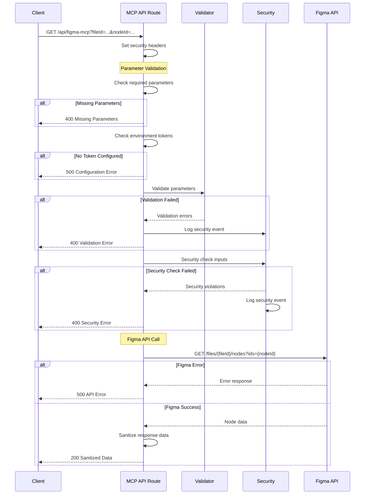
```mermaid
sequenceDiagram
    participant C as Client
    participant API as MCP API Route
    participant V as Validator
    participant S as Security
    participant Figma as Figma API

    C->>API: GET /api/figma-mcp?fileId=...&nodeId=...
    API->>API: Set security headers

    Note over API: Parameter Validation
    API->>API: Check required parameters
    alt Missing Parameters
        API-->>C: 400 Missing Parameters
    end

    API->>API: Check environment tokens
    alt No Token Configured
        API-->>C: 500 Configuration Error
    end

    API->>V: Validate parameters
    alt Validation Failed
        V-->>API: Validation errors
        API->>S: Log security event
        API-->>C: 400 Validation Error
    end

    API->>S: Security check inputs
    alt Security Check Failed
        S-->>API: Security violations
        S->>S: Log security event
        API-->>C: 400 Security Error
    end

    Note over API: Figma API Call
    API->>Figma: GET /files/{fileId}/nodes?ids={nodeId}
    alt Figma Error
        Figma-->>API: Error response
        API-->>C: 500 API Error
    else Figma Success
        Figma-->>API: Node data
        API->>API: Sanitize response data
        API-->>C: 200 Sanitized Data
    end
```

### Webhook Processing Flow

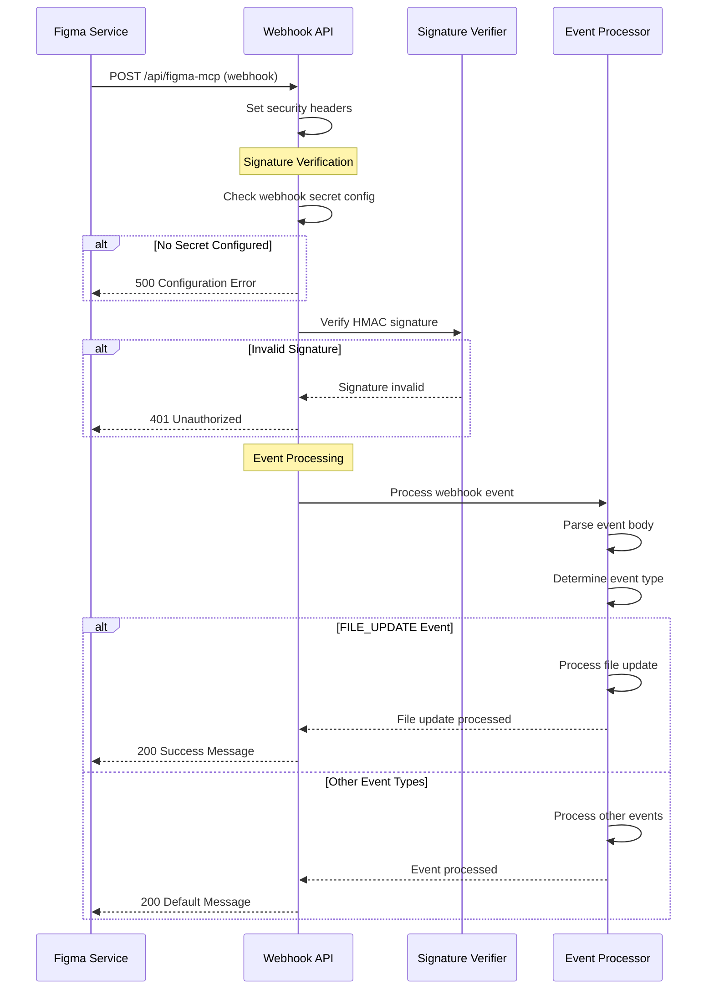
```mermaid
sequenceDiagram
    participant Figma as Figma Service
    participant API as Webhook API
    participant V as Signature Verifier
    participant P as Event Processor

    Figma->>API: POST /api/figma-mcp (webhook)
    API->>API: Set security headers

    Note over API: Signature Verification
    API->>API: Check webhook secret config
    alt No Secret Configured
        API-->>Figma: 500 Configuration Error
    end

    API->>V: Verify HMAC signature
    alt Invalid Signature
        V-->>API: Signature invalid
        API-->>Figma: 401 Unauthorized
    end

    Note over API: Event Processing
    API->>P: Process webhook event
    P->>P: Parse event body
    P->>P: Determine event type

    alt FILE_UPDATE Event
        P->>P: Process file update
        P-->>API: File update processed
        API-->>Figma: 200 Success Message
    else Other Event Types
        P->>P: Process other events
        P-->>API: Event processed
        API-->>Figma: 200 Default Message
    end
```

## Data Transformation and Sanitization

### Input Data Processing Pipeline

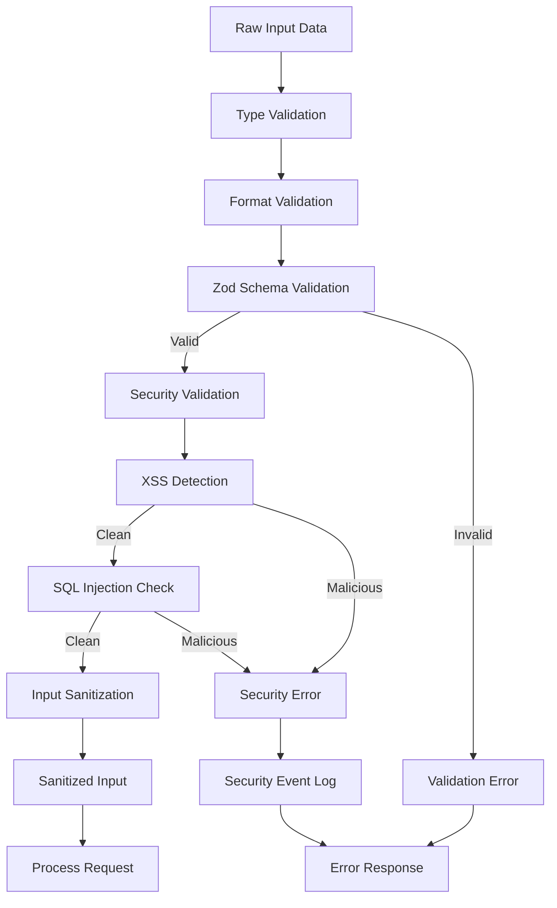
```mermaid
flowchart TD
    RawInput[Raw Input Data] --> TypeCheck[Type Validation]
    TypeCheck --> FormatCheck[Format Validation]
    FormatCheck --> SchemaValidation[Zod Schema Validation]

    SchemaValidation -->|Valid| SecurityCheck[Security Validation]
    SchemaValidation -->|Invalid| ValidationError[Validation Error]

    SecurityCheck --> XSSCheck[XSS Detection]
    XSSCheck -->|Clean| SQLCheck[SQL Injection Check]
    XSSCheck -->|Malicious| SecurityError[Security Error]

    SQLCheck -->|Clean| InputSanitization[Input Sanitization]
    SQLCheck -->|Malicious| SecurityError

    InputSanitization --> SanitizedInput[Sanitized Input]

    ValidationError --> ErrorResponse[Error Response]
    SecurityError --> SecurityLog[Security Event Log]
    SecurityLog --> ErrorResponse

    SanitizedInput --> ProcessRequest[Process Request]
```

### Output Data Sanitization Flow

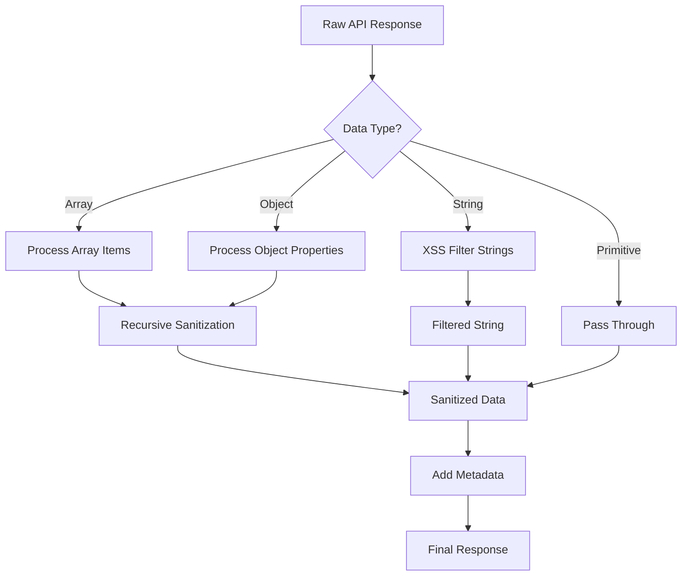
```mermaid
flowchart TD
    RawResponse[Raw API Response] --> DataType{Data Type?}

    DataType -->|String| StringSanitization[XSS Filter Strings]
    DataType -->|Array| ArrayProcessing[Process Array Items]
    DataType -->|Object| ObjectProcessing[Process Object Properties]
    DataType -->|Primitive| PassThrough[Pass Through]

    StringSanitization --> FilteredString[Filtered String]
    ArrayProcessing --> RecursiveSanitization[Recursive Sanitization]
    ObjectProcessing --> RecursiveSanitization

    RecursiveSanitization --> SanitizedData[Sanitized Data]
    FilteredString --> SanitizedData
    PassThrough --> SanitizedData

    SanitizedData --> MetadataAddition[Add Metadata]
    MetadataAddition --> FinalResponse[Final Response]
```

### Data Transformation Examples

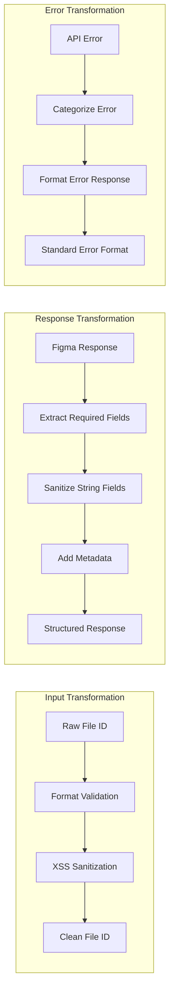
```mermaid
graph LR
    subgraph "Input Transformation"
        RawFileId[Raw File ID] --> Validation[Format Validation]
        Validation --> Sanitization[XSS Sanitization]
        Sanitization --> CleanFileId[Clean File ID]
    end

    subgraph "Response Transformation"
        FigmaResponse[Figma Response] --> FieldExtraction[Extract Required Fields]
        FieldExtraction --> StringSanitization[Sanitize String Fields]
        StringSanitization --> MetadataAddition[Add Metadata]
        MetadataAddition --> StructuredResponse[Structured Response]
    end

    subgraph "Error Transformation"
        APIError[API Error] --> ErrorCategorization[Categorize Error]
        ErrorCategorization --> ErrorFormatting[Format Error Response]
        ErrorFormatting --> StandardError[Standard Error Format]
    end
```

## Error Handling and Retry Mechanisms

### Comprehensive Error Handling Flow

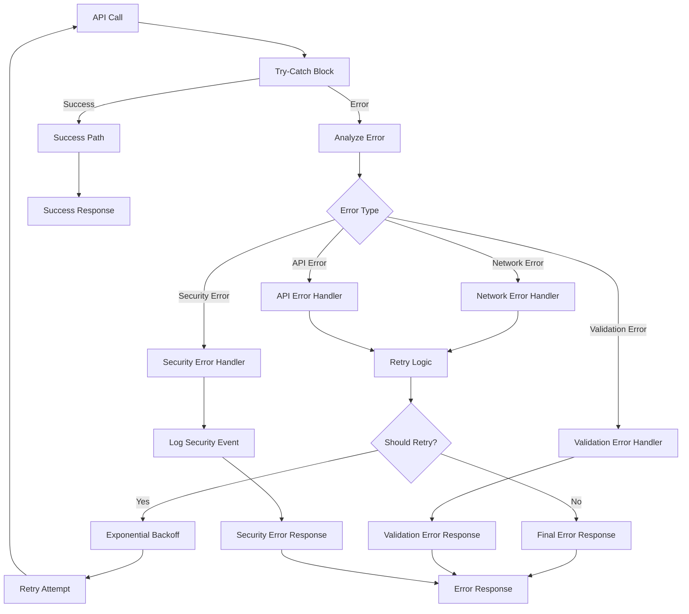
```mermaid
flowchart TD
    APICall[API Call] --> TryCatch[Try-Catch Block]
    TryCatch -->|Success| SuccessPath[Success Path]
    TryCatch -->|Error| ErrorAnalysis[Analyze Error]

    ErrorAnalysis --> ErrorType{Error Type}

    ErrorType -->|Network Error| NetworkErrorHandler[Network Error Handler]
    ErrorType -->|Validation Error| ValidationErrorHandler[Validation Error Handler]
    ErrorType -->|API Error| APIErrorHandler[API Error Handler]
    ErrorType -->|Security Error| SecurityErrorHandler[Security Error Handler]

    NetworkErrorHandler --> RetryLogic[Retry Logic]
    APIErrorHandler --> RetryLogic

    RetryLogic --> RetryCheck{Should Retry?}
    RetryCheck -->|Yes| BackoffDelay[Exponential Backoff]
    RetryCheck -->|No| FinalError[Final Error Response]

    BackoffDelay --> RetryAttempt[Retry Attempt]
    RetryAttempt --> APICall

    ValidationErrorHandler --> ValidationResponse[Validation Error Response]
    SecurityErrorHandler --> SecurityLog[Log Security Event]
    SecurityLog --> SecurityResponse[Security Error Response]

    SuccessPath --> SuccessResponse[Success Response]
    FinalError --> ErrorResponse[Error Response]
    ValidationResponse --> ErrorResponse
    SecurityResponse --> ErrorResponse
```

### Retry Strategy Implementation

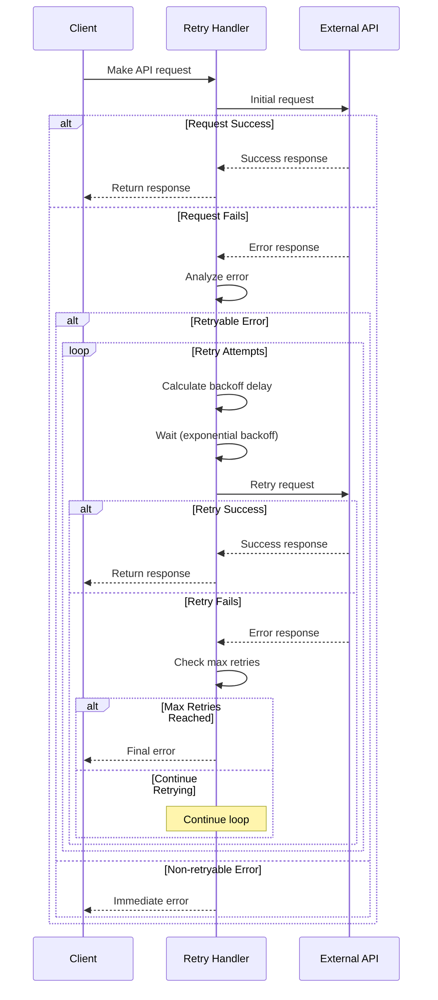
```mermaid
sequenceDiagram
    participant C as Client
    participant R as Retry Handler
    participant API as External API

    C->>R: Make API request
    R->>API: Initial request

    alt Request Success
        API-->>R: Success response
        R-->>C: Return response
    else Request Fails
        API-->>R: Error response
        R->>R: Analyze error

        alt Retryable Error
            loop Retry Attempts
                R->>R: Calculate backoff delay
                R->>R: Wait (exponential backoff)
                R->>API: Retry request

                alt Retry Success
                    API-->>R: Success response
                    R-->>C: Return response
                else Retry Fails
                    API-->>R: Error response
                    R->>R: Check max retries

                    alt Max Retries Reached
                        R-->>C: Final error
                    else Continue Retrying
                        Note over R: Continue loop
                    end
                end
            end
        else Non-retryable Error
            R-->>C: Immediate error
        end
    end
```

### Error Recovery Patterns

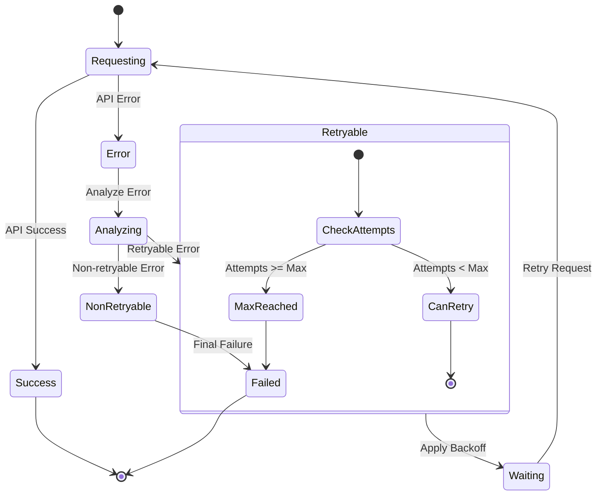
```mermaid
stateDiagram-v2
    [*] --> Requesting
    Requesting --> Success : API Success
    Requesting --> Error : API Error

    Error --> Analyzing : Analyze Error
    Analyzing --> Retryable : Retryable Error
    Analyzing --> NonRetryable : Non-retryable Error

    Retryable --> Waiting : Apply Backoff
    Waiting --> Requesting : Retry Request

    NonRetryable --> Failed : Final Failure
    Success --> [*]
    Failed --> [*]

    state Retryable {
        [*] --> CheckAttempts
        CheckAttempts --> CanRetry : Attempts < Max
        CheckAttempts --> MaxReached : Attempts >= Max
        CanRetry --> [*]
        MaxReached --> Failed
    }
```

## Caching Strategies

### Multi-Level Caching Architecture

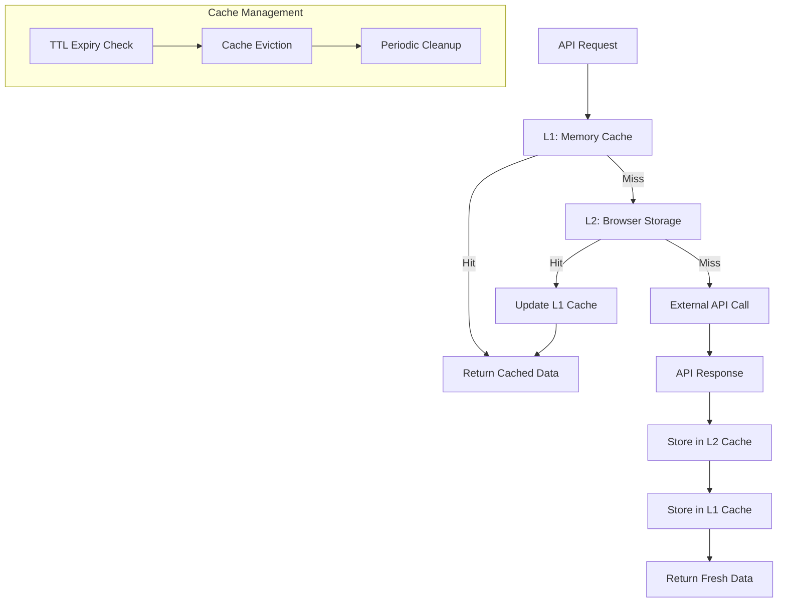
```mermaid
graph TD
    Request[API Request] --> L1Cache[L1: Memory Cache]
    L1Cache -->|Hit| CacheHit[Return Cached Data]
    L1Cache -->|Miss| L2Cache[L2: Browser Storage]
    L2Cache -->|Hit| UpdateL1[Update L1 Cache]
    L2Cache -->|Miss| APICall[External API Call]

    UpdateL1 --> CacheHit
    APICall --> APIResponse[API Response]
    APIResponse --> StoreL2[Store in L2 Cache]
    StoreL2 --> StoreL1[Store in L1 Cache]
    StoreL1 --> ReturnData[Return Fresh Data]

    subgraph "Cache Management"
        TTLCheck[TTL Expiry Check]
        CacheEviction[Cache Eviction]
        CacheCleanup[Periodic Cleanup]
    end

    TTLCheck --> CacheEviction
    CacheEviction --> CacheCleanup
```

### Cache Lifecycle Management

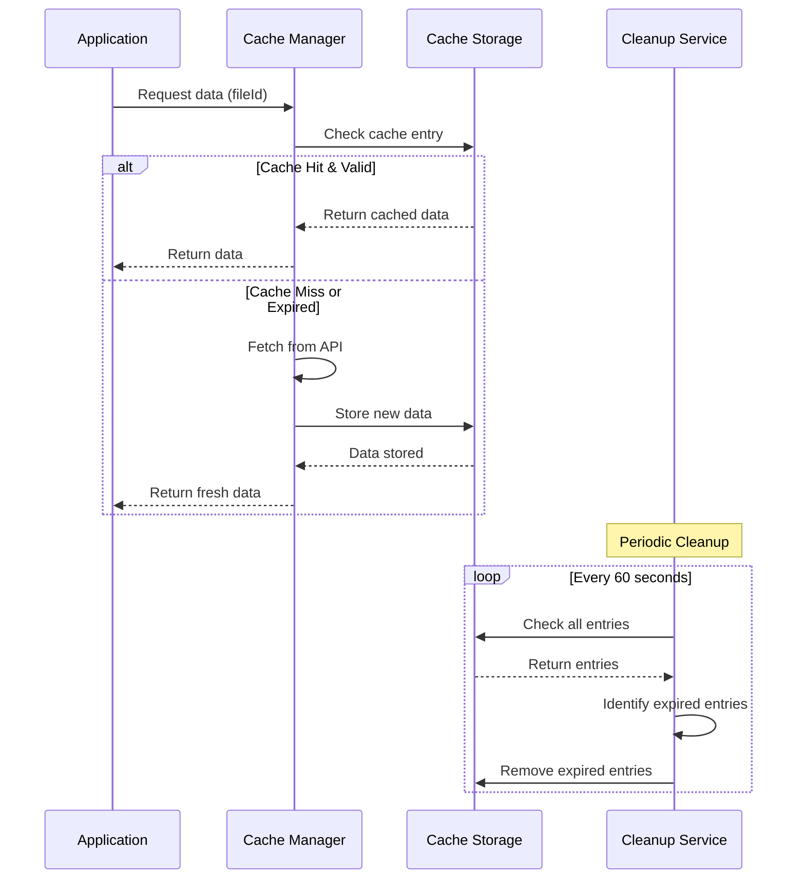
```mermaid
sequenceDiagram
    participant App as Application
    participant Cache as Cache Manager
    participant Storage as Cache Storage
    participant Cleanup as Cleanup Service

    App->>Cache: Request data (fileId)
    Cache->>Storage: Check cache entry

    alt Cache Hit & Valid
        Storage-->>Cache: Return cached data
        Cache-->>App: Return data
    else Cache Miss or Expired
        Cache->>Cache: Fetch from API
        Cache->>Storage: Store new data
        Storage-->>Cache: Data stored
        Cache-->>App: Return fresh data
    end

    Note over Cleanup: Periodic Cleanup
    loop Every 60 seconds
        Cleanup->>Storage: Check all entries
        Storage-->>Cleanup: Return entries
        Cleanup->>Cleanup: Identify expired entries
        Cleanup->>Storage: Remove expired entries
    end
```

### Cache Strategy Decision Flow

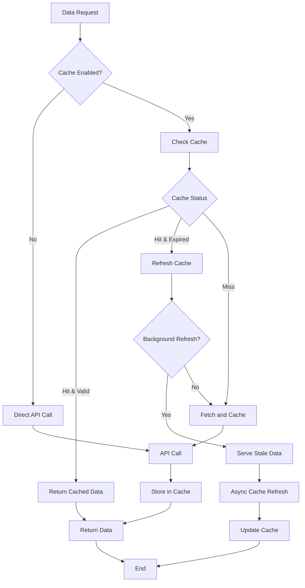
```mermaid
flowchart TD
    DataRequest[Data Request] --> CacheConfig{Cache Enabled?}
    CacheConfig -->|No| DirectAPI[Direct API Call]
    CacheConfig -->|Yes| CacheCheck[Check Cache]

    CacheCheck --> CacheStatus{Cache Status}
    CacheStatus -->|Hit & Valid| CacheReturn[Return Cached Data]
    CacheStatus -->|Hit & Expired| RefreshCache[Refresh Cache]
    CacheStatus -->|Miss| FetchAndCache[Fetch and Cache]

    RefreshCache --> BackgroundRefresh{Background Refresh?}
    BackgroundRefresh -->|Yes| ServeStale[Serve Stale Data]
    BackgroundRefresh -->|No| FetchAndCache

    ServeStale --> AsyncRefresh[Async Cache Refresh]
    FetchAndCache --> APICall[API Call]
    DirectAPI --> APICall

    APICall --> StoreInCache[Store in Cache]
    StoreInCache --> ReturnData[Return Data]
    AsyncRefresh --> UpdateCache[Update Cache]

    CacheReturn --> ReturnData
    ReturnData --> End[End]
    UpdateCache --> End
```

## Data Persistence Flows

### Client-Side Data Persistence

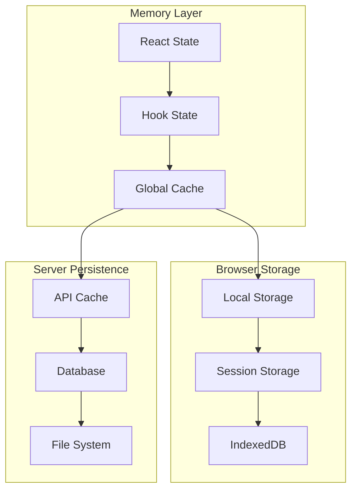
```mermaid
graph TD
    subgraph "Memory Layer"
        ReactState[React State]
        HookState[Hook State]
        GlobalCache[Global Cache]
    end

    subgraph "Browser Storage"
        LocalStorage[Local Storage]
        SessionStorage[Session Storage]
        IndexedDB[IndexedDB]
    end

    subgraph "Server Persistence"
        APICache[API Cache]
        Database[Database]
        FileSystem[File System]
    end

    ReactState --> HookState
    HookState --> GlobalCache
    GlobalCache --> LocalStorage
    LocalStorage --> SessionStorage
    SessionStorage --> IndexedDB

    GlobalCache --> APICache
    APICache --> Database
    Database --> FileSystem
```

### Data Synchronization Flow

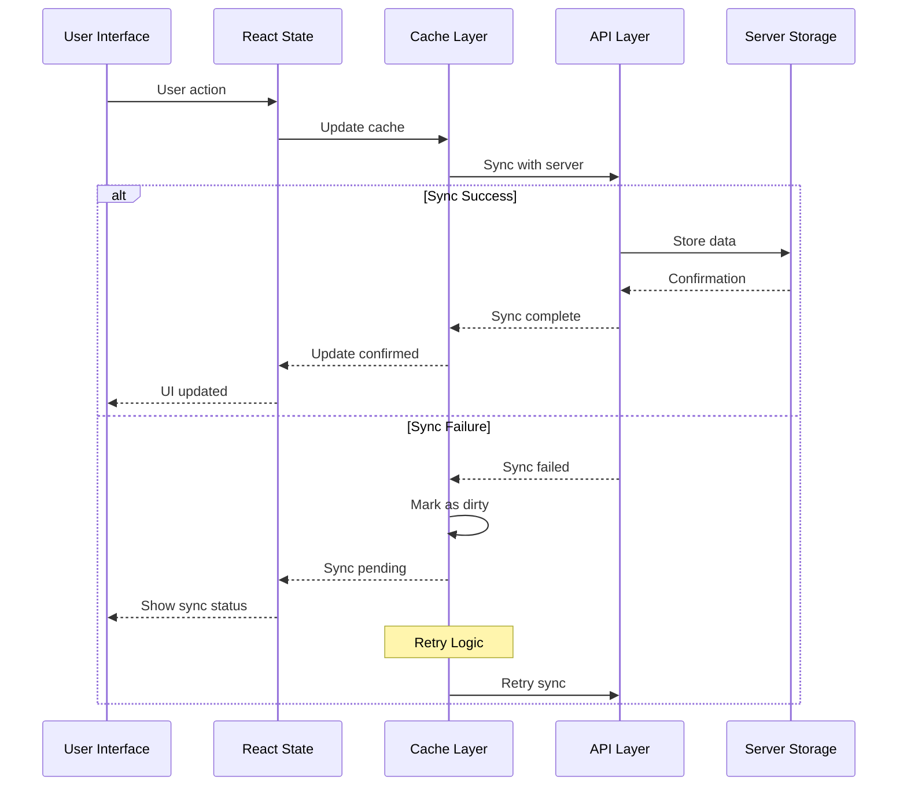
```mermaid
sequenceDiagram
    participant UI as User Interface
    participant State as React State
    participant Cache as Cache Layer
    participant API as API Layer
    participant Server as Server Storage

    UI->>State: User action
    State->>Cache: Update cache
    Cache->>API: Sync with server

    alt Sync Success
        API->>Server: Store data
        Server-->>API: Confirmation
        API-->>Cache: Sync complete
        Cache-->>State: Update confirmed
        State-->>UI: UI updated
    else Sync Failure
        API-->>Cache: Sync failed
        Cache->>Cache: Mark as dirty
        Cache-->>State: Sync pending
        State-->>UI: Show sync status

        Note over Cache: Retry Logic
        Cache->>API: Retry sync
    end
```

### Offline Data Handling

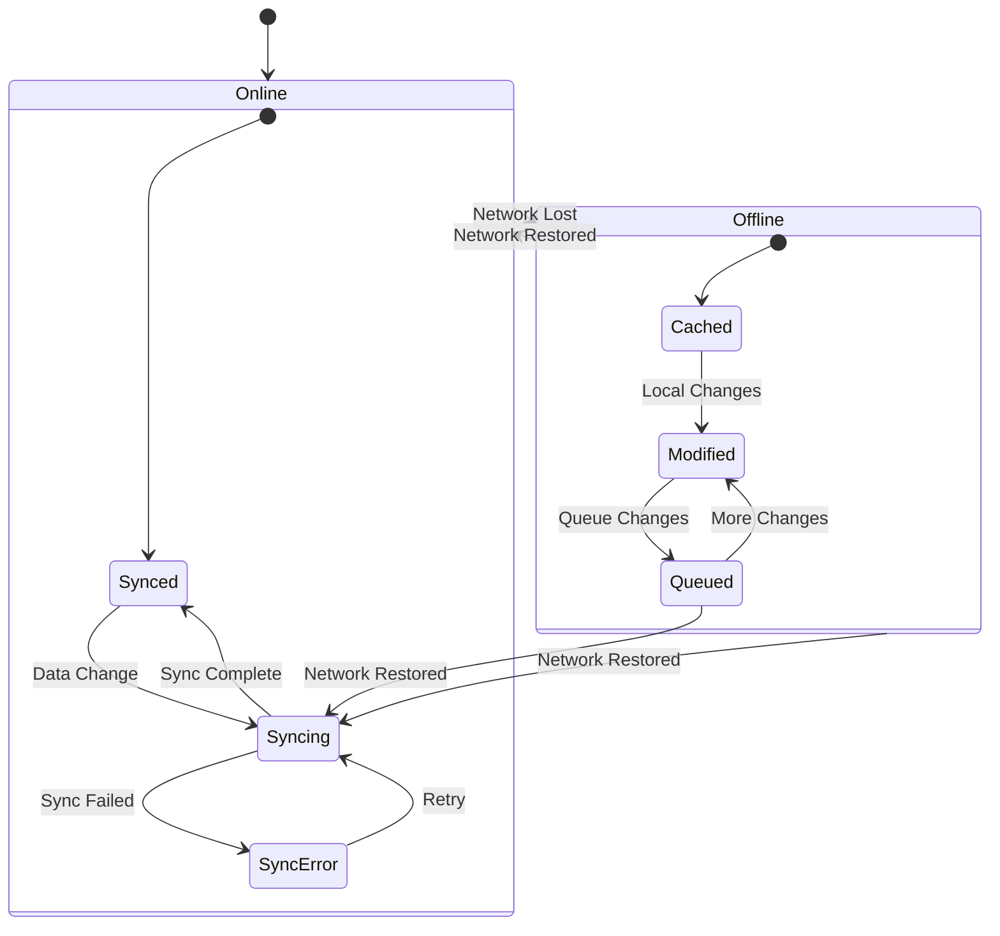
```mermaid
stateDiagram-v2
    [*] --> Online
    Online --> Offline : Network Lost
    Offline --> Online : Network Restored

    state Online {
        [*] --> Synced
        Synced --> Syncing : Data Change
        Syncing --> Synced : Sync Complete
        Syncing --> SyncError : Sync Failed
        SyncError --> Syncing : Retry
    }

    state Offline {
        [*] --> Cached
        Cached --> Modified : Local Changes
        Modified --> Queued : Queue Changes
        Queued --> Modified : More Changes
    }

    Offline --> Syncing : Network Restored
    Queued --> Syncing : Network Restored
```

## Security and Validation Flows

### Input Security Pipeline

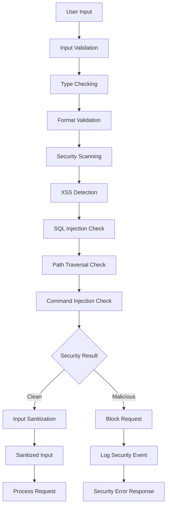
```mermaid
flowchart TD
    UserInput[User Input] --> InputValidation[Input Validation]
    InputValidation --> TypeCheck[Type Checking]
    TypeCheck --> FormatValidation[Format Validation]
    FormatValidation --> SecurityScan[Security Scanning]

    SecurityScan --> XSSDetection[XSS Detection]
    XSSDetection --> SQLInjectionCheck[SQL Injection Check]
    SQLInjectionCheck --> PathTraversalCheck[Path Traversal Check]
    PathTraversalCheck --> CommandInjectionCheck[Command Injection Check]

    CommandInjectionCheck --> SecurityResult{Security Result}
    SecurityResult -->|Clean| InputSanitization[Input Sanitization]
    SecurityResult -->|Malicious| SecurityBlock[Block Request]

    SecurityBlock --> SecurityLog[Log Security Event]
    SecurityLog --> SecurityResponse[Security Error Response]

    InputSanitization --> SanitizedInput[Sanitized Input]
    SanitizedInput --> ProcessRequest[Process Request]
```

### API Security Flow

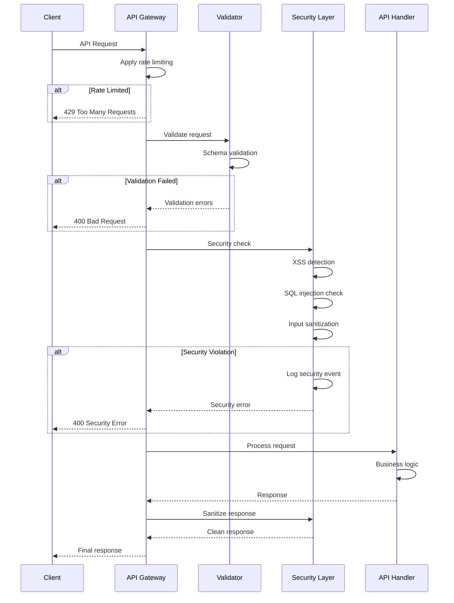
```mermaid
sequenceDiagram
    participant C as Client
    participant G as API Gateway
    participant V as Validator
    participant S as Security Layer
    participant API as API Handler

    C->>G: API Request
    G->>G: Apply rate limiting

    alt Rate Limited
        G-->>C: 429 Too Many Requests
    end

    G->>V: Validate request
    V->>V: Schema validation

    alt Validation Failed
        V-->>G: Validation errors
        G-->>C: 400 Bad Request
    end

    G->>S: Security check
    S->>S: XSS detection
    S->>S: SQL injection check
    S->>S: Input sanitization

    alt Security Violation
        S->>S: Log security event
        S-->>G: Security error
        G-->>C: 400 Security Error
    end

    G->>API: Process request
    API->>API: Business logic
    API-->>G: Response
    G->>S: Sanitize response
    S-->>G: Clean response
    G-->>C: Final response
```

## Performance Optimization

### Request Optimization Flow

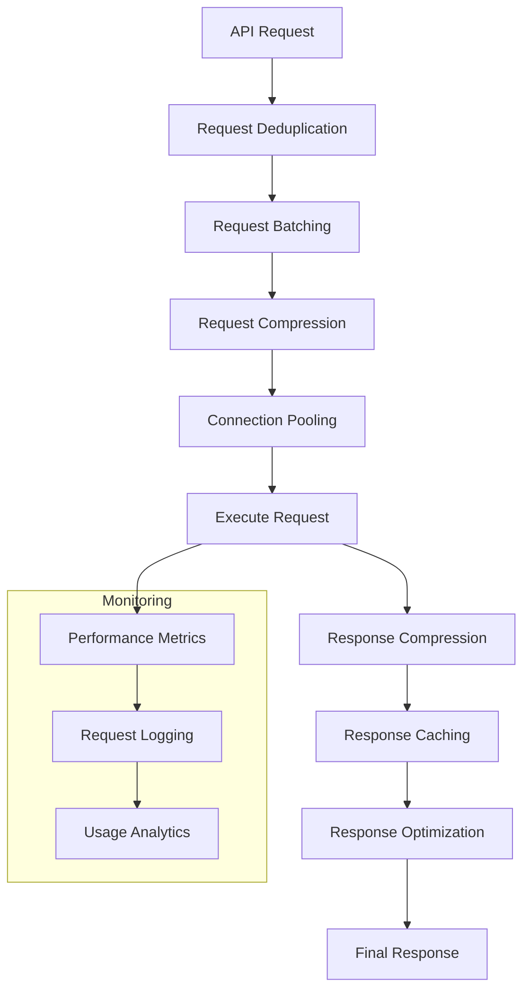
```mermaid
graph TD
    Request[API Request] --> Deduplication[Request Deduplication]
    Deduplication --> Batching[Request Batching]
    Batching --> Compression[Request Compression]
    Compression --> Connection[Connection Pooling]

    Connection --> Execution[Execute Request]
    Execution --> ResponseCompression[Response Compression]
    ResponseCompression --> Caching[Response Caching]
    Caching --> Optimization[Response Optimization]

    Optimization --> FinalResponse[Final Response]

    subgraph "Monitoring"
        Metrics[Performance Metrics]
        Logging[Request Logging]
        Analytics[Usage Analytics]
    end

    Execution --> Metrics
    Metrics --> Logging
    Logging --> Analytics
```

### Load Balancing and Scaling

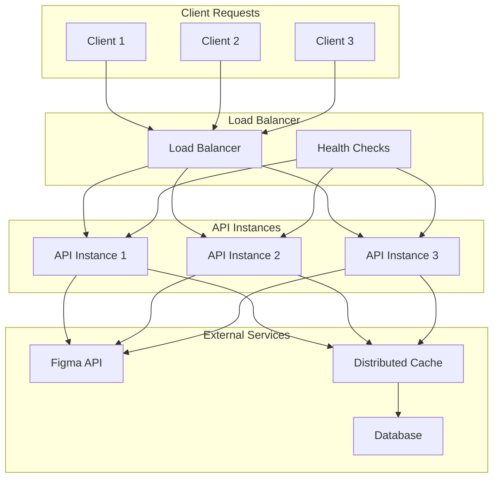
```mermaid
graph TD
    subgraph "Client Requests"
        Client1[Client 1]
        Client2[Client 2]
        Client3[Client 3]
    end

    subgraph "Load Balancer"
        LB[Load Balancer]
        HealthCheck[Health Checks]
    end

    subgraph "API Instances"
        API1[API Instance 1]
        API2[API Instance 2]
        API3[API Instance 3]
    end

    subgraph "External Services"
        FigmaAPI[Figma API]
        Cache[Distributed Cache]
        Database[Database]
    end

    Client1 --> LB
    Client2 --> LB
    Client3 --> LB

    LB --> API1
    LB --> API2
    LB --> API3

    HealthCheck --> API1
    HealthCheck --> API2
    HealthCheck --> API3

    API1 --> FigmaAPI
    API2 --> FigmaAPI
    API3 --> FigmaAPI

    API1 --> Cache
    API2 --> Cache
    API3 --> Cache

    Cache --> Database
```

This comprehensive documentation provides detailed insights into how API integration and data processing work in the AI Development Template, including security measures, performance optimizations, and error handling strategies.
