# Authentication and User Management Flow Diagrams

## Overview

This document provides comprehensive flow diagrams for authentication and user management in the AI Development Template. The application uses Firebase Authentication with support for email/password and Google OAuth authentication methods.

## Table of Contents

1. [Authentication Architecture](#authentication-architecture)
2. [Email/Password Authentication Flow](#emailpassword-authentication-flow)
3. [Google OAuth Authentication Flow](#google-oauth-authentication-flow)
4. [State Management Flow](#state-management-flow)
5. [Session Management](#session-management)
6. [Token Handling](#token-handling)
7. [Error Handling Flows](#error-handling-flows)
8. [Security Considerations](#security-considerations)

## Authentication Architecture

The authentication system is built on Firebase Authentication with React Context for state management:

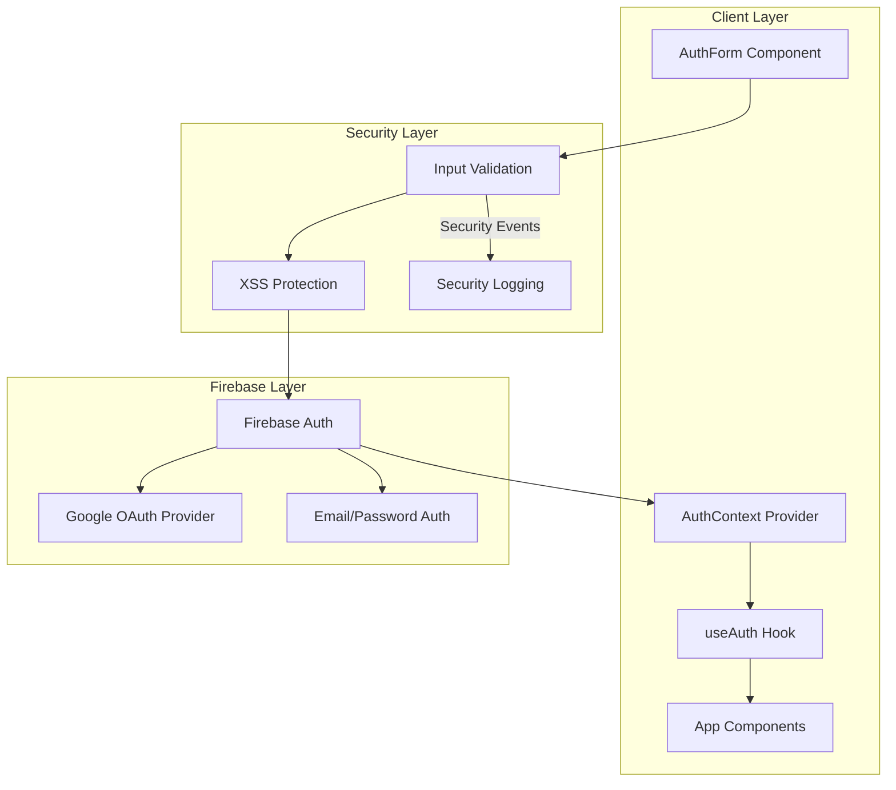
```mermaid
graph TB
    subgraph "Client Layer"
        AuthForm[AuthForm Component]
        AuthContext[AuthContext Provider]
        AuthHook[useAuth Hook]
        Components[App Components]
    end

    subgraph "Firebase Layer"
        FirebaseAuth[Firebase Auth]
        GoogleProvider[Google OAuth Provider]
        EmailAuth[Email/Password Auth]
    end

    subgraph "Security Layer"
        Validation[Input Validation]
        Sanitization[XSS Protection]
        SecurityLog[Security Logging]
    end

    AuthForm --> Validation
    Validation --> Sanitization
    Sanitization --> FirebaseAuth
    FirebaseAuth --> GoogleProvider
    FirebaseAuth --> EmailAuth
    FirebaseAuth --> AuthContext
    AuthContext --> AuthHook
    AuthHook --> Components

    Validation -->|Security Events| SecurityLog
```

## Email/Password Authentication Flow

### Registration Flow

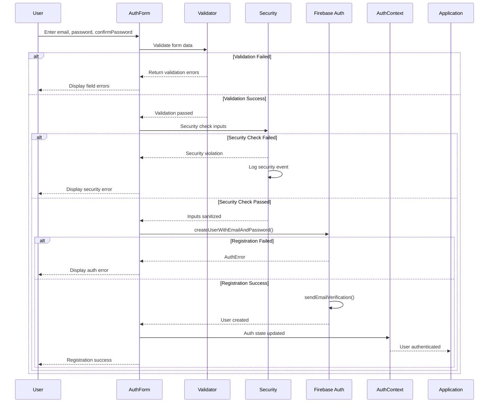
```mermaid
sequenceDiagram
    participant U as User
    participant AF as AuthForm
    participant V as Validator
    participant S as Security
    participant FB as Firebase Auth
    participant AC as AuthContext
    participant App as Application

    U->>AF: Enter email, password, confirmPassword
    AF->>V: Validate form data

    alt Validation Failed
        V-->>AF: Return validation errors
        AF-->>U: Display field errors
    else Validation Success
        V-->>AF: Validation passed
        AF->>S: Security check inputs

        alt Security Check Failed
            S-->>AF: Security violation
            S->>S: Log security event
            AF-->>U: Display security error
        else Security Check Passed
            S-->>AF: Inputs sanitized
            AF->>FB: createUserWithEmailAndPassword()

            alt Registration Failed
                FB-->>AF: AuthError
                AF-->>U: Display auth error
            else Registration Success
                FB->>FB: sendEmailVerification()
                FB-->>AF: User created
                AF->>AC: Auth state updated
                AC-->>App: User authenticated
                AF-->>U: Registration success
            end
        end
    end
```

### Login Flow

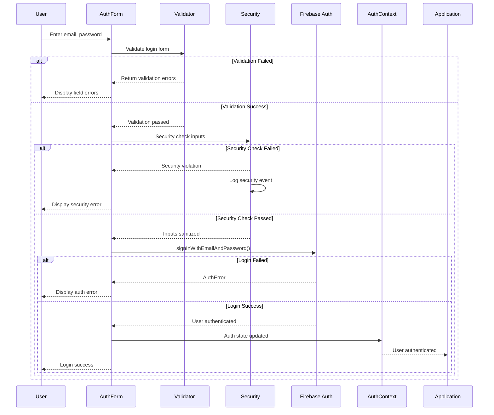
```mermaid
sequenceDiagram
    participant U as User
    participant AF as AuthForm
    participant V as Validator
    participant S as Security
    participant FB as Firebase Auth
    participant AC as AuthContext
    participant App as Application

    U->>AF: Enter email, password
    AF->>V: Validate login form

    alt Validation Failed
        V-->>AF: Return validation errors
        AF-->>U: Display field errors
    else Validation Success
        V-->>AF: Validation passed
        AF->>S: Security check inputs

        alt Security Check Failed
            S-->>AF: Security violation
            S->>S: Log security event
            AF-->>U: Display security error
        else Security Check Passed
            S-->>AF: Inputs sanitized
            AF->>FB: signInWithEmailAndPassword()

            alt Login Failed
                FB-->>AF: AuthError
                AF-->>U: Display auth error
            else Login Success
                FB-->>AF: User authenticated
                AF->>AC: Auth state updated
                AC-->>App: User authenticated
                AF-->>U: Login success
            end
        end
    end
```

### Logout Flow

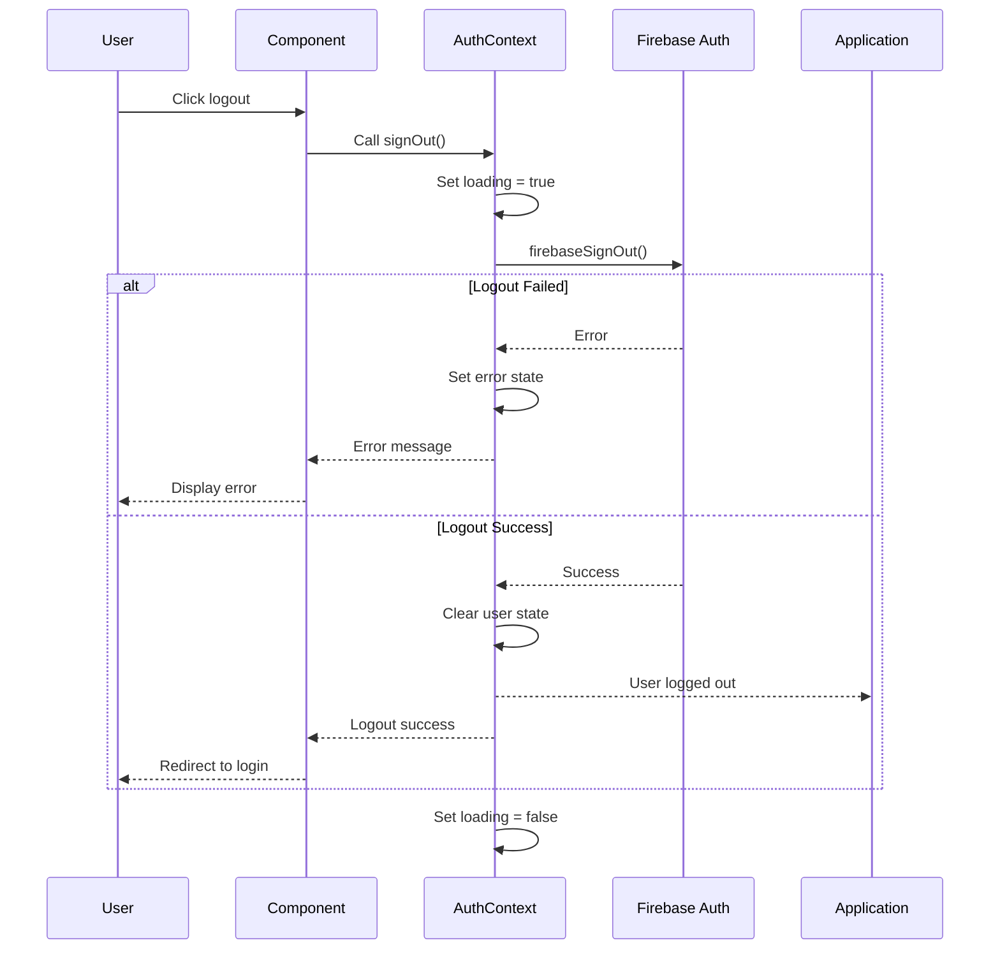
```mermaid
sequenceDiagram
    participant U as User
    participant C as Component
    participant AC as AuthContext
    participant FB as Firebase Auth
    participant App as Application

    U->>C: Click logout
    C->>AC: Call signOut()
    AC->>AC: Set loading = true
    AC->>FB: firebaseSignOut()

    alt Logout Failed
        FB-->>AC: Error
        AC->>AC: Set error state
        AC-->>C: Error message
        C-->>U: Display error
    else Logout Success
        FB-->>AC: Success
        AC->>AC: Clear user state
        AC-->>App: User logged out
        AC-->>C: Logout success
        C-->>U: Redirect to login
    end

    AC->>AC: Set loading = false
```

## Google OAuth Authentication Flow

### Google Sign-In Flow

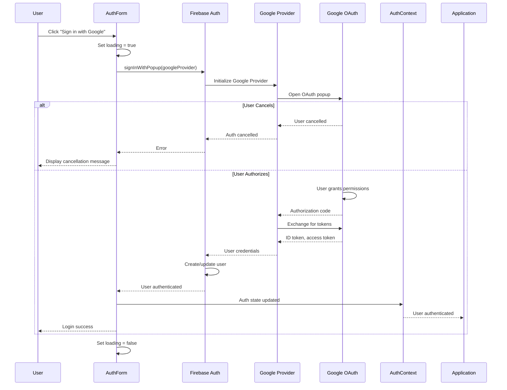
```mermaid
sequenceDiagram
    participant U as User
    participant AF as AuthForm
    participant FB as Firebase Auth
    participant GP as Google Provider
    participant Google as Google OAuth
    participant AC as AuthContext
    participant App as Application

    U->>AF: Click "Sign in with Google"
    AF->>AF: Set loading = true
    AF->>FB: signInWithPopup(googleProvider)
    FB->>GP: Initialize Google Provider
    GP->>Google: Open OAuth popup

    alt User Cancels
        Google-->>GP: User cancelled
        GP-->>FB: Auth cancelled
        FB-->>AF: Error
        AF-->>U: Display cancellation message
    else User Authorizes
        Google->>Google: User grants permissions
        Google-->>GP: Authorization code
        GP->>Google: Exchange for tokens
        Google-->>GP: ID token, access token
        GP-->>FB: User credentials
        FB->>FB: Create/update user
        FB-->>AF: User authenticated
        AF->>AC: Auth state updated
        AC-->>App: User authenticated
        AF-->>U: Login success
    end

    AF->>AF: Set loading = false
```

### Google Provider Configuration

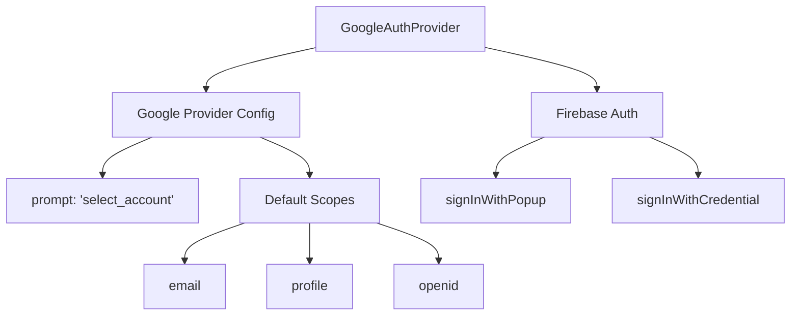
```mermaid
graph TD
    Config[Google Provider Config] --> Prompt[prompt: 'select_account']
    Config --> Scopes[Default Scopes]
    Scopes --> Email[email]
    Scopes --> Profile[profile]
    Scopes --> OpenID[openid]

    Provider[GoogleAuthProvider] --> Config
    Provider --> Firebase[Firebase Auth]
    Firebase --> Popup[signInWithPopup]
    Firebase --> Credential[signInWithCredential]
```

## State Management Flow

### AuthContext State Management

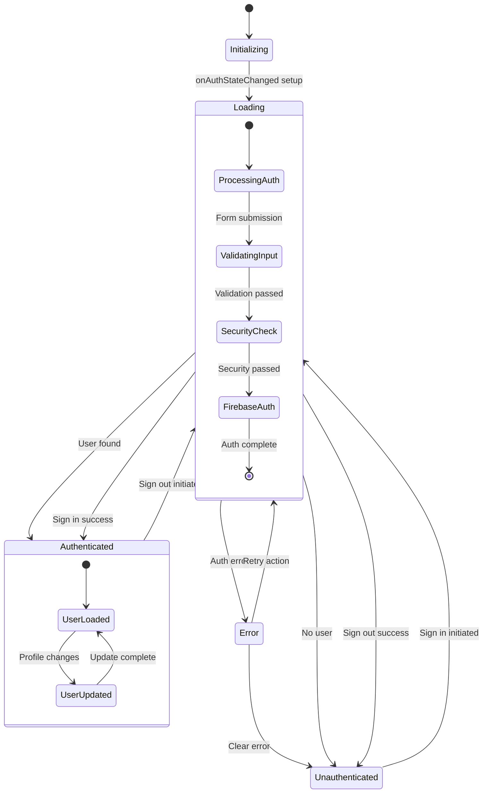
```mermaid
stateDiagram-v2
    [*] --> Initializing
    Initializing --> Loading : onAuthStateChanged setup
    Loading --> Authenticated : User found
    Loading --> Unauthenticated : No user

    Authenticated --> Loading : Sign out initiated
    Unauthenticated --> Loading : Sign in initiated

    Loading --> Authenticated : Sign in success
    Loading --> Unauthenticated : Sign out success
    Loading --> Error : Auth error

    Error --> Loading : Retry action
    Error --> Unauthenticated : Clear error

    state Authenticated {
        [*] --> UserLoaded
        UserLoaded --> UserUpdated : Profile changes
        UserUpdated --> UserLoaded : Update complete
    }

    state Loading {
        [*] --> ProcessingAuth
        ProcessingAuth --> ValidatingInput : Form submission
        ValidatingInput --> SecurityCheck : Validation passed
        SecurityCheck --> FirebaseAuth : Security passed
        FirebaseAuth --> [*] : Auth complete
    }
```

### AuthContext Provider Implementation

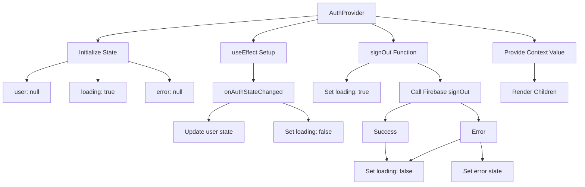
```mermaid
flowchart TD
    Provider[AuthProvider] --> State[Initialize State]
    State --> UserState[user: null]
    State --> LoadingState[loading: true]
    State --> ErrorState[error: null]

    Provider --> Effect[useEffect Setup]
    Effect --> Listener[onAuthStateChanged]
    Listener --> UserUpdate[Update user state]
    Listener --> LoadingUpdate[Set loading: false]

    Provider --> SignOut[signOut Function]
    SignOut --> SetLoading[Set loading: true]
    SignOut --> FirebaseSignOut[Call Firebase signOut]
    FirebaseSignOut --> Success[Success]
    FirebaseSignOut --> Error[Error]
    Success --> ClearLoading[Set loading: false]
    Error --> SetError[Set error state]
    Error --> ClearLoading

    Provider --> Context[Provide Context Value]
    Context --> Children[Render Children]
```

### useAuth Hook Usage Pattern

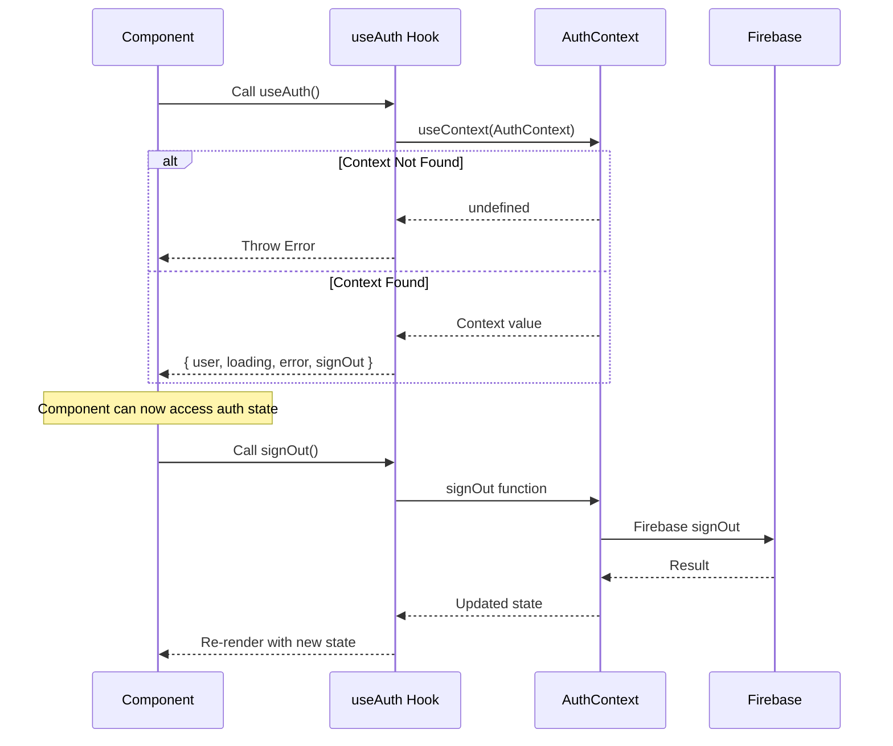
```mermaid
sequenceDiagram
    participant C as Component
    participant H as useAuth Hook
    participant AC as AuthContext
    participant FB as Firebase

    C->>H: Call useAuth()
    H->>AC: useContext(AuthContext)

    alt Context Not Found
        AC-->>H: undefined
        H-->>C: Throw Error
    else Context Found
        AC-->>H: Context value
        H-->>C: { user, loading, error, signOut }
    end

    Note over C: Component can now access auth state

    C->>H: Call signOut()
    H->>AC: signOut function
    AC->>FB: Firebase signOut
    FB-->>AC: Result
    AC-->>H: Updated state
    H-->>C: Re-render with new state
```

## Session Management

### Firebase Session Lifecycle

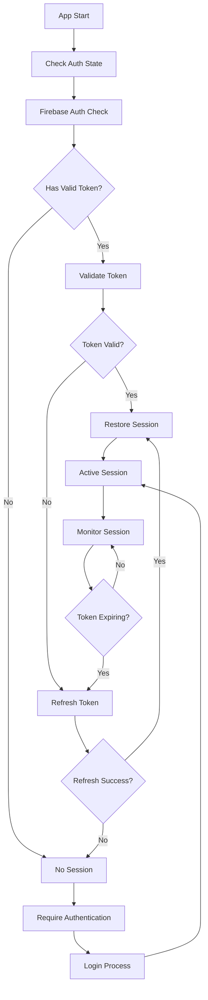
```mermaid
graph TD
    Start[App Start] --> Check[Check Auth State]
    Check --> Firebase[Firebase Auth Check]

    Firebase --> HasToken{Has Valid Token?}
    HasToken -->|Yes| ValidateToken[Validate Token]
    HasToken -->|No| NoSession[No Session]

    ValidateToken --> TokenValid{Token Valid?}
    TokenValid -->|Yes| RestoreSession[Restore Session]
    TokenValid -->|No| RefreshToken[Refresh Token]

    RefreshToken --> RefreshSuccess{Refresh Success?}
    RefreshSuccess -->|Yes| RestoreSession
    RefreshSuccess -->|No| NoSession

    RestoreSession --> ActiveSession[Active Session]
    NoSession --> RequireAuth[Require Authentication]

    ActiveSession --> Monitor[Monitor Session]
    Monitor --> TokenExpiry{Token Expiring?}
    TokenExpiry -->|Yes| RefreshToken
    TokenExpiry -->|No| Monitor

    RequireAuth --> Login[Login Process]
    Login --> ActiveSession
```

### Session State Transitions

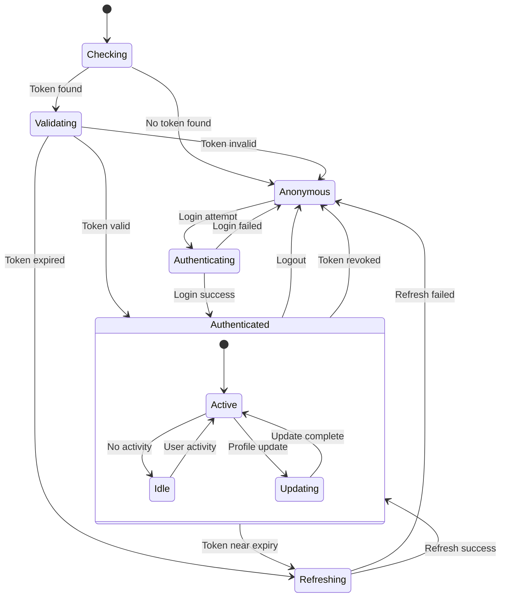
```mermaid
stateDiagram-v2
    [*] --> Checking
    Checking --> Anonymous : No token found
    Checking --> Validating : Token found

    Validating --> Authenticated : Token valid
    Validating --> Refreshing : Token expired
    Validating --> Anonymous : Token invalid

    Refreshing --> Authenticated : Refresh success
    Refreshing --> Anonymous : Refresh failed

    Anonymous --> Authenticating : Login attempt
    Authenticating --> Authenticated : Login success
    Authenticating --> Anonymous : Login failed

    Authenticated --> Refreshing : Token near expiry
    Authenticated --> Anonymous : Logout
    Authenticated --> Anonymous : Token revoked

    state Authenticated {
        [*] --> Active
        Active --> Idle : No activity
        Idle --> Active : User activity
        Active --> Updating : Profile update
        Updating --> Active : Update complete
    }
```

## Token Handling

### Firebase Token Management

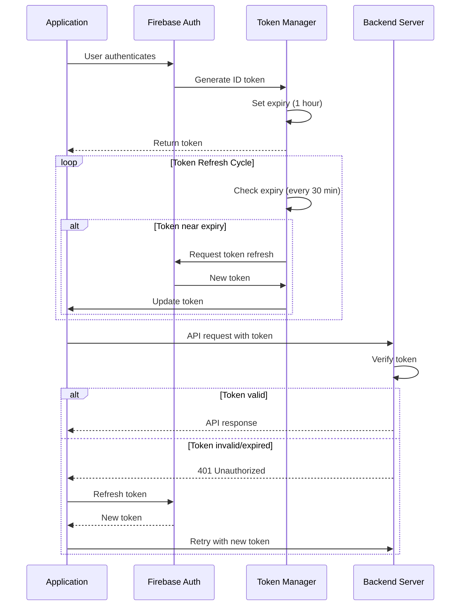
```mermaid
sequenceDiagram
    participant App as Application
    participant Auth as Firebase Auth
    participant Token as Token Manager
    participant Server as Backend Server

    App->>Auth: User authenticates
    Auth->>Token: Generate ID token
    Token->>Token: Set expiry (1 hour)
    Token-->>App: Return token

    loop Token Refresh Cycle
        Token->>Token: Check expiry (every 30 min)
        alt Token near expiry
            Token->>Auth: Request token refresh
            Auth->>Token: New token
            Token->>App: Update token
        end
    end

    App->>Server: API request with token
    Server->>Server: Verify token

    alt Token valid
        Server-->>App: API response
    else Token invalid/expired
        Server-->>App: 401 Unauthorized
        App->>Auth: Refresh token
        Auth-->>App: New token
        App->>Server: Retry with new token
    end
```

### Token Validation Flow

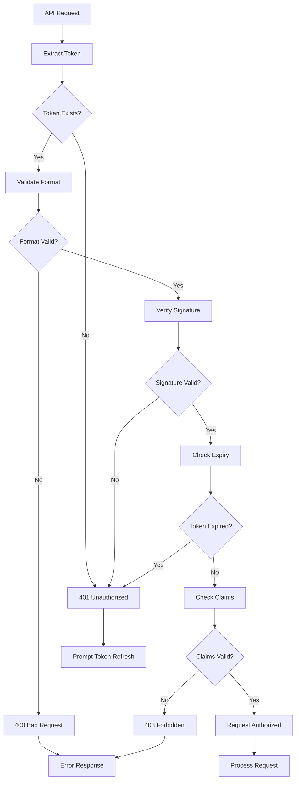
```mermaid
flowchart TD
    Request[API Request] --> ExtractToken[Extract Token]
    ExtractToken --> TokenExists{Token Exists?}

    TokenExists -->|No| Unauthorized[401 Unauthorized]
    TokenExists -->|Yes| ValidateFormat[Validate Format]

    ValidateFormat --> FormatValid{Format Valid?}
    FormatValid -->|No| BadRequest[400 Bad Request]
    FormatValid -->|Yes| VerifySignature[Verify Signature]

    VerifySignature --> SignatureValid{Signature Valid?}
    SignatureValid -->|No| Unauthorized
    SignatureValid -->|Yes| CheckExpiry[Check Expiry]

    CheckExpiry --> TokenExpired{Token Expired?}
    TokenExpired -->|Yes| Unauthorized
    TokenExpired -->|No| CheckClaims[Check Claims]

    CheckClaims --> ClaimsValid{Claims Valid?}
    ClaimsValid -->|No| Forbidden[403 Forbidden]
    ClaimsValid -->|Yes| Authorized[Request Authorized]

    Unauthorized --> RefreshPrompt[Prompt Token Refresh]
    BadRequest --> ErrorResponse[Error Response]
    Forbidden --> ErrorResponse
    Authorized --> ProcessRequest[Process Request]
```

## Error Handling Flows

### Authentication Error Handling

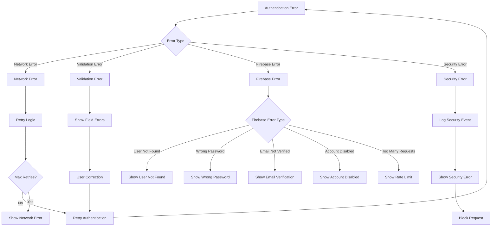
```mermaid
flowchart TD
    AuthError[Authentication Error] --> ErrorType{Error Type}

    ErrorType -->|Network Error| NetworkError[Network Error]
    ErrorType -->|Validation Error| ValidationError[Validation Error]
    ErrorType -->|Firebase Error| FirebaseError[Firebase Error]
    ErrorType -->|Security Error| SecurityError[Security Error]

    NetworkError --> RetryLogic[Retry Logic]
    RetryLogic --> MaxRetries{Max Retries?}
    MaxRetries -->|No| RetryAuth[Retry Authentication]
    MaxRetries -->|Yes| ShowNetworkError[Show Network Error]

    ValidationError --> ShowFieldErrors[Show Field Errors]
    ShowFieldErrors --> UserCorrection[User Correction]
    UserCorrection --> RetryAuth

    FirebaseError --> FirebaseErrorType{Firebase Error Type}
    FirebaseErrorType -->|User Not Found| ShowUserNotFound[Show User Not Found]
    FirebaseErrorType -->|Wrong Password| ShowWrongPassword[Show Wrong Password]
    FirebaseErrorType -->|Email Not Verified| ShowEmailVerification[Show Email Verification]
    FirebaseErrorType -->|Account Disabled| ShowAccountDisabled[Show Account Disabled]
    FirebaseErrorType -->|Too Many Requests| ShowRateLimit[Show Rate Limit]

    SecurityError --> LogSecurityEvent[Log Security Event]
    LogSecurityEvent --> ShowSecurityError[Show Security Error]
    ShowSecurityError --> BlockRequest[Block Request]

    RetryAuth --> AuthError
```

### Error Recovery Patterns

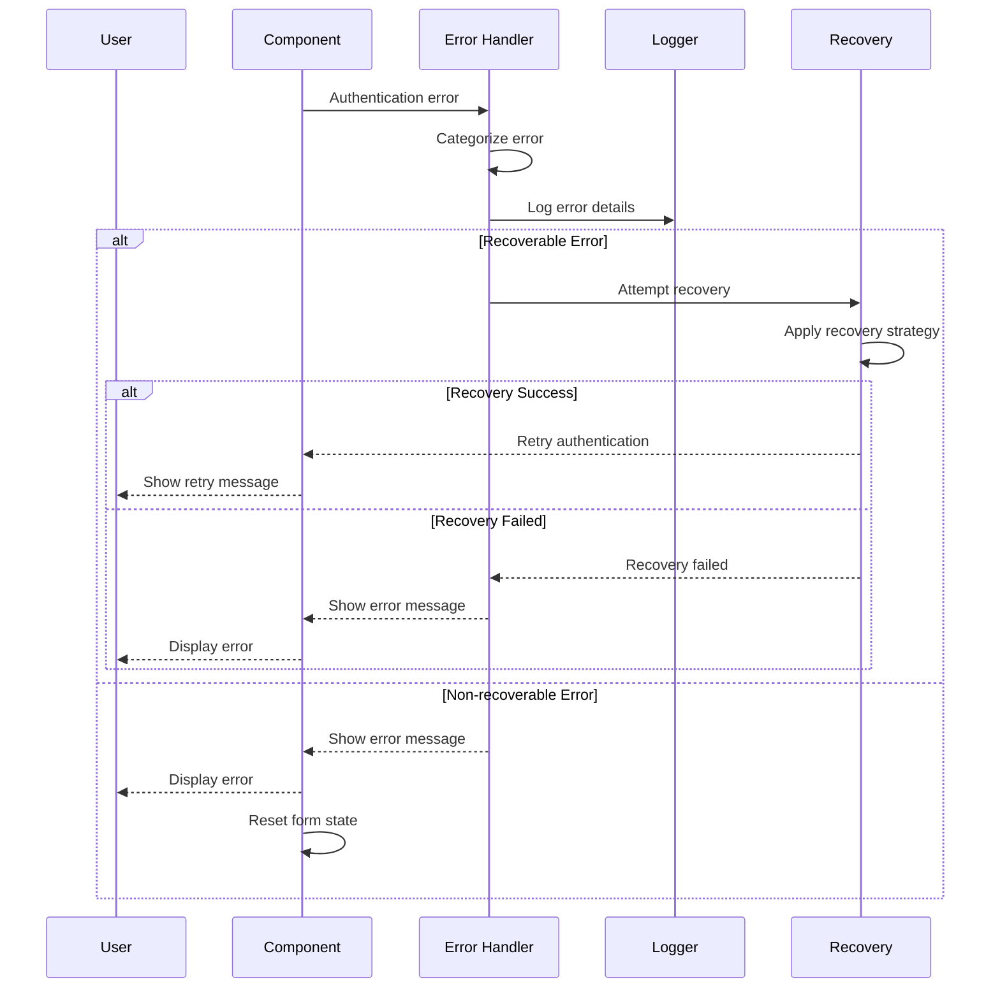
```mermaid
sequenceDiagram
    participant U as User
    participant C as Component
    participant E as Error Handler
    participant L as Logger
    participant R as Recovery

    C->>E: Authentication error
    E->>E: Categorize error
    E->>L: Log error details

    alt Recoverable Error
        E->>R: Attempt recovery
        R->>R: Apply recovery strategy

        alt Recovery Success
            R-->>C: Retry authentication
            C-->>U: Show retry message
        else Recovery Failed
            R-->>E: Recovery failed
            E-->>C: Show error message
            C-->>U: Display error
        end
    else Non-recoverable Error
        E-->>C: Show error message
        C-->>U: Display error
        C->>C: Reset form state
    end
```

## Security Considerations

### Input Validation and Sanitization

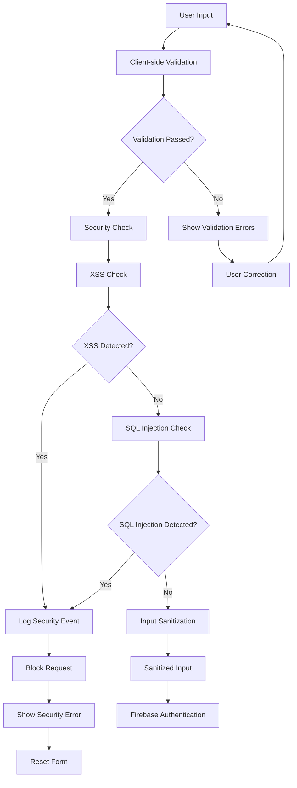
```mermaid
flowchart TD
    UserInput[User Input] --> ClientValidation[Client-side Validation]
    ClientValidation --> ValidationPassed{Validation Passed?}

    ValidationPassed -->|No| ShowErrors[Show Validation Errors]
    ValidationPassed -->|Yes| SecurityCheck[Security Check]

    SecurityCheck --> XSSCheck[XSS Check]
    XSSCheck --> XSSDetected{XSS Detected?}
    XSSDetected -->|Yes| LogSecurityEvent[Log Security Event]
    XSSDetected -->|No| SQLCheck[SQL Injection Check]

    SQLCheck --> SQLDetected{SQL Injection Detected?}
    SQLDetected -->|Yes| LogSecurityEvent
    SQLDetected -->|No| Sanitization[Input Sanitization]

    LogSecurityEvent --> BlockRequest[Block Request]
    BlockRequest --> ShowSecurityError[Show Security Error]

    Sanitization --> SanitizedInput[Sanitized Input]
    SanitizedInput --> FirebaseAuth[Firebase Authentication]

    ShowErrors --> UserCorrection[User Correction]
    UserCorrection --> UserInput

    ShowSecurityError --> FormReset[Reset Form]
```

### Security Event Logging

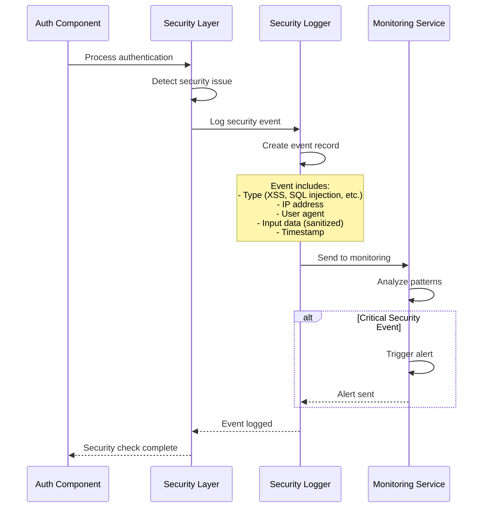
```mermaid
sequenceDiagram
    participant Auth as Auth Component
    participant Security as Security Layer
    participant Logger as Security Logger
    participant Monitor as Monitoring Service

    Auth->>Security: Process authentication
    Security->>Security: Detect security issue
    Security->>Logger: Log security event

    Logger->>Logger: Create event record
    Note over Logger: Event includes:<br/>- Type (XSS, SQL injection, etc.)<br/>- IP address<br/>- User agent<br/>- Input data (sanitized)<br/>- Timestamp

    Logger->>Monitor: Send to monitoring
    Monitor->>Monitor: Analyze patterns

    alt Critical Security Event
        Monitor->>Monitor: Trigger alert
        Monitor-->>Logger: Alert sent
    end

    Logger-->>Security: Event logged
    Security-->>Auth: Security check complete
```

### Rate Limiting for Authentication

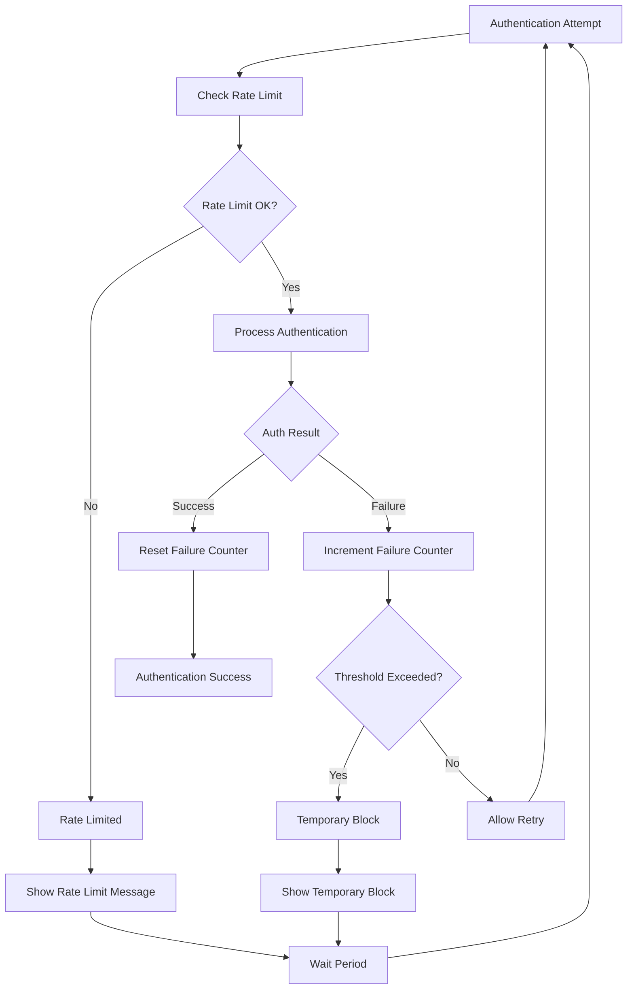
```mermaid
graph TD
    AuthAttempt[Authentication Attempt] --> CheckRateLimit[Check Rate Limit]
    CheckRateLimit --> RateLimitOK{Rate Limit OK?}

    RateLimitOK -->|Yes| ProcessAuth[Process Authentication]
    RateLimitOK -->|No| RateLimited[Rate Limited]

    ProcessAuth --> AuthResult{Auth Result}
    AuthResult -->|Success| ResetCounter[Reset Failure Counter]
    AuthResult -->|Failure| IncrementCounter[Increment Failure Counter]

    IncrementCounter --> CheckThreshold{Threshold Exceeded?}
    CheckThreshold -->|Yes| TempBlock[Temporary Block]
    CheckThreshold -->|No| AllowRetry[Allow Retry]

    RateLimited --> ShowRateLimit[Show Rate Limit Message]
    TempBlock --> ShowTempBlock[Show Temporary Block]

    ResetCounter --> AuthSuccess[Authentication Success]
    AllowRetry --> AuthAttempt

    ShowRateLimit --> WaitPeriod[Wait Period]
    ShowTempBlock --> WaitPeriod
    WaitPeriod --> AuthAttempt
```

This comprehensive authentication flow documentation provides detailed insights into how authentication and user management work in the AI Development Template, including security considerations and error handling patterns.
