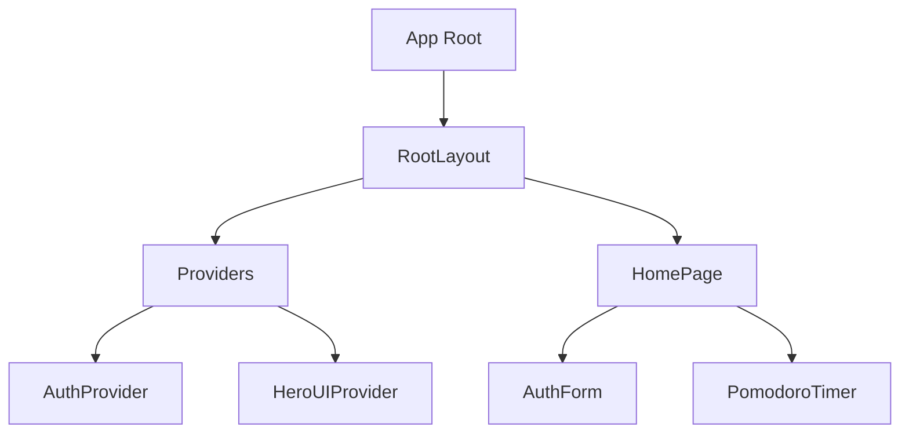

# Component Architecture

## Overview

This document details the component architecture of the AI Development Template, including component relationships, props interfaces, and component patterns. The application follows a component-based architecture using React and TypeScript, with a focus on reusability, maintainability, and type safety.

## Component Hierarchy

The application's component hierarchy is organized as follows:



## Core Components

### RootLayout

**Purpose:** Serves as the root layout for the entire application, providing global styles and metadata.

**Key Features:**

- Sets up font loading with Next.js font optimization
- Provides HTML structure and metadata
- Wraps the application with necessary providers

**Implementation:**

```tsx
// src/app/layout.tsx
export default function RootLayout({
  children,
}: Readonly<{
  children: React.ReactNode;
}>) {
  return (
    <html lang="en" className={`${notoSans.className} ${robotoMono.className}`}>
      <body className="antialiased">
        <Providers>{children}</Providers>
      </body>
    </html>
  );
}
```

### Providers

**Purpose:** Centralizes all context providers in a single component.

**Key Features:**

- Wraps the application with HeroUIProvider for UI theming
- Provides AuthProvider for authentication state management

**Implementation:**

```tsx
// src/app/providers.tsx
export function Providers({ children }: { children: React.ReactNode }) {
  return (
    <HeroUIProvider>
      <AuthProvider>{children}</AuthProvider>
    </HeroUIProvider>
  );
}
```

### HomePage

**Purpose:** Main page component that handles conditional rendering based on authentication state.

**Key Features:**

- Displays loading state during authentication check
- Shows AuthForm for unauthenticated users
- Renders application dashboard for authenticated users
- Provides sign-out functionality

**Implementation:**

```tsx
// src/app/page.tsx
export default function HomePage() {
  const { user, loading, signOut } = useAuth();

  if (loading) {
    return <LoadingState />;
  }

  if (!user) {
    return <AuthForm />;
  }

  return <Dashboard user={user} onSignOut={signOut} />;
}
```

### AuthForm

**Purpose:** Handles user authentication with email/password and Google OAuth.

**Props Interface:**

```tsx
interface AuthFormProps {
  onSuccess?: () => void;
}
```

**Key Features:**

- Toggle between login and registration modes
- Form validation with Zod schemas
- Security checks and input sanitization
- Error handling and display
- Integration with Firebase authentication

**State Management:**

- Form input values (email, password, confirmPassword)
- Loading state during authentication
- Error messages and validation errors
- Login/register mode toggle

**Implementation Pattern:**
Client-side form with controlled inputs, validation, and authentication service integration.

### PomodoroTimer

**Purpose:** Implements a Pomodoro technique timer for productivity.

**Props Interface:**

```tsx
interface PomodoroTimerProps {
  className?: string;
}
```

**Key Features:**

- 25-minute work sessions with 5-minute breaks
- Visual progress indicator with CircularProgress
- Start, pause, and reset functionality
- Session counting and type tracking
- Audio notifications

**State Management:**

- Timer countdown (timeLeft)
- Active state (isActive)
- Session type ('work' or 'break')
- Session count tracking

**Implementation Pattern:**
Client-side component with useEffect for timer logic and useRef for interval management.

## Component Patterns

### 1. Container/Presentation Pattern

The application uses a variation of the Container/Presentation pattern, where:

- **Container Components:** Handle state management, data fetching, and business logic
  - Example: HomePage manages authentication state and conditional rendering
- **Presentation Components:** Focus on rendering UI based on props
  - Example: UI elements within PomodoroTimer that render based on state

### 2. Compound Component Pattern

Some components use the Compound Component pattern to provide a more flexible and expressive API:

- **HeroUI Components:** Card, CardHeader, CardBody form a compound component
- **Benefits:** Improved readability and component composition

### 3. Controlled Component Pattern

Form inputs follow the Controlled Component pattern:

- **Implementation:** Form state is managed in React state, not DOM
- **Example:** AuthForm manages all input values in component state
- **Benefits:** Centralized form state management and validation

### 4. Error Boundary Pattern

Error handling is implemented using try/catch patterns:

- **Implementation:** Authentication operations are wrapped in try/catch blocks
- **Benefits:** Graceful error handling and user feedback

### 5. Conditional Rendering Pattern

Components use conditional rendering based on state:

- **Implementation:** HomePage renders different UIs based on authentication state
- **Benefits:** Dynamic UI based on application state

## Component Communication

### 1. Props Passing

Direct parent-to-child communication through props:

```tsx
<AuthForm onSuccess={handleAuthSuccess} />
```

### 2. Context API

Global state management through React Context:

```tsx
const { user, loading, signOut } = useAuth();
```

### 3. Custom Hooks

Encapsulated logic and state management:

```tsx
const { data, loading, error, fetchFigmaFile } = useFigmaAPI();
```

## Component Styling

The application uses a combination of styling approaches:

### 1. Tailwind CSS

Utility-first CSS framework for rapid UI development:

```tsx
<div className="min-h-screen flex items-center justify-center bg-gray-50">
```

### 2. HeroUI Components

Pre-styled components from the HeroUI library:

```tsx
<Card className="w-full max-w-md mx-auto">
  <CardHeader>...</CardHeader>
  <CardBody>...</CardBody>
</Card>
```

### 3. CSS Modules (where applicable)

Scoped CSS for component-specific styling (not heavily used in current implementation).

## Component Documentation

Components are documented through:

1. **TypeScript Interfaces:** Props and state types
2. **JSDoc Comments:** Function and component descriptions
3. **Storybook Stories:** Interactive component examples

## Performance Considerations

### 1. Memoization

- Use of React.memo for expensive rendering components
- useCallback for stable function references

### 2. Code Splitting

- Dynamic imports for larger components
- Route-based code splitting with Next.js

### 3. Lazy Loading

- Deferred loading of non-critical components
- Progressive enhancement of features

## Accessibility

Components follow accessibility best practices:

1. **Semantic HTML:** Proper use of HTML elements
2. **ARIA Attributes:** Enhanced accessibility where needed
3. **Keyboard Navigation:** Support for keyboard users
4. **Color Contrast:** Sufficient contrast ratios
5. **Focus Management:** Proper focus handling

## Testing Strategy

Components are designed with testability in mind:

1. **Unit Testing:** Individual component testing
2. **Integration Testing:** Component interaction testing
3. **Visual Testing:** Storybook-based visual regression testing
4. **Accessibility Testing:** a11y checks in Storybook

## Conclusion

The component architecture of the AI Development Template follows modern React best practices, with a focus on reusability, type safety, and maintainability. The use of TypeScript interfaces, React hooks, and context providers creates a scalable foundation for building complex applications.

The clear separation between container and presentation components, combined with well-defined props interfaces, makes the codebase easier to understand and extend. The integration with HeroUI components provides a consistent design language while allowing for customization through Tailwind CSS.
