# Data Flow Architecture

## Overview

This document details the data flow architecture of the AI Development Template, including state management, API integration, authentication flows, and data transformation processes. The application uses a combination of React Context for global state, custom hooks for encapsulated logic, and Next.js API routes for backend functionality.

## State Management

The application uses a hybrid state management approach:

### 1. React Context for Global State

React Context is used for global state that needs to be accessed by multiple components:

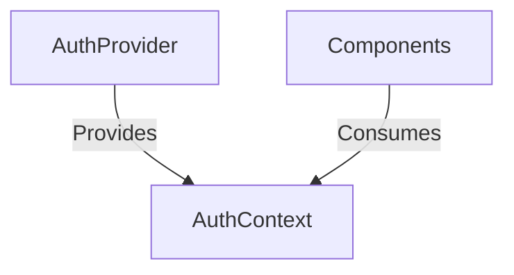

**Implementation:**

```tsx
// src/lib/auth-context.tsx
export function AuthProvider({ children }: AuthProviderProps) {
  const [user, setUser] = useState<User | null>(null);
  const [loading, setLoading] = useState(true);
  const [error, setError] = useState<string | null>(null);

  // Authentication logic...

  const value = {
    user,
    loading,
    error,
    signOut,
  };

  return <AuthContext.Provider value={value}>{children}</AuthContext.Provider>;
}
```

**Usage:**

```tsx
// In components
const { user, loading, signOut } = useAuth();
```

### 2. Component-Level State

Local state is managed within components for UI-specific state:

```tsx
// In PomodoroTimer.tsx
const [timeLeft, setTimeLeft] = useState(25 * 60);
const [isActive, setIsActive] = useState(false);
const [sessionType, setSessionType] = useState<"work" | "break">("work");
const [sessionCount, setSessionCount] = useState(0);
```

### 3. Custom Hooks for Encapsulated State Logic

Custom hooks encapsulate complex state logic and side effects:

```tsx
// In useFigmaAPI.ts
export const useFigmaAPI = (): UseFigmaAPIResult => {
  const [data, setData] = useState<FigmaData | null>(null);
  const [loading, setLoading] = useState(false);
  const [error, setError] = useState<ApiErrorInfo | null>(null);

  // API logic...

  return {
    data,
    loading,
    error,
    fetchFigmaFile,
    clearError,
    clearData,
    retry,
  };
};
```

## Data Flow Patterns

### 1. Unidirectional Data Flow

The application follows a unidirectional data flow pattern:

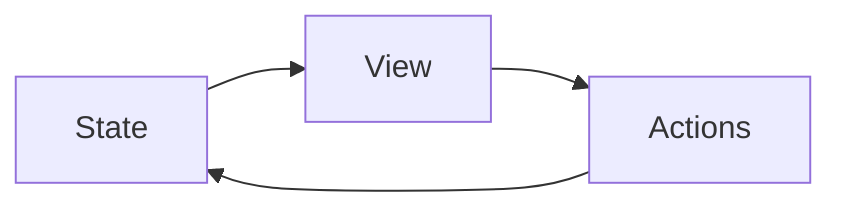

1. **State:** Stored in React Context, component state, or custom hooks
2. **View:** React components render based on current state
3. **Actions:** User interactions or system events trigger state updates
4. **State Updates:** State is updated, triggering re-renders

### 2. Request-Response Pattern

API interactions follow a request-response pattern:

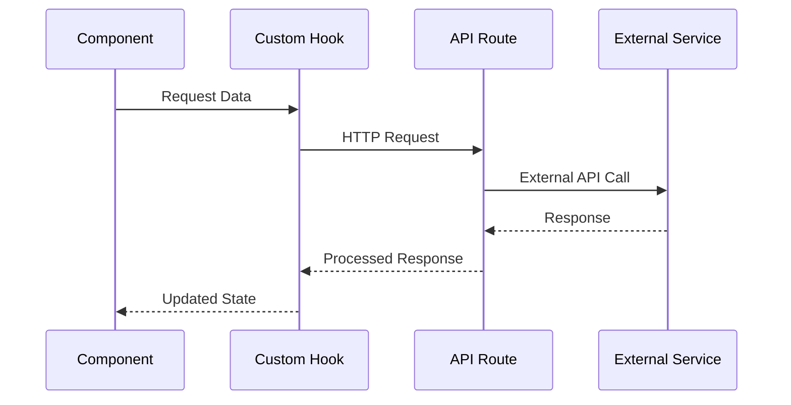

## Authentication Flow

The authentication flow manages user identity and access:

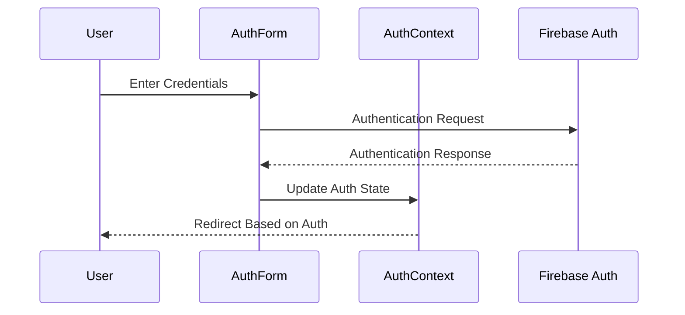

**Key Steps:**

1. **User Input:** User enters credentials in AuthForm
2. **Validation:** Input is validated and sanitized
3. **Authentication:** Credentials are sent to Firebase Auth
4. **State Update:** AuthContext state is updated with user information
5. **UI Update:** UI changes based on authentication state

## API Integration Flow

The application integrates with external APIs through a structured flow:

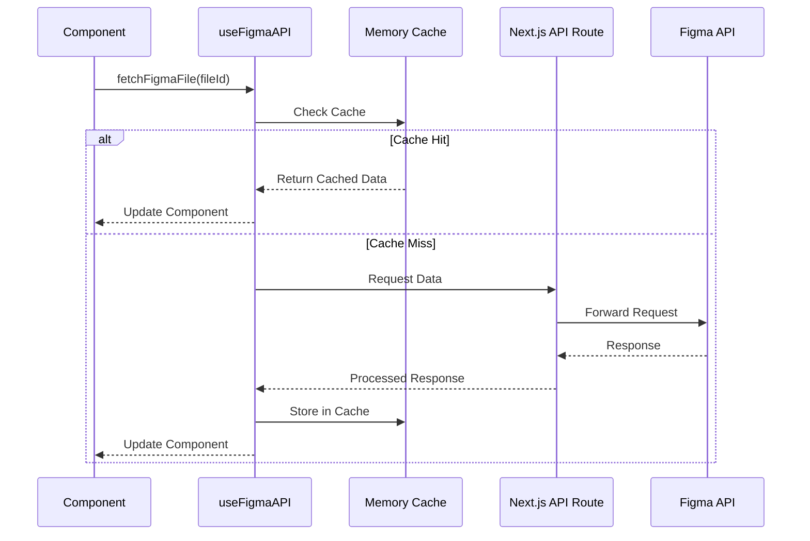

**Key Features:**

1. **Caching:** In-memory caching with TTL
2. **Error Handling:** Comprehensive error handling and retry logic
3. **Rate Limiting:** Respects API rate limits
4. **Data Transformation:** Sanitizes and transforms API responses

## Data Transformation

Data undergoes several transformation stages:

### 1. Input Validation and Sanitization

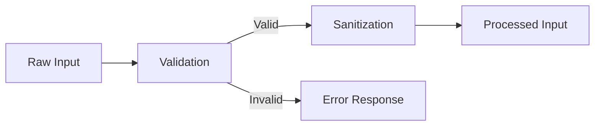

**Implementation:**

```typescript
// Input validation and sanitization
const validationResult = validators.figmaFileRequest({ fileId });
if (!validationResult.success) {
  // Handle validation error
}

const securityCheck = security.api.validateAndSanitize(fileId);
if (!securityCheck.isValid) {
  // Handle security error
}

const sanitizedFileId = securityCheck.sanitized!;
```

### 2. Response Processing

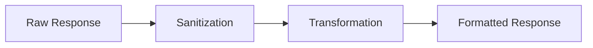

**Implementation:**

```typescript
// Response sanitization and transformation
const sanitizedResponse = {
  name: security.xss.filterXSS(response.data.name || "Untitled"),
  lastModified: response.data.lastModified || new Date().toISOString(),
  version: security.xss.filterXSS(response.data.version || "1.0"),
  document: response.data.document
    ? {
        id: security.xss.filterXSS(response.data.document.id || ""),
        name: security.xss.filterXSS(response.data.document.name || ""),
        type: security.xss.filterXSS(response.data.document.type || "DOCUMENT"),
      }
    : undefined,
  metadata: {
    timestamp: response.timestamp,
    requestId,
    status: "success",
  },
};
```

## Security Data Flow

Security measures are integrated throughout the data flow:

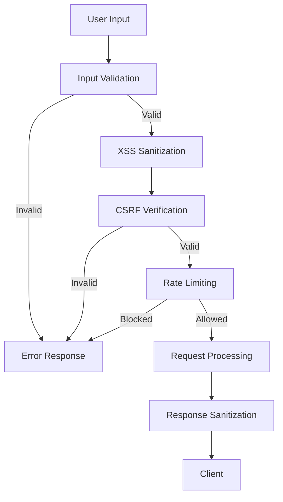

**Key Security Measures:**

1. **Input Validation:** Schema-based validation with Zod
2. **XSS Protection:** Input and output sanitization with DOMPurify
3. **CSRF Protection:** Token verification for state-changing operations
4. **Rate Limiting:** Request throttling to prevent abuse
5. **Response Sanitization:** Ensuring safe data is returned to the client

## Environment Configuration Flow

Environment variables are validated and processed:

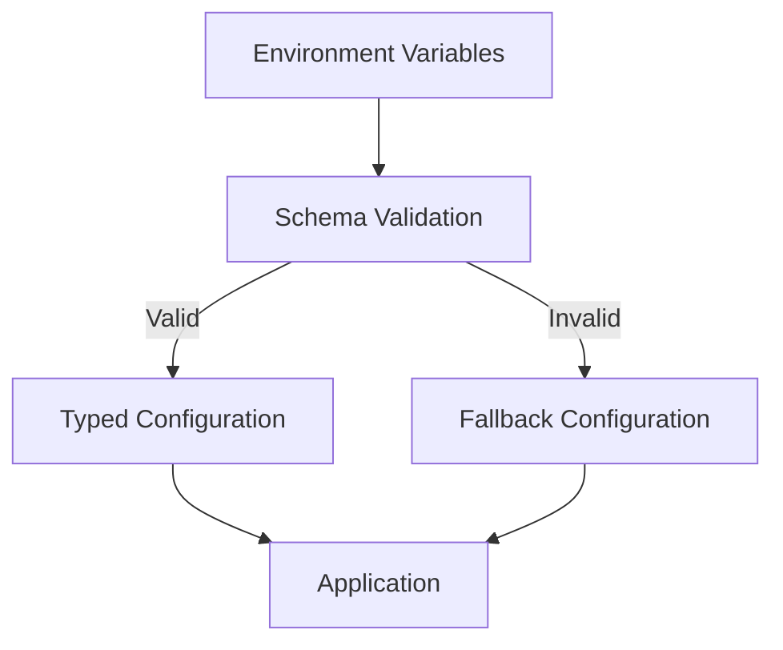

**Implementation:**

```typescript
// Environment validation
const firebaseConfigResult = validateFirebaseConfig();

if (firebaseConfigResult.success) {
  try {
    app = initializeApp(firebaseConfigResult.config);
  } catch (error) {
    if (envUtils.isDevelopment()) {
      console.warn("Firebase initialization failed:", error);
    }
    app = null;
  }
}
```

## Error Handling Flow

Errors are handled through a structured flow:

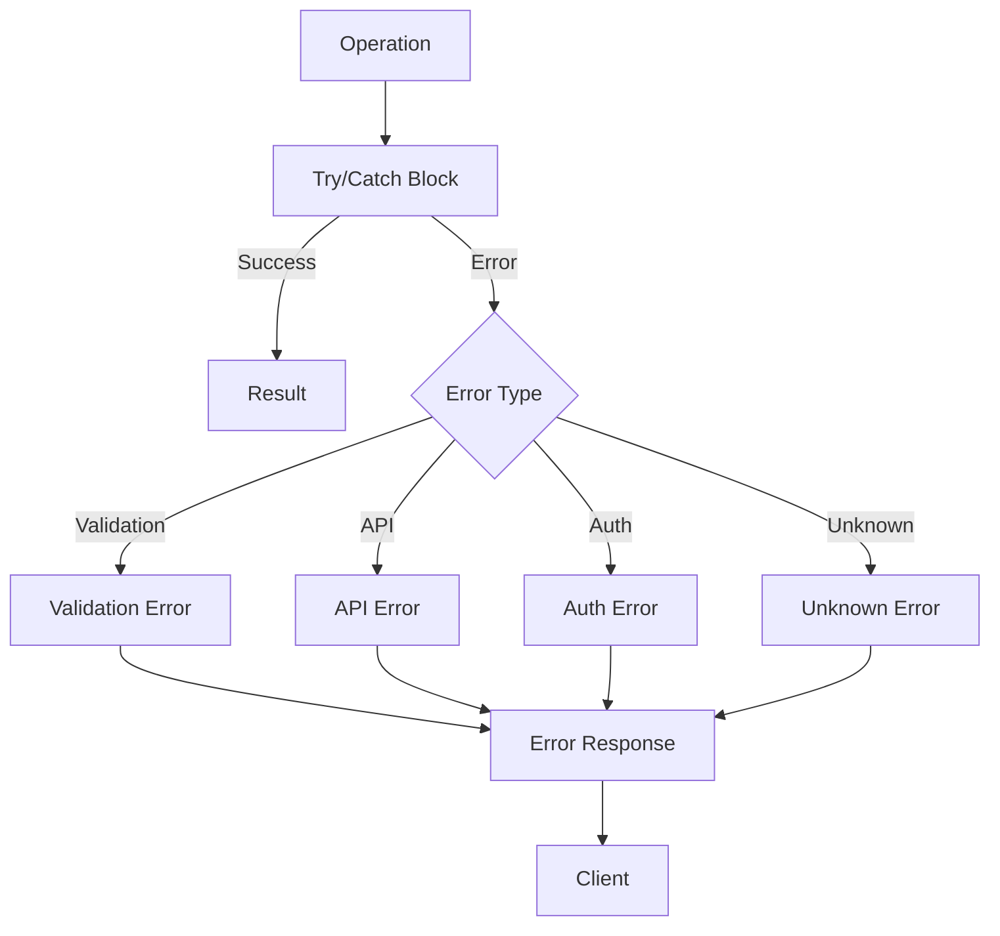

**Implementation:**

```typescript
try {
  // Operation
} catch (error) {
  // Error handling
  let errorInfo: ApiErrorInfo;

  if (error && typeof error === "object" && "code" in error) {
    // API error
    const apiError = error as ApiError;
    errorInfo = {
      code: apiError.code,
      message: apiError.message,
      details: apiError.details,
      timestamp: apiError.timestamp,
      ...(apiError.requestId && { requestId: apiError.requestId }),
    };
  } else if (error instanceof Error) {
    // Standard error
    errorInfo = {
      code: "CLIENT_ERROR",
      message: error.message,
      timestamp: new Date().toISOString(),
    };
  } else {
    // Unknown error
    errorInfo = {
      code: "UNKNOWN_ERROR",
      message: "An unknown error occurred",
      timestamp: new Date().toISOString(),
    };
  }

  setError(errorInfo);
}
```

## Data Persistence

The application uses several data persistence mechanisms:

### 1. Firebase Firestore

For server-side persistent data storage:

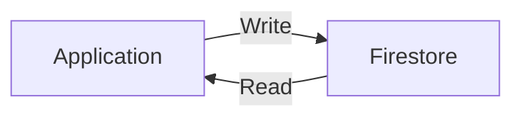

### 2. Firebase Authentication

For user identity and session management:

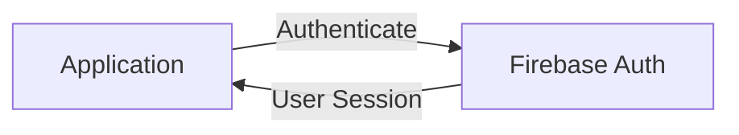

### 3. In-Memory Cache

For temporary data storage and performance optimization:

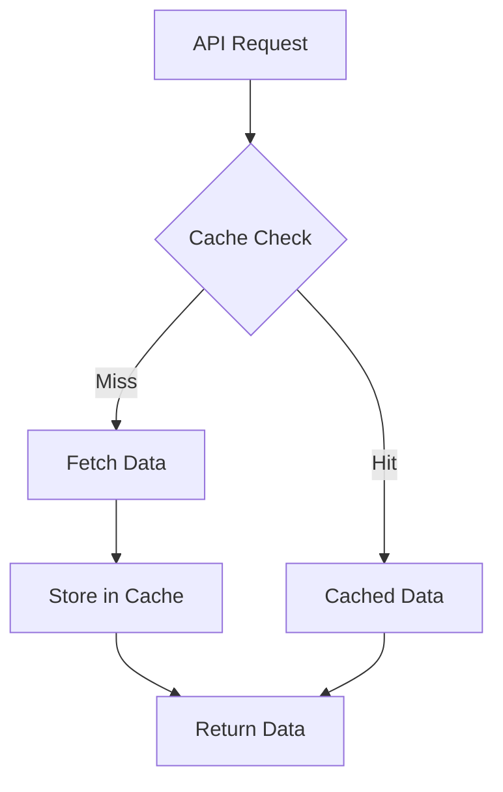

**Implementation:**

```typescript
// Cache implementation
const globalCache = new Map<string, CacheEntry>();
const CACHE_DURATION = 5 * 60 * 1000; // 5 minutes

// Cache retrieval
const getCachedData = useCallback((fileId: string): FigmaData | null => {
  const cacheKey = `figma_file_${fileId}`;
  const cached = globalCache.get(cacheKey);

  if (cached && Date.now() < cached.expiry) {
    return cached.data;
  }

  return null;
}, []);

// Cache storage
const setCachedData = useCallback((fileId: string, data: FigmaData): void => {
  const cacheKey = `figma_file_${fileId}`;
  const now = Date.now();

  globalCache.set(cacheKey, {
    data,
    timestamp: now,
    expiry: now + CACHE_DURATION,
  });
}, []);
```

## Conclusion

The data flow architecture of the AI Development Template provides a robust foundation for managing application state, API integration, and data transformation. The combination of React Context for global state, component-level state for UI concerns, and custom hooks for encapsulated logic creates a maintainable and scalable architecture.

The structured approach to data validation, transformation, and error handling ensures that data flows through the application in a predictable and secure manner. The integration with Firebase services provides reliable authentication and data persistence capabilities, while the custom caching mechanisms optimize performance for API-intensive operations.
