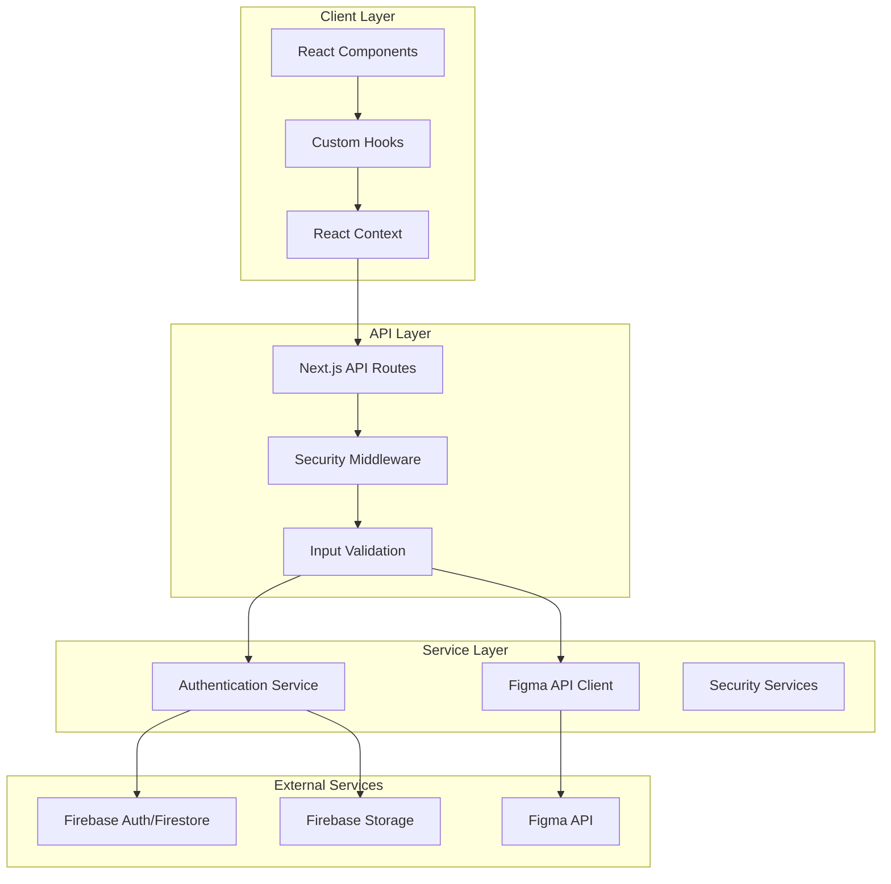
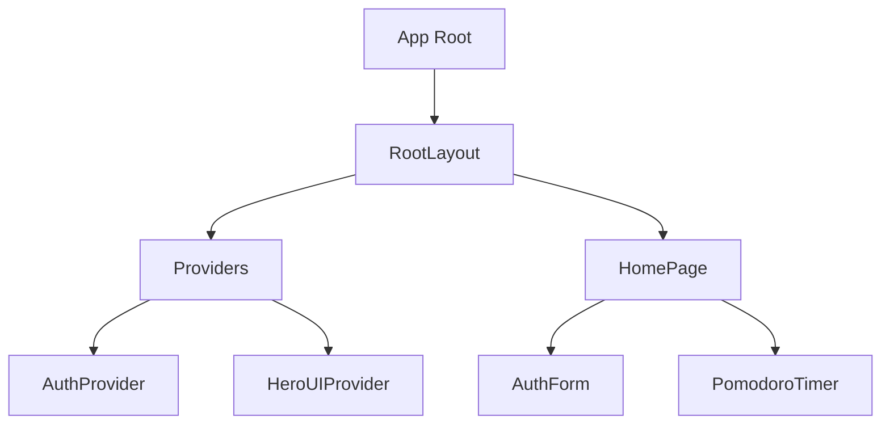
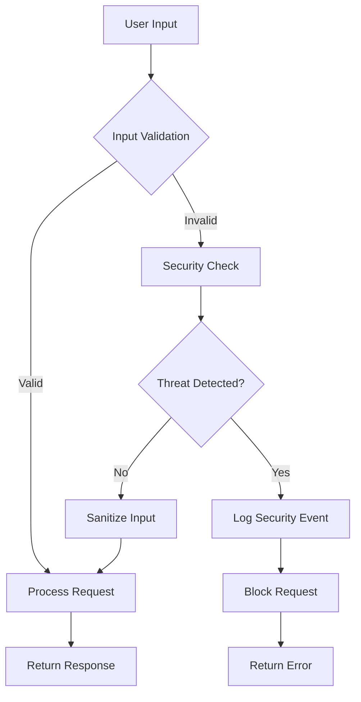
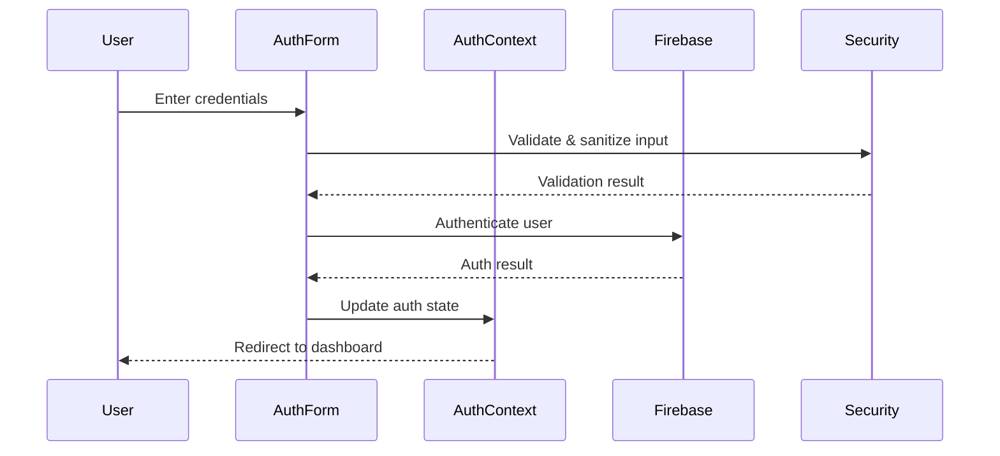
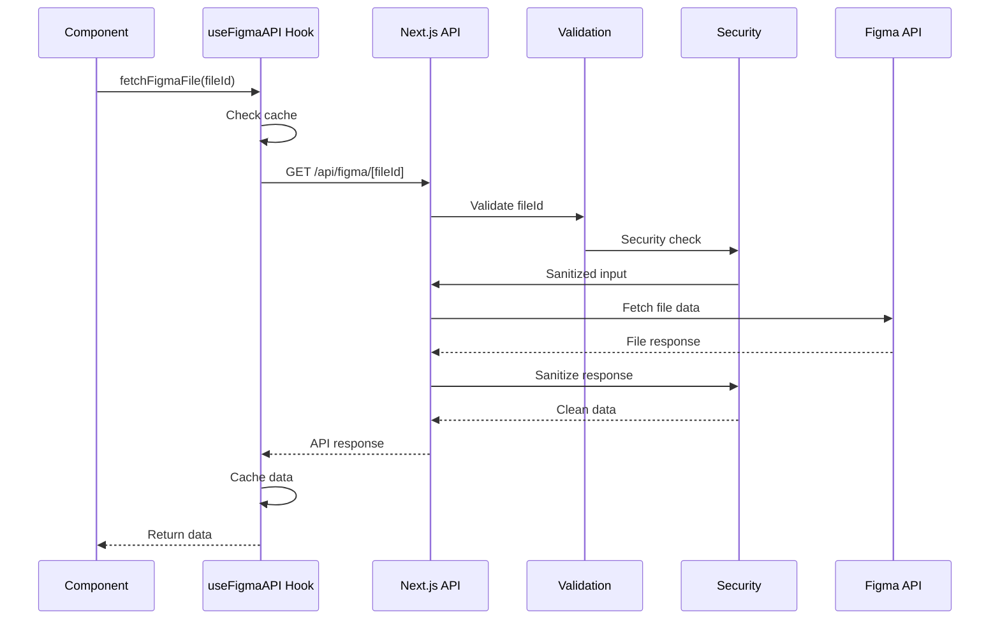

# System Architecture Overview

## Introduction

This document provides a comprehensive overview of the AI Development Template architecture, including the technology stack, component hierarchy, design patterns, and architectural decisions. The system is designed as a secure, scalable template for AI-powered service development with modern frontend technologies and robust security measures.

## Technology Stack

### Frontend Technologies

| Technology    | Version | Purpose                                                                        |
| ------------- | ------- | ------------------------------------------------------------------------------ |
| Next.js       | 15.3.5  | React framework with server-side rendering, API routes, and file-based routing |
| React         | 19.1.0  | UI component library for building interactive user interfaces                  |
| TypeScript    | 5.1.6   | Static type checking for improved code quality and developer experience        |
| HeroUI        | 2.8.1   | UI component library providing pre-styled components                           |
| Tailwind CSS  | 3.4.1   | Utility-first CSS framework for rapid UI development                           |
| Framer Motion | 12.23.3 | Animation library for React components                                         |
| Storybook     | 8.6.14  | UI component development and documentation environment                         |

### Backend & Services

| Technology         | Version | Purpose                                                  |
| ------------------ | ------- | -------------------------------------------------------- |
| Firebase           | 11.10.0 | Authentication, Firestore database, and storage services |
| Next.js API Routes | 15.3.5  | Serverless API endpoints for backend functionality       |
| Axios              | 1.9.0   | HTTP client for API requests                             |
| Zod                | 3.22.4  | Schema validation library for runtime type checking      |

### Security & Utilities

| Technology       | Version  | Purpose                                                   |
| ---------------- | -------- | --------------------------------------------------------- |
| DOMPurify        | 3.2.6    | XSS protection through HTML sanitization                  |
| Validator        | 13.15.15 | String validation and sanitization                        |
| Crypto (Node.js) | Built-in | Cryptographic functionality for security features         |
| ESLint           | 8.57.1   | Static code analysis for identifying problematic patterns |
| Semgrep          | N/A      | Advanced static analysis security tool                    |

### Development & Testing

| Technology | Version | Purpose                                  |
| ---------- | ------- | ---------------------------------------- |
| Playwright | 1.54.1  | End-to-end testing framework             |
| TypeScript | 5.1.6   | Type checking and developer tooling      |
| ESLint     | 8.57.1  | Code quality and style enforcement       |
| Storybook  | 8.6.14  | Component development and visual testing |

## System Architecture

The application follows a modern full-stack architecture with clear separation of concerns:



## Component Hierarchy

The application is structured with the following component hierarchy:



## Directory Structure

```
src/
├── app/                    # Next.js App Router components and routes
│   ├── api/                # API routes (App Router)
│   │   └── figma/          # Figma API integration endpoints
│   ├── layout.tsx          # Root layout component
│   ├── page.tsx            # Home page component
│   └── providers.tsx       # Context providers wrapper
├── components/             # Reusable React components
│   ├── AuthForm.tsx        # Authentication form component
│   └── PomodoroTimer.tsx   # Pomodoro timer component
├── hooks/                  # Custom React hooks
│   └── useFigmaAPI.ts      # Hook for Figma API integration
├── lib/                    # Utility libraries and services
│   ├── api-client.ts       # API client utilities
│   ├── auth-context.tsx    # Authentication context provider
│   ├── cors-config.ts      # CORS configuration
│   ├── crypto.ts           # Cryptography utilities
│   ├── csrf.ts             # CSRF protection
│   ├── env.ts              # Environment variable management
│   ├── firebase.ts         # Firebase configuration and services
│   ├── secure-storage.ts   # Secure storage utilities
│   ├── security.ts         # Security utilities
│   └── validation.ts       # Input validation utilities
├── pages/                  # Next.js Pages Router (legacy)
│   └── api/                # API routes (Pages Router)
│       └── figma-mcp.tsx   # Figma MCP API endpoint
├── stories/                # Storybook stories
└── types/                  # TypeScript type definitions
```

## Key Design Patterns

### 1. Provider Pattern

The application uses the Provider Pattern through React Context to manage global state and provide services to components throughout the application tree.

**Implementation:**

- `AuthProvider`: Manages authentication state and provides auth-related functions
- `HeroUIProvider`: Provides theme and styling context for UI components

**Benefits:**

- Avoids prop drilling through component hierarchy
- Centralizes state management
- Simplifies component testing and composition

### 2. Custom Hook Pattern

Custom hooks are used to encapsulate and reuse stateful logic across components.

**Implementation:**

- `useFigmaAPI`: Manages Figma API requests, caching, and error handling

**Benefits:**

- Separates concerns between UI and business logic
- Promotes code reuse
- Simplifies testing of business logic

### 3. Repository Pattern

The application implements a simplified Repository Pattern for data access abstraction.

**Implementation:**

- Firebase service wrappers that abstract the underlying data storage
- API client utilities that provide a consistent interface for external services

**Benefits:**

- Decouples business logic from data access implementation
- Simplifies testing through mock repositories
- Centralizes data access logic

### 4. Middleware Pattern

Security and validation middleware are used to process requests before they reach handlers.

**Implementation:**

- Input validation middleware using Zod schemas
- Security middleware for XSS protection, CSRF, and other security measures

**Benefits:**

- Centralizes cross-cutting concerns
- Ensures consistent security and validation
- Simplifies handler logic

### 5. Module Pattern

The application uses the Module Pattern to organize related functionality into cohesive units.

**Implementation:**

- Security module with various security-related utilities
- Validation module with schema definitions and validation functions

**Benefits:**

- Improves code organization and discoverability
- Encapsulates related functionality
- Provides clear public interfaces

## Security Architecture

The application implements a multi-layered security architecture:



### Security Layers

1. **Input Validation Layer:**

   - Zod schema validation
   - Custom validators for specific formats
   - Type-safe validation results

2. **XSS Protection Layer:**

   - DOMPurify sanitization
   - HTML escaping
   - Script tag removal
   - Event handler filtering

3. **SQL Injection Protection:**

   - Pattern detection
   - Input sanitization
   - Suspicious input flagging

4. **CSRF Protection:**

   - Token generation and validation
   - Timing attack prevention

5. **API Security:**
   - Rate limiting
   - Security headers
   - Request/response sanitization

## Data Flow

### Authentication Flow



### API Request Flow



## Key Architectural Decisions

### 1. Next.js App Router & Pages Router Hybrid

**Decision:** Use both Next.js App Router (new) and Pages Router (legacy) simultaneously during migration.

**Rationale:**

- Allows gradual migration from Pages Router to App Router
- Maintains backward compatibility with existing code
- Leverages new features of App Router where appropriate

**Trade-offs:**

- Increased complexity with two routing systems
- Potential for confusion in routing precedence
- Temporary solution until full migration to App Router

### 2. Firebase for Authentication & Storage

**Decision:** Use Firebase for authentication, database, and storage services.

**Rationale:**

- Provides a complete backend solution with minimal setup
- Strong security features and integration with Google services
- Scalable and reliable infrastructure

**Trade-offs:**

- Vendor lock-in to Google Cloud ecosystem
- Limited customization compared to self-hosted solutions
- Potential cost implications at scale

### 3. Multi-Layer Security Approach

**Decision:** Implement multiple layers of security throughout the application.

**Rationale:**

- Defense in depth strategy protects against various attack vectors
- Centralized security utilities ensure consistent implementation
- Comprehensive logging and monitoring of security events

**Trade-offs:**

- Increased complexity in request processing
- Potential performance impact from multiple validation layers
- Additional development and maintenance overhead

### 4. Zod for Runtime Type Validation

**Decision:** Use Zod for schema validation instead of alternatives like Joi or Yup.

**Rationale:**

- TypeScript integration with automatic type inference
- Composable schema definitions
- Comprehensive validation capabilities

**Trade-offs:**

- Learning curve for developers unfamiliar with Zod
- Bundle size considerations
- Runtime performance impact

### 5. HeroUI Component Library

**Decision:** Use HeroUI as the primary UI component library.

**Rationale:**

- Consistent design language across the application
- Pre-built accessible components reduce development time
- Integration with Tailwind CSS for customization

**Trade-offs:**

- Dependency on external library maintenance
- Potential styling conflicts with custom components
- Learning curve for developers new to the library

## Conclusion

The AI Development Template architecture provides a robust foundation for building secure, scalable AI-powered applications. The combination of modern frontend technologies, serverless backend capabilities, and comprehensive security measures creates a development environment that prioritizes developer experience, code quality, and application security.

The modular design and clear separation of concerns allow for easy extension and customization, while the use of TypeScript throughout the codebase ensures type safety and improved developer productivity. The multi-layered security approach protects against common web vulnerabilities and provides a secure foundation for handling sensitive user data.
