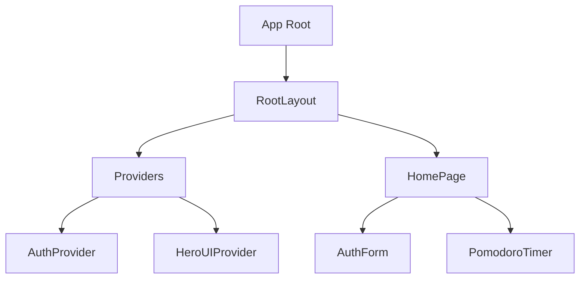
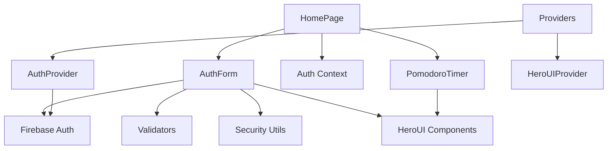

# Component Catalog

## Overview

This document provides a comprehensive catalog of all React components in the AI Development Template, including their props interfaces, usage patterns, and relationships with other components.

## Core Components

### AuthForm

**File Path:** `src/components/AuthForm.tsx`

**Props Interface:**

```typescript
interface AuthFormProps {
  onSuccess?: () => void;
}
```

**Description:**
The AuthForm component handles user authentication, providing both email/password and Google OAuth login options. It includes form validation, security checks, and error handling.

**State Management:**

- `isLogin`: Toggle between login and registration modes
- `email`, `password`, `confirmPassword`: Form input values
- `loading`: Loading state during authentication
- `error`: Error message display
- `validationErrors`: Form validation errors

**Dependencies:**

- HeroUI components: Button, Input, Card, CardBody, CardHeader, Divider
- Firebase authentication functions: registerWithEmail, loginWithEmail, signInWithGoogle
- Validation utilities: validators
- Security utilities: security.api.validateAndSanitize, security.xss.filterXSS

**Usage Example:**

```tsx
import AuthForm from '../components/AuthForm';

// Basic usage
<AuthForm />

// With success callback
<AuthForm onSuccess={() => console.log('Authentication successful')} />
```

**Component Diagram:**

```
┌─────────────────────────────────────┐
│ AuthForm                            │
├─────────────────────────────────────┤
│ Props:                              │
│ - onSuccess?: () => void            │
├─────────────────────────────────────┤
│ State:                              │
│ - isLogin: boolean                  │
│ - email: string                     │
│ - password: string                  │
│ - confirmPassword: string           │
│ - loading: boolean                  │
│ - error: string                     │
│ - validationErrors: ValidationError[]│
├─────────────────────────────────────┤
│ Methods:                            │
│ - handleEmailAuth()                 │
│ - handleGoogleAuth()                │
│ - getFieldError()                   │
└─────────────────────────────────────┘
```

### PomodoroTimer

**File Path:** `src/components/PomodoroTimer.tsx`

**Props Interface:**

```typescript
interface PomodoroTimerProps {
  className?: string;
}
```

**Description:**
The PomodoroTimer component implements a Pomodoro technique timer with work and break sessions. It includes visual progress tracking, audio notifications, and session counting.

**State Management:**

- `timeLeft`: Remaining time in seconds
- `isActive`: Timer active state
- `sessionType`: Current session type ('work' or 'break')
- `sessionCount`: Number of completed sessions
- `audioRef`: Reference to audio element for notifications
- `intervalRef`: Reference to timer interval

**Dependencies:**

- HeroUI components: Button, Card, CardBody, CardHeader, Chip, CircularProgress
- Lucide React icons: Play, Pause, RotateCcw
- React hooks: useState, useEffect, useRef, useCallback

**Usage Example:**

```tsx
import PomodoroTimer from '../components/PomodoroTimer';

// Basic usage
<PomodoroTimer />

// With custom class
<PomodoroTimer className="my-custom-class" />
```

**Component Diagram:**

```
┌─────────────────────────────────────┐
│ PomodoroTimer                       │
├─────────────────────────────────────┤
│ Props:                              │
│ - className?: string                │
├─────────────────────────────────────┤
│ State:                              │
│ - timeLeft: number                  │
│ - isActive: boolean                 │
│ - sessionType: 'work' | 'break'     │
│ - sessionCount: number              │
├─────────────────────────────────────┤
│ Refs:                               │
│ - audioRef: HTMLAudioElement        │
│ - intervalRef: NodeJS.Timeout       │
├─────────────────────────────────────┤
│ Methods:                            │
│ - handleSessionComplete()           │
│ - handleStartPause()                │
│ - handleReset()                     │
│ - formatTime()                      │
└─────────────────────────────────────┘
```

### RootLayout

**File Path:** `src/app/layout.tsx`

**Props Interface:**

```typescript
interface RootLayoutProps {
  children: React.ReactNode;
}
```

**Description:**
The RootLayout component serves as the root layout for the entire application, providing global styles, fonts, and metadata. It wraps the application with the Providers component.

**Dependencies:**

- Next.js components and utilities: Metadata
- Next.js font optimization: Noto_Sans_JP, Roboto_Mono
- Custom components: Providers

**Usage Example:**

```tsx
// Used automatically by Next.js App Router
// src/app/layout.tsx
export default function RootLayout({ children }: RootLayoutProps) {
  return (
    <html lang="en" className={`${notoSans.className} ${robotoMono.className}`}>
      <body className="antialiased">
        <Providers>{children}</Providers>
      </body>
    </html>
  );
}
```

**Component Diagram:**

```
┌─────────────────────────────────────┐
│ RootLayout                          │
├─────────────────────────────────────┤
│ Props:                              │
│ - children: React.ReactNode         │
├─────────────────────────────────────┤
│ Metadata:                           │
│ - title: string                     │
│ - description: string               │
└─────────────────────────────────────┘
```

### HomePage

**File Path:** `src/app/page.tsx`

**Description:**
The HomePage component is the main page of the application. It conditionally renders different UI based on authentication state: loading indicator during authentication check, AuthForm for unauthenticated users, and the main dashboard with PomodoroTimer for authenticated users.

**State Management:**

- Uses AuthContext for authentication state: user, loading, signOut

**Dependencies:**

- Custom hooks: useAuth
- Components: AuthForm, PomodoroTimer
- HeroUI components: Button

**Usage Example:**

```tsx
// Used automatically by Next.js App Router
// src/app/page.tsx
export default function HomePage() {
  // Component implementation
}
```

**Component Diagram:**

```
┌─────────────────────────────────────┐
│ HomePage                            │
├─────────────────────────────────────┤
│ Context:                            │
│ - AuthContext                       │
├─────────────────────────────────────┤
│ Conditional Rendering:              │
│ - Loading State                     │
│ - AuthForm (unauthenticated)        │
│ - Dashboard (authenticated)         │
└─────────────────────────────────────┘
```

### Providers

**File Path:** `src/app/providers.tsx`

**Props Interface:**

```typescript
interface ProvidersProps {
  children: React.ReactNode;
}
```

**Description:**
The Providers component centralizes all context providers in a single component. It wraps the application with HeroUIProvider for UI theming and AuthProvider for authentication state management.

**Dependencies:**

- HeroUI components: HeroUIProvider
- Custom providers: AuthProvider

**Usage Example:**

```tsx
import { Providers } from "./providers";

<Providers>
  <YourComponent />
</Providers>;
```

**Component Diagram:**

```
┌─────────────────────────────────────┐
│ Providers                           │
├─────────────────────────────────────┤
│ Props:                              │
│ - children: React.ReactNode         │
├─────────────────────────────────────┤
│ Providers:                          │
│ - HeroUIProvider                    │
│ - AuthProvider                      │
└─────────────────────────────────────┘
```

## Context Providers

### AuthProvider

**File Path:** `src/lib/auth-context.tsx`

**Props Interface:**

```typescript
interface AuthProviderProps {
  children: ReactNode;
}
```

**Context Interface:**

```typescript
interface AuthContextType {
  user: User | null;
  loading: boolean;
  error: string | null;
  signOut: () => Promise<void>;
}
```

**Description:**
The AuthProvider component manages authentication state using React Context. It provides user information, loading state, error messages, and sign-out functionality to all child components.

**State Management:**

- `user`: Current authenticated user or null
- `loading`: Authentication loading state
- `error`: Authentication error message

**Dependencies:**

- React hooks: createContext, useContext, useEffect, useState
- Firebase authentication: onAuthStateChanged, firebaseSignOut

**Usage Example:**

```tsx
import { AuthProvider } from "../lib/auth-context";

<AuthProvider>
  <YourComponent />
</AuthProvider>;

// In child components
const { user, loading, error, signOut } = useAuth();
```

**Component Diagram:**

```
┌─────────────────────────────────────┐
│ AuthProvider                        │
├─────────────────────────────────────┤
│ Props:                              │
│ - children: ReactNode               │
├─────────────────────────────────────┤
│ State:                              │
│ - user: User | null                 │
│ - loading: boolean                  │
│ - error: string | null              │
├─────────────────────────────────────┤
│ Methods:                            │
│ - signOut()                         │
└─────────────────────────────────────┘
```

## Custom Hooks

### useAuth

**File Path:** `src/lib/auth-context.tsx`

**Return Type:**

```typescript
interface AuthContextType {
  user: User | null;
  loading: boolean;
  error: string | null;
  signOut: () => Promise<void>;
}
```

**Description:**
The useAuth hook provides access to the authentication context. It returns the current user, loading state, error message, and sign-out function.

**Dependencies:**

- React hooks: useContext
- Custom context: AuthContext

**Usage Example:**

```tsx
import { useAuth } from "../lib/auth-context";

function MyComponent() {
  const { user, loading, error, signOut } = useAuth();

  // Use authentication state
}
```

### useFigmaAPI

**File Path:** `src/hooks/useFigmaAPI.ts`

**Return Type:**

```typescript
interface UseFigmaAPIResult {
  data: FigmaData | null;
  loading: boolean;
  error: ApiErrorInfo | null;
  rateLimitInfo: {
    remaining: number;
    reset: number;
    limit: number;
  } | null;
  fetchFigmaFile: (fileId: string, options?: FetchOptions) => Promise<void>;
  clearError: () => void;
  clearData: () => void;
  retry: () => Promise<void>;
}
```

**Description:**
The useFigmaAPI hook manages Figma API requests, caching, and error handling. It provides functions for fetching Figma file data, clearing errors and data, and retrying failed requests.

**State Management:**

- `data`: Figma API response data
- `loading`: Request loading state
- `error`: Error information
- `rateLimitInfo`: API rate limit information

**Dependencies:**

- React hooks: useState, useCallback, useRef, useEffect
- API client: createApiClient

**Usage Example:**

```tsx
import { useFigmaAPI } from "../hooks/useFigmaAPI";

function MyComponent() {
  const { data, loading, error, fetchFigmaFile } = useFigmaAPI();

  useEffect(() => {
    fetchFigmaFile("figmaFileId");
  }, [fetchFigmaFile]);

  // Use Figma data
}
```

## Component Relationships

### Component Hierarchy



### Component Dependencies



## Component Patterns

### 1. Container/Presentation Pattern

The application uses a variation of the Container/Presentation pattern:

**Container Components:**

- HomePage: Manages authentication state and conditional rendering
- AuthProvider: Manages authentication state and provides it to child components

**Presentation Components:**

- AuthForm: Renders authentication UI based on props and internal state
- PomodoroTimer: Renders timer UI based on internal state

### 2. Provider Pattern

The application uses the Provider Pattern for global state management:

**Implementation:**

- AuthProvider: Provides authentication state through React Context
- HeroUIProvider: Provides UI theming through React Context

**Benefits:**

- Avoids prop drilling
- Centralizes state management
- Makes state available throughout the component tree

### 3. Custom Hook Pattern

The application uses custom hooks to encapsulate and reuse logic:

**Implementation:**

- useAuth: Provides access to authentication context
- useFigmaAPI: Manages Figma API requests, caching, and error handling

**Benefits:**

- Separates concerns
- Promotes code reuse
- Simplifies component logic

### 4. Conditional Rendering Pattern

Components use conditional rendering based on state:

**Implementation:**

```tsx
// In HomePage.tsx
if (loading) {
  return <LoadingState />;
}

if (!user) {
  return <AuthForm />;
}

return <Dashboard />;
```

**Benefits:**

- Adapts UI based on application state
- Improves user experience
- Simplifies component logic

### 5. Error Boundary Pattern

The application uses try/catch blocks for error handling:

**Implementation:**

```tsx
try {
  // Operation
} catch (error) {
  // Handle error
}
```

**Benefits:**

- Graceful error handling
- Improved user experience
- Prevents application crashes

## Styling Approaches

### 1. Tailwind CSS

The application uses Tailwind CSS for utility-first styling:

**Example:**

```tsx
<div className="min-h-screen flex items-center justify-center bg-gray-50">
```

### 2. HeroUI Components

The application uses pre-styled components from the HeroUI library:

**Example:**

```tsx
<Card className="w-full max-w-md mx-auto">
  <CardHeader>...</CardHeader>
  <CardBody>...</CardBody>
</Card>
```

### 3. Conditional Styling

The application uses conditional styling based on component state:

**Example:**

```tsx
<Chip
  color={
    isActive ? (sessionType === "work" ? "success" : "primary") : "default"
  }
  variant="flat"
>
  {isActive ? "Active" : "Paused"}
</Chip>
```

## Conclusion

The component architecture of the AI Development Template follows modern React best practices, with a focus on reusability, type safety, and maintainability. The use of TypeScript interfaces, React hooks, and context providers creates a scalable foundation for building complex applications.

The clear separation between container and presentation components, combined with well-defined props interfaces, makes the codebase easier to understand and extend. The integration with HeroUI components provides a consistent design language while allowing for customization through Tailwind CSS.
