# AI Development Template Documentation

Welcome to the comprehensive documentation for the AI Development Template project. This index provides a complete overview of all available documentation with cross-references to help you navigate the project efficiently.

## Documentation Map

```mermaid
graph TD
    A[Documentation Index] --> B[Project Overview]
    A --> C[Architecture]
    A --> D[Development]
    A --> E[API]
    A --> F[Components]
    A --> G[Security]
    A --> H[Types & Data Models]
    A --> I[Deployment]

    B --> B1[Executive Summary]
    B --> B2[Technology Stack]
    B --> B3[Project Roadmap]

    C --> C1[System Overview]
    C --> C2[Component Architecture]
    C --> C3[Data Flow]
    C --> C4[Authentication Flows]
    C --> C5[API Integration Flows]

    D --> D1[Developer Guide]
    D --> D2[Build System & Tools]
    D --> D3[Custom Hooks]
    D --> D4[Utility Functions]
    D --> D5[Testing & QA]

    E --> E1[API Overview]
    E --> E2[OpenAPI Specification]
    E --> E3[Usage Examples]
    E --> E4[Error Handling]
    E --> E5[Security & Rate Limiting]

    F --> F1[Component Catalog]

    G --> G1[Security Architecture]
    G --> G2[Security Implementation]
    G --> G3[Security Operations]

    H --> H1[Type Definitions Catalog]
    H --> H2[Data Models & Schemas]

    I --> I1[Environment & Deployment]
    I --> I2[GitHub Secrets Guide]
```

## Quick Navigation

| Category               | Description                      | Key Documents                                                                                              |
| ---------------------- | -------------------------------- | ---------------------------------------------------------------------------------------------------------- |
| 🚀 **Getting Started** | Project introduction and setup   | [Project Overview](./project-overview.md), [Developer Guide](./development/developer-guide.md)             |
| 🏗️ **Architecture**    | System design and patterns       | [System Overview](./architecture/system-overview.md), [Data Flow](./architecture/data-flow.md)             |
| 💻 **Development**     | Development guides and utilities | [Build System](./development/build-system-and-tools.md), [Custom Hooks](./development/custom-hooks.md)     |
| 🔌 **API**             | API documentation                | [API Overview](./api/README.md), [OpenAPI Spec](./api/openapi.yaml)                                        |
| 🧩 **Components**      | UI component documentation       | [Component Catalog](./components/component-catalog.md)                                                     |
| 🔐 **Security**        | Security implementation          | [Security Architecture](./security/security-architecture.md)                                               |
| 📊 **Types & Data**    | Type definitions and data models | [Type Definitions](./types/type-definitions-catalog.md), [Data Models](./types/data-models-and-schemas.md) |
| 🚀 **Deployment**      | Deployment and operations        | [Environment & Deployment](./deployment/environment-and-deployment.md)                                     |

## Complete Documentation Tree

Click to expand full documentation tree

- [Project Overview](./project-overview.md)
- **Architecture**
  - [System Overview](./architecture/system-overview.md)
  - [Component Architecture](./architecture/component-architecture.md)
  - [Data Flow](./architecture/data-flow.md)
  - [Authentication Flows](./architecture/authentication-flows.md)
  - [API Integration Flows](./architecture/api-integration-flows.md)
- **Development**
  - [Developer Guide](./development/developer-guide.md)
  - [Build System & Tools](./development/build-system-and-tools.md)
  - [Custom Hooks](./development/custom-hooks.md)
  - [Utility Functions](./development/utility-functions.md)
  - [Testing & Quality Assurance](./development/testing-and-quality-assurance.md)
- **API**
  - [API Overview](./api/README.md)
  - [OpenAPI Specification](./api/openapi.yaml)
  - [Usage Examples](./api/usage-examples.md)
  - [Error Handling](./api/error-handling.md)
  - [Security & Rate Limiting](./api/security-and-rate-limiting.md)
- **Components**
  - [Component Catalog](./components/component-catalog.md)
- **Security**
  - [Security Architecture](./security/security-architecture.md)
  - [Security Implementation](../SECURITY_IMPLEMENTATION.md)
  - [Security Operations](../SECURITY_OPERATIONS.md)
- **Types & Data Models**
  - [Type Definitions Catalog](./types/type-definitions-catalog.md)
  - [Data Models & Schemas](./types/data-models-and-schemas.md)
- **Deployment**
  - [Environment & Deployment](./deployment/environment-and-deployment.md)
  - [GitHub Secrets Guide](./github-secrets-guide.md)
- **Guides & Templates**
  - [AI Implementation Rules](./AI_IMPLEMENTATION_RULES.md)
  - [Refactoring Guide](./REFACTORING_GUIDE.md)
  - [Claude Command Guide](./CLAUDE_CODE_SLASH_COMMANDS_GUIDE.md)

## Documentation by Role

### For New Developers

1. Start with [Project Overview](./project-overview.md)
2. Set up your environment using [Developer Guide](./development/developer-guide.md)
3. Understand the [System Architecture](./architecture/system-overview.md)
4. Explore [Component Catalog](./components/component-catalog.md) and [API Overview](./api/README.md)

### For Frontend Developers

1. Review [Component Architecture](./architecture/component-architecture.md)
2. Explore [Component Catalog](./components/component-catalog.md)
3. Learn about [Custom Hooks](./development/custom-hooks.md)
4. Understand [Type Definitions](./types/type-definitions-catalog.md)

### For Backend Developers

1. Review [API Overview](./api/README.md) and [OpenAPI Specification](./api/openapi.yaml)
2. Understand [Authentication Flows](./architecture/authentication-flows.md)
3. Learn about [Security Architecture](./security/security-architecture.md)
4. Explore [Data Models & Schemas](./types/data-models-and-schemas.md)

### For DevOps Engineers

1. Review [Environment & Deployment](./deployment/environment-and-deployment.md)
2. Understand [GitHub Secrets Guide](./github-secrets-guide.md)
3. Learn about [Security Operations](../SECURITY_OPERATIONS.md)

## Documentation by Technology

### Next.js

- [Build System & Tools](./development/build-system-and-tools.md)
- [Developer Guide](./development/developer-guide.md)
- [Component Architecture](./architecture/component-architecture.md)

### React

- [Component Catalog](./components/component-catalog.md)
- [Custom Hooks](./development/custom-hooks.md)

### TypeScript

- [Type Definitions Catalog](./types/type-definitions-catalog.md)
- [Data Models & Schemas](./types/data-models-and-schemas.md)

### Firebase

- [Authentication Flows](./architecture/authentication-flows.md)
- [Environment & Deployment](./deployment/environment-and-deployment.md)
- [Security Implementation](../SECURITY_IMPLEMENTATION.md)

### Figma API

- [API Integration Flows](./architecture/api-integration-flows.md)
- [Custom Hooks](./development/custom-hooks.md)

## Search Documentation

Use the search functionality in the top navigation bar to quickly find specific topics across all documentation.

## Documentation Validation

All documentation is automatically validated for:

- Broken links
- Code example correctness
- Markdown formatting
- Completeness of information

Last validated: July 18, 2025

## Feedback and Contributions

If you find any issues or have suggestions for improving the documentation:

1. Submit an issue on GitHub
2. Create a pull request with your proposed changes
3. Contact the documentation team

---

_This documentation index was last updated on July 18, 2025_
