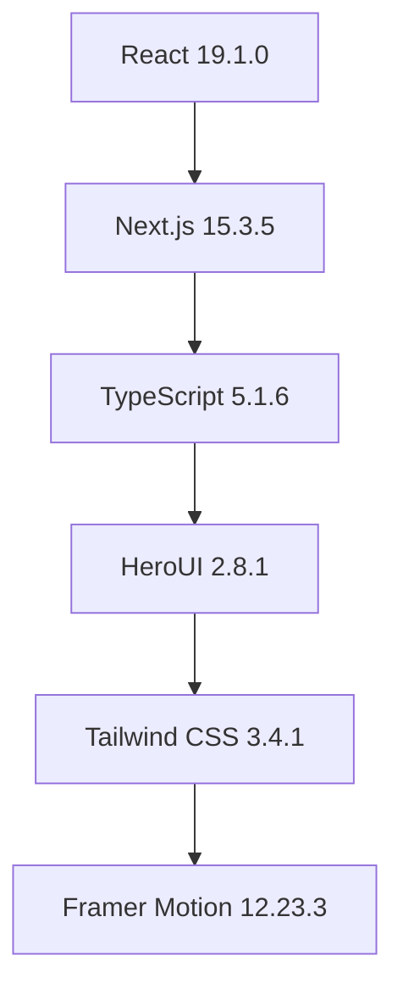
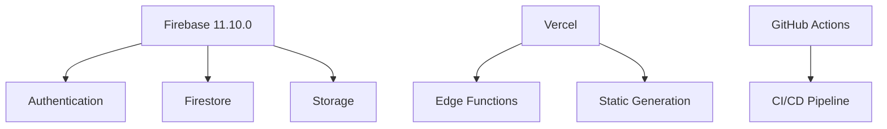
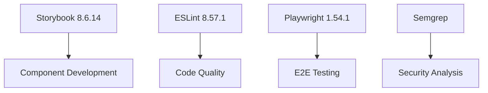
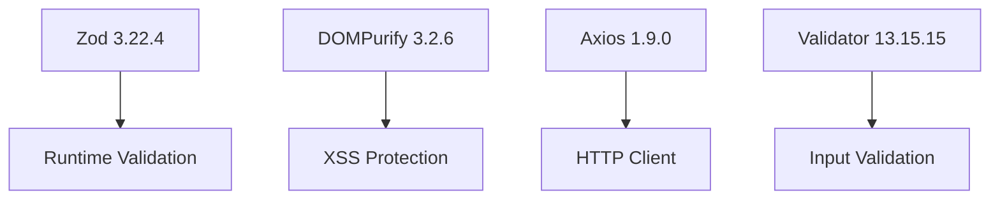
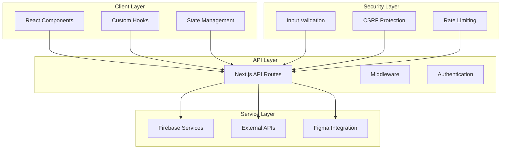
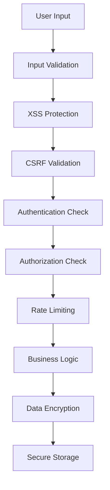
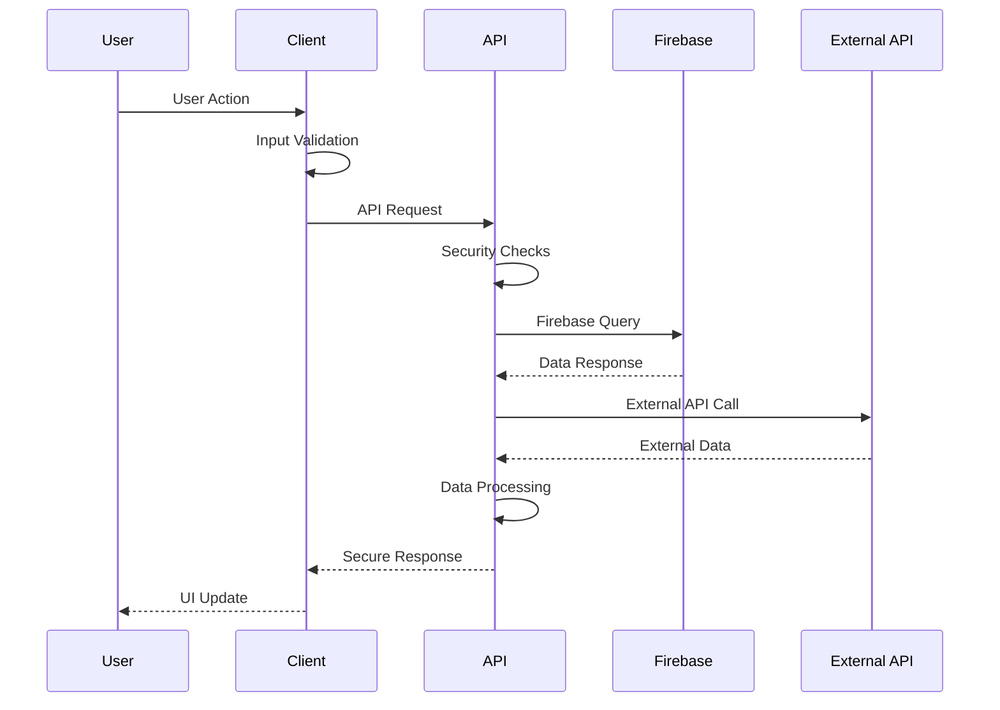

# AI Development Template - プロジェクト概要

## エグゼクティブサマリー

**AI Development Template** は、現代的な AI 駆動サービス開発のための包括的なテンプレートプロジェクトです。Next.js 15、HeroUI、TypeScript を核とした最新技術スタックを採用し、セキュリティ、パフォーマンス、開発体験を重視した設計となっています。

このテンプレートは、AI アプリケーション開発における共通的な課題を解決し、開発チームが本質的な機能開発に集中できる環境を提供します。認証システム、セキュリティ対策、UI コンポーネント、開発ツールチェーンが統合されており、プロダクション品質のアプリケーションを迅速に構築できます。

### 主要な価値提案

- **開発速度の向上**: 事前設定された開発環境とツールチェーンにより、プロジェクト開始から本格開発まで数時間で移行可能
- **セキュリティファースト**: 多層防御アーキテクチャとセキュリティベストプラクティスの実装
- **型安全性**: TypeScript による完全な型安全性とランタイムバリデーション
- **スケーラビリティ**: モジュラー設計とクリーンアーキテクチャによる長期的な保守性

## プロジェクト目標

### 短期目標（3-6 ヶ月）

- AI サービス開発のためのベストプラクティステンプレートの確立
- 開発者体験の最適化とドキュメント整備
- セキュリティ監査とコンプライアンス対応
- パフォーマンス最適化とモニタリング体制構築

### 中期目標（6-12 ヶ月）

- AI/ML モデル統合のためのフレームワーク拡張
- マルチテナント対応とエンタープライズ機能
- 国際化対応とアクセシビリティ強化
- DevOps パイプラインの自動化

### 長期目標（1-2 年）

- AI エコシステムとの深い統合
- 業界標準テンプレートとしての地位確立
- オープンソースコミュニティの形成
- 商用サポートとコンサルティングサービス

## 主要機能と特徴

### 🎨 ユーザーインターフェース

- **HeroUI コンポーネントライブラリ**: モダンで一貫性のあるデザインシステム
- **レスポンシブデザイン**: モバイルファーストのアプローチ
- **ダークモード対応**: システム設定に応じた自動切り替え
- **アクセシビリティ**: WCAG 2.1 AA レベル準拠

### 🔐 認証・セキュリティ

- **Firebase Authentication**: Google OAuth、メール/パスワード認証
- **多層セキュリティ**: XSS、CSRF、SQL インジェクション対策
- **暗号化**: AES-256-GCM による機密データ保護
- **セキュリティヘッダー**: 包括的な HTTP セキュリティヘッダー設定

### 🛠 開発体験

- **TypeScript**: 完全な型安全性と IntelliSense サポート
- **Hot Reload**: 高速な開発サイクル
- **Storybook**: コンポーネント駆動開発
- **ESLint/Prettier**: 自動コード品質管理

### 📊 監視・分析

- **セキュリティ監視**: Semgrep による静的解析
- **パフォーマンス監視**: Core Web Vitals 追跡
- **エラー追跡**: Sentry 統合（オプション）
- **ログ管理**: 構造化ログとセキュリティイベント追跡

### 🚀 デプロイメント

- **Vercel 最適化**: ワンクリックデプロイメント
- **環境管理**: 開発/ステージング/本番環境の分離
- **CI/CD**: GitHub Actions による自動化
- **セキュリティスキャン**: デプロイ前の自動セキュリティチェック

## 技術スタック

### フロントエンド



#### 選定理由

- **React 19**: 最新の Concurrent Features と Server Components サポート
- **Next.js 15**: App Router による最適化されたルーティングと SSR/SSG
- **TypeScript**: 大規模開発における型安全性と保守性
- **HeroUI**: アクセシブルで美しいコンポーネントライブラリ
- **Tailwind CSS**: ユーティリティファーストによる高速スタイリング

### バックエンド・インフラ



#### 選定理由

- **Firebase**: マネージドサービスによる運用コスト削減
- **Vercel**: Next.js に最適化されたホスティング環境
- **GitHub Actions**: 統合された CI/CD パイプライン

### 開発ツール



#### 選定理由

- **Storybook**: 独立したコンポーネント開発環境
- **ESLint**: 一貫したコード品質の維持
- **Playwright**: 信頼性の高い E2E テスト
- **Semgrep**: 静的セキュリティ解析

### セキュリティ・ユーティリティ



#### 選定理由

- **Zod**: TypeScript ファーストなスキーマバリデーション
- **DOMPurify**: 信頼性の高い XSS 対策
- **Axios**: 豊富な機能を持つ HTTP クライアント
- **Validator**: 包括的な入力値検証

## アーキテクチャ概要

### システム構成



### セキュリティアーキテクチャ



### データフロー



## 主要コンポーネント

### 認証システム

- **Firebase Authentication**: Google OAuth、メール/パスワード認証
- **セッション管理**: セキュアなトークン管理
- **権限制御**: ロールベースアクセス制御（RBAC）

### UI コンポーネント

- **AuthForm**: 統合認証フォーム
- **PomodoroTimer**: 生産性向上ツール
- **共通コンポーネント**: 再利用可能な UI パーツ

### ユーティリティライブラリ

- **バリデーション**: Zod ベースの型安全バリデーション
- **暗号化**: AES-256-GCM による機密データ保護
- **セキュリティ**: 包括的なセキュリティ対策
- **API クライアント**: 認証・リトライ機能付き HTTP クライアント

## 開発ワークフロー

### 1. 環境セットアップ

```bash
# プロジェクトクローン
git clone <repository-url>
cd ai-development-template

# 依存関係インストール
npm install

# 環境変数設定
cp .env.example .env.local
# 必要な環境変数を設定

# 開発サーバー起動
npm run dev
```

### 2. 機能開発

```bash
# 新機能ブランチ作成
git checkout -b feature/new-feature

# Storybook でコンポーネント開発
npm run storybook

# 型チェック
npm run type-check

# リンティング
npm run lint
```

### 3. 品質保証

```bash
# セキュリティスキャン
npm run security:full

# ビルドテスト
npm run build

# E2Eテスト（将来実装）
npm run test:e2e
```

### 4. デプロイメント

```bash
# プロダクションビルド
npm run build

# Vercel デプロイ
vercel --prod
```

## パフォーマンス指標

### Core Web Vitals 目標値

- **LCP (Largest Contentful Paint)**: < 2.5 秒
- **FID (First Input Delay)**: < 100ms
- **CLS (Cumulative Layout Shift)**: < 0.1

### セキュリティ指標

- **セキュリティヘッダー**: A+ 評価（Security Headers）
- **脆弱性**: 高・重要レベル 0 件
- **依存関係**: 最新版維持率 90%以上

### 開発効率指標

- **ビルド時間**: < 30 秒
- **ホットリロード**: < 1 秒
- **型チェック**: < 10 秒

## プロジェクトロードマップ

### Phase 1: 基盤整備（完了）

- ✅ 基本的なプロジェクト構造
- ✅ 認証システム実装
- ✅ セキュリティ対策実装
- ✅ 開発環境整備

### Phase 2: 機能拡張（進行中）

- 🔄 AI/ML モデル統合フレームワーク
- 🔄 高度な UI コンポーネント
- 🔄 パフォーマンス最適化
- 🔄 テスト自動化

### Phase 3: エンタープライズ対応（計画中）

- 📋 マルチテナント機能
- 📋 高度な権限管理
- 📋 監査ログ機能
- 📋 SLA 監視

### Phase 4: エコシステム拡張（将来）

- 🔮 プラグインアーキテクチャ
- 🔮 サードパーティ統合
- 🔮 マーケットプレイス
- 🔮 エンタープライズサポート

## 技術的負債と課題

### 現在の技術的負債

1. **テストカバレッジ**: ユニットテスト・統合テストの不足
2. **国際化**: i18n 対応の未実装
3. **アクセシビリティ**: 一部コンポーネントでの改善余地
4. **パフォーマンス**: 大規模データセット処理の最適化

### 解決計画

- **Q1 2025**: テストフレームワーク導入とカバレッジ向上
- **Q2 2025**: 国際化対応とアクセシビリティ強化
- **Q3 2025**: パフォーマンス最適化とモニタリング強化
- **Q4 2025**: エンタープライズ機能実装

## 競合分析

### 類似プロジェクト

1. **Create Next App**: 基本的な Next.js テンプレート
2. **T3 Stack**: TypeScript フルスタックテンプレート
3. **Supabase Starter**: Supabase 統合テンプレート

### 差別化要因

- **AI 特化**: AI サービス開発に最適化された設計
- **セキュリティファースト**: エンタープライズレベルのセキュリティ
- **包括的ドキュメント**: 詳細な開発ガイドとベストプラクティス
- **プロダクション対応**: 実運用を想定した設計と監視

## 成功指標（KPI）

### 開発効率

- **プロジェクト開始時間**: 環境構築から開発開始まで < 1 時間
- **機能開発速度**: 基本機能実装時間の 50%短縮
- **バグ発生率**: セキュリティ関連バグ < 1 件/月

### 品質指標

- **セキュリティスコア**: 95%以上
- **パフォーマンススコア**: 90%以上
- **アクセシビリティスコア**: 95%以上

### 採用指標

- **GitHub Stars**: 1,000+ (6 ヶ月以内)
- **フォーク数**: 200+ (6 ヶ月以内)
- **コミュニティ貢献**: 月間アクティブコントリビューター 10+

## 今後の展望

### 技術革新への対応

- **React 19 新機能**: Server Components、Concurrent Features の活用
- **Next.js 進化**: 新機能の迅速な採用
- **AI/ML 統合**: 最新の AI 技術との統合強化

### コミュニティ形成

- **オープンソース化**: コミュニティ主導の開発体制
- **ドキュメント充実**: 多言語対応とチュートリアル拡充
- **イベント開催**: 勉強会・ハッカソンの定期開催

### 商業化戦略

- **プレミアムサポート**: エンタープライズ向けサポートサービス
- **コンサルティング**: 導入支援・カスタマイズサービス
- **トレーニング**: 開発者向け教育プログラム

## 結論

AI Development Template は、現代的な AI サービス開発における課題を包括的に解決する、戦略的に設計されたテンプレートプロジェクトです。技術的な優秀性、セキュリティの堅牢性、開発体験の優秀性を兼ね備え、個人開発者からエンタープライズまで幅広いニーズに対応できる柔軟性を持っています。

継続的な改善とコミュニティとの協力により、AI 開発分野におけるデファクトスタンダードとしての地位確立を目指します。
