# Security Architecture Documentation

## Overview

This document provides comprehensive documentation of the security architecture implemented in the AI Development Template. The application employs a multi-layered security approach with defense-in-depth principles, comprehensive threat modeling, and robust mitigation strategies to protect against various attack vectors.

## Table of Contents

1. [Security Architecture Overview](#security-architecture-overview)
2. [Multi-Layer Security Implementation](#multi-layer-security-implementation)
3. [Threat Model and Risk Assessment](#threat-model-and-risk-assessment)
4. [Input Validation and Sanitization](#input-validation-and-sanitization)
5. [Authentication and Authorization](#authentication-and-authorization)
6. [Data Protection and Privacy](#data-protection-and-privacy)
7. [Network Security](#network-security)
8. [Security Configuration](#security-configuration)
9. [Security Monitoring and Logging](#security-monitoring-and-logging)
10. [Security Best Practices](#security-best-practices)

## Security Architecture Overview

The AI Development Template implements a comprehensive security architecture based on the principle of defense-in-depth:

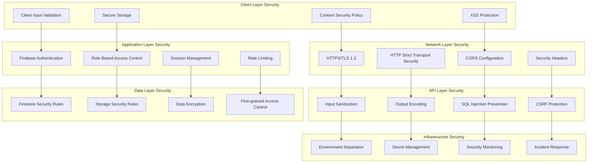
```mermaid
graph TB
    subgraph "Client Layer Security"
        CSP[Content Security Policy]
        XSSProtection[XSS Protection]
        InputValidation[Client Input Validation]
        SecureStorage[Secure Storage]
    end

    subgraph "Network Layer Security"
        HTTPS[HTTPS/TLS 1.3]
        HSTS[HTTP Strict Transport Security]
        CORS[CORS Configuration]
        SecurityHeaders[Security Headers]
    end

    subgraph "Application Layer Security"
        Authentication[Firebase Authentication]
        Authorization[Role-Based Access Control]
        SessionManagement[Session Management]
        RateLimit[Rate Limiting]
    end

    subgraph "API Layer Security"
        InputSanitization[Input Sanitization]
        OutputEncoding[Output Encoding]
        SQLInjectionPrevention[SQL Injection Prevention]
        CSRFProtection[CSRF Protection]
    end

    subgraph "Data Layer Security"
        FirestoreRules[Firestore Security Rules]
        StorageRules[Storage Security Rules]
        DataEncryption[Data Encryption]
        AccessControl[Fine-grained Access Control]
    end

    subgraph "Infrastructure Security"
        EnvironmentSeparation[Environment Separation]
        SecretManagement[Secret Management]
        SecurityMonitoring[Security Monitoring]
        IncidentResponse[Incident Response]
    end

    CSP --> HTTPS
    XSSProtection --> CORS
    InputValidation --> Authentication
    SecureStorage --> Authorization

    HTTPS --> InputSanitization
    HSTS --> OutputEncoding
    CORS --> SQLInjectionPrevention
    SecurityHeaders --> CSRFProtection

    Authentication --> FirestoreRules
    Authorization --> StorageRules
    SessionManagement --> DataEncryption
    RateLimit --> AccessControl

    InputSanitization --> EnvironmentSeparation
    OutputEncoding --> SecretManagement
    SQLInjectionPrevention --> SecurityMonitoring
    CSRFProtection --> IncidentResponse
```

## Multi-Layer Security Implementation

### Layer 1: Client-Side Security

#### Content Security Policy (CSP)

```typescript
const CSP_DIRECTIVES = {
  "default-src": ["'self'"],
  "script-src": ["'self'", "'unsafe-inline'", "https://trusted-cdn.com"],
  "style-src": ["'self'", "'unsafe-inline'"],
  "img-src": ["'self'", "data:", "https:"],
  "font-src": ["'self'", "https://fonts.gstatic.com"],
  "connect-src": ["'self'", "https://api.figma.com"],
  "frame-ancestors": ["'none'"],
  "base-uri": ["'self'"],
  "form-action": ["'self'"],
  "upgrade-insecure-requests": [],
};
```

#### XSS Protection Implementation

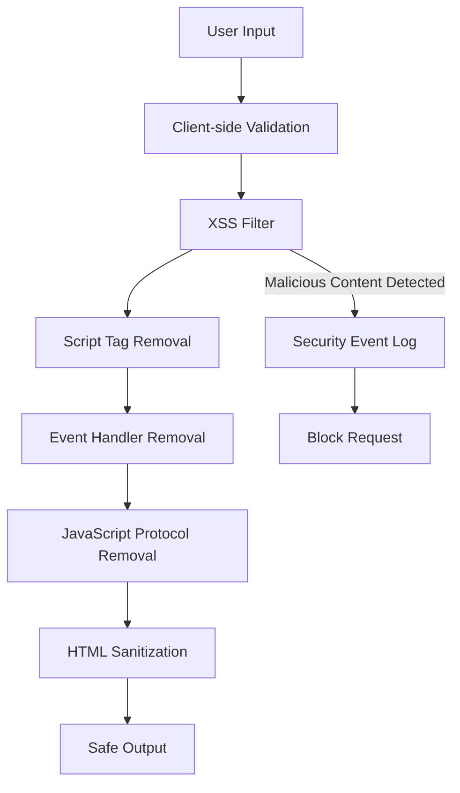
```mermaid
flowchart TD
    UserInput[User Input] --> ClientValidation[Client-side Validation]
    ClientValidation --> XSSFilter[XSS Filter]
    XSSFilter --> ScriptRemoval[Script Tag Removal]
    ScriptRemoval --> EventHandlerRemoval[Event Handler Removal]
    EventHandlerRemoval --> JSProtocolRemoval[JavaScript Protocol Removal]
    JSProtocolRemoval --> HTMLSanitization[HTML Sanitization]
    HTMLSanitization --> SafeOutput[Safe Output]

    XSSFilter -->|Malicious Content Detected| SecurityLog[Security Event Log]
    SecurityLog --> BlockRequest[Block Request]
```

### Layer 2: Network Security

#### HTTPS and Transport Security

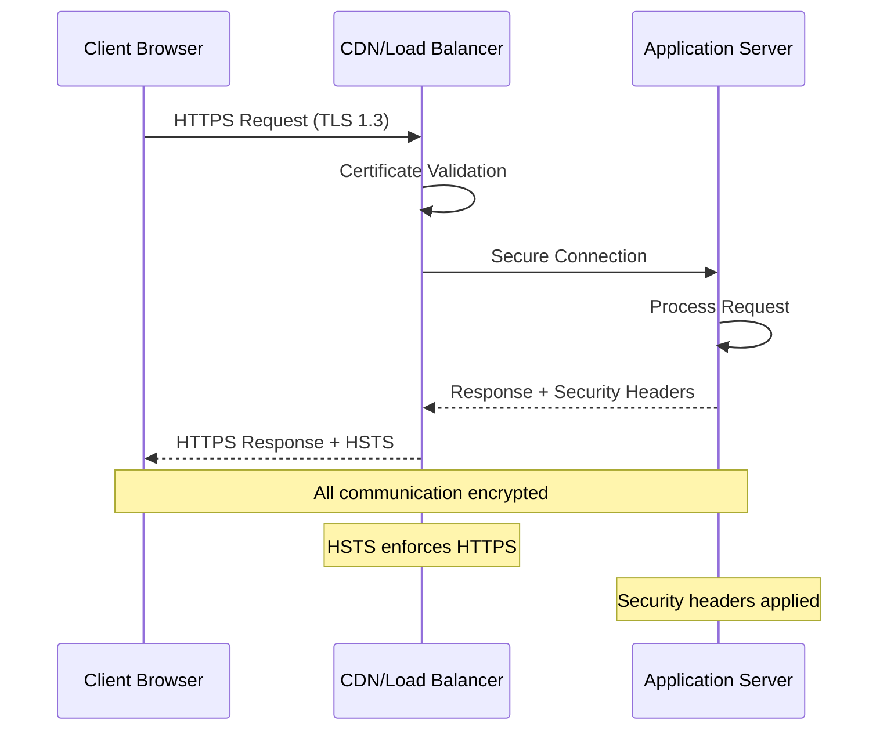
```mermaid
sequenceDiagram
    participant Client as Client Browser
    participant CDN as CDN/Load Balancer
    participant Server as Application Server

    Client->>CDN: HTTPS Request (TLS 1.3)
    CDN->>CDN: Certificate Validation
    CDN->>Server: Secure Connection
    Server->>Server: Process Request
    Server-->>CDN: Response + Security Headers
    CDN-->>Client: HTTPS Response + HSTS

    Note over Client,Server: All communication encrypted
    Note over CDN: HSTS enforces HTTPS
    Note over Server: Security headers applied
```

#### Security Headers Configuration

```typescript
const securityHeaders = {
  "Strict-Transport-Security": "max-age=31536000; includeSubDomains; preload",
  "X-Content-Type-Options": "nosniff",
  "X-Frame-Options": "DENY",
  "X-XSS-Protection": "1; mode=block",
  "Referrer-Policy": "strict-origin-when-cross-origin",
  "Permissions-Policy": "camera=(), microphone=(), geolocation=()",
  "Cross-Origin-Embedder-Policy": "require-corp",
  "Cross-Origin-Opener-Policy": "same-origin",
  "Cross-Origin-Resource-Policy": "same-origin",
};
```

### Layer 3: Application Security

#### Authentication Flow Security

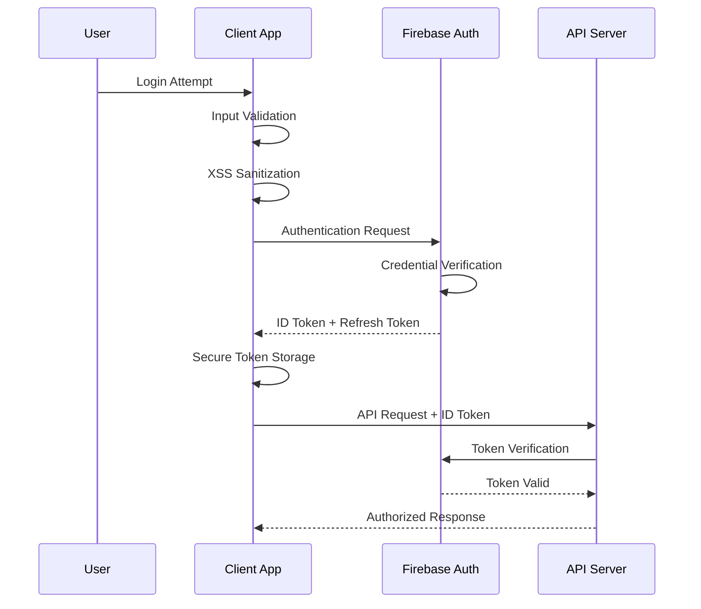
```mermaid
sequenceDiagram
    participant User as User
    participant Client as Client App
    participant Firebase as Firebase Auth
    participant API as API Server

    User->>Client: Login Attempt
    Client->>Client: Input Validation
    Client->>Client: XSS Sanitization
    Client->>Firebase: Authentication Request
    Firebase->>Firebase: Credential Verification
    Firebase-->>Client: ID Token + Refresh Token
    Client->>Client: Secure Token Storage
    Client->>API: API Request + ID Token
    API->>Firebase: Token Verification
    Firebase-->>API: Token Valid
    API-->>Client: Authorized Response
```

#### Session Management Security

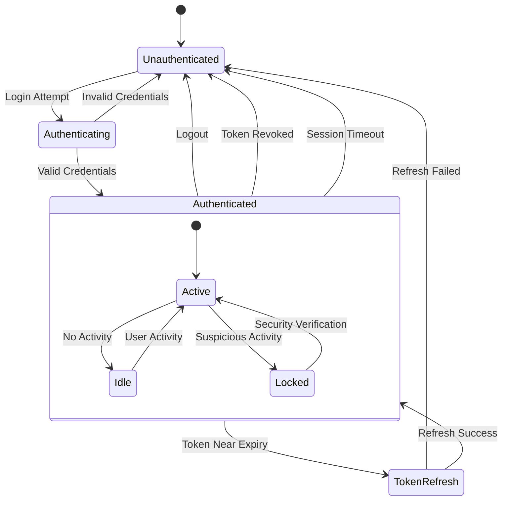
```mermaid
stateDiagram-v2
    [*] --> Unauthenticated
    Unauthenticated --> Authenticating : Login Attempt
    Authenticating --> Authenticated : Valid Credentials
    Authenticating --> Unauthenticated : Invalid Credentials

    Authenticated --> TokenRefresh : Token Near Expiry
    TokenRefresh --> Authenticated : Refresh Success
    TokenRefresh --> Unauthenticated : Refresh Failed

    Authenticated --> Unauthenticated : Logout
    Authenticated --> Unauthenticated : Token Revoked
    Authenticated --> Unauthenticated : Session Timeout

    state Authenticated {
        [*] --> Active
        Active --> Idle : No Activity
        Idle --> Active : User Activity
        Active --> Locked : Suspicious Activity
        Locked --> Active : Security Verification
    }
```

### Layer 4: API Security

#### Input Validation Pipeline

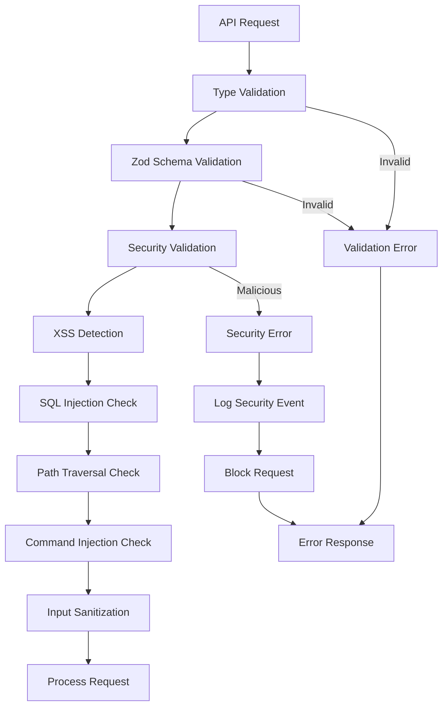
```mermaid
flowchart TD
    APIRequest[API Request] --> TypeValidation[Type Validation]
    TypeValidation --> SchemaValidation[Zod Schema Validation]
    SchemaValidation --> SecurityValidation[Security Validation]

    SecurityValidation --> XSSCheck[XSS Detection]
    XSSCheck --> SQLCheck[SQL Injection Check]
    SQLCheck --> PathTraversalCheck[Path Traversal Check]
    PathTraversalCheck --> CommandInjectionCheck[Command Injection Check]

    CommandInjectionCheck --> InputSanitization[Input Sanitization]
    InputSanitization --> ProcessRequest[Process Request]

    TypeValidation -->|Invalid| ValidationError[Validation Error]
    SchemaValidation -->|Invalid| ValidationError
    SecurityValidation -->|Malicious| SecurityError[Security Error]

    SecurityError --> SecurityLog[Log Security Event]
    SecurityLog --> BlockRequest[Block Request]
    ValidationError --> ErrorResponse[Error Response]
    BlockRequest --> ErrorResponse
```

#### Output Sanitization Process

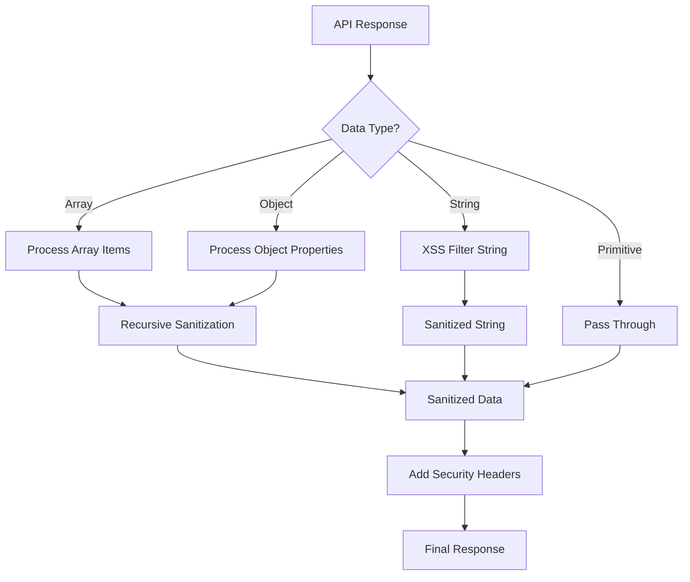
```mermaid
flowchart TD
    APIResponse[API Response] --> DataTypeCheck{Data Type?}

    DataTypeCheck -->|String| StringSanitization[XSS Filter String]
    DataTypeCheck -->|Array| ArrayProcessing[Process Array Items]
    DataTypeCheck -->|Object| ObjectProcessing[Process Object Properties]
    DataTypeCheck -->|Primitive| PassThrough[Pass Through]

    StringSanitization --> SanitizedString[Sanitized String]
    ArrayProcessing --> RecursiveSanitization[Recursive Sanitization]
    ObjectProcessing --> RecursiveSanitization

    RecursiveSanitization --> SanitizedData[Sanitized Data]
    SanitizedString --> SanitizedData
    PassThrough --> SanitizedData

    SanitizedData --> ResponseHeaders[Add Security Headers]
    ResponseHeaders --> FinalResponse[Final Response]
```

### Layer 5: Data Security

#### Firestore Security Rules Architecture

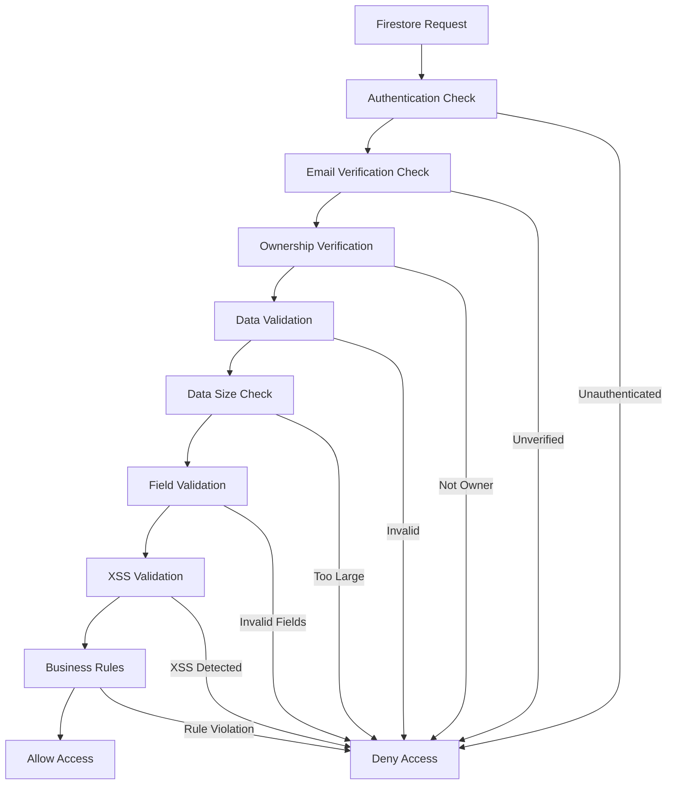
```mermaid
graph TD
    Request[Firestore Request] --> AuthCheck[Authentication Check]
    AuthCheck --> EmailVerification[Email Verification Check]
    EmailVerification --> OwnershipCheck[Ownership Verification]
    OwnershipCheck --> DataValidation[Data Validation]

    DataValidation --> SizeCheck[Data Size Check]
    SizeCheck --> FieldValidation[Field Validation]
    FieldValidation --> XSSValidation[XSS Validation]
    XSSValidation --> BusinessRules[Business Rules]

    BusinessRules --> AllowAccess[Allow Access]

    AuthCheck -->|Unauthenticated| DenyAccess[Deny Access]
    EmailVerification -->|Unverified| DenyAccess
    OwnershipCheck -->|Not Owner| DenyAccess
    DataValidation -->|Invalid| DenyAccess
    SizeCheck -->|Too Large| DenyAccess
    FieldValidation -->|Invalid Fields| DenyAccess
    XSSValidation -->|XSS Detected| DenyAccess
    BusinessRules -->|Rule Violation| DenyAccess
```

## Threat Model and Risk Assessment

### STRIDE Threat Analysis

#### Spoofing Threats

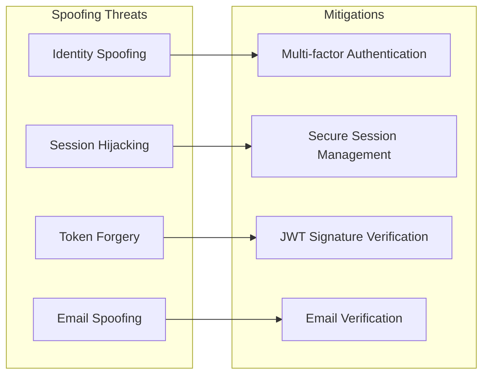
```mermaid
graph LR
    subgraph "Spoofing Threats"
        ST1[Identity Spoofing]
        ST2[Session Hijacking]
        ST3[Token Forgery]
        ST4[Email Spoofing]
    end

    subgraph "Mitigations"
        SM1[Multi-factor Authentication]
        SM2[Secure Session Management]
        SM3[JWT Signature Verification]
        SM4[Email Verification]
    end

    ST1 --> SM1
    ST2 --> SM2
    ST3 --> SM3
    ST4 --> SM4
```

#### Tampering Threats

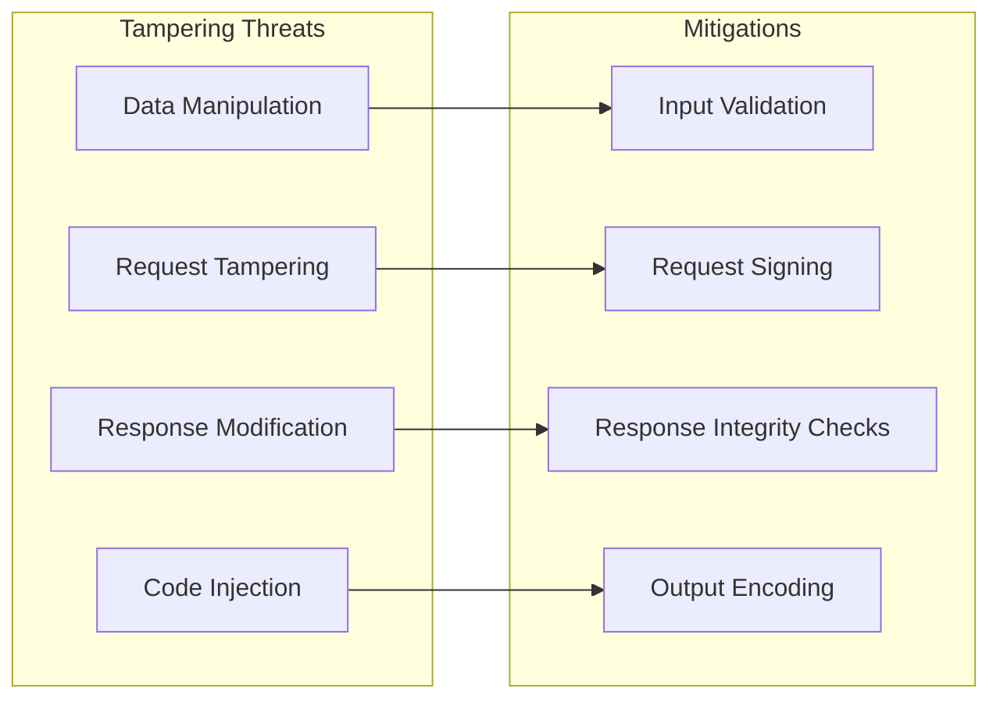
```mermaid
graph LR
    subgraph "Tampering Threats"
        TT1[Data Manipulation]
        TT2[Request Tampering]
        TT3[Response Modification]
        TT4[Code Injection]
    end

    subgraph "Mitigations"
        TM1[Input Validation]
        TM2[Request Signing]
        TM3[Response Integrity Checks]
        TM4[Output Encoding]
    end

    TT1 --> TM1
    TT2 --> TM2
    TT3 --> TM3
    TT4 --> TM4
```

#### Repudiation Threats

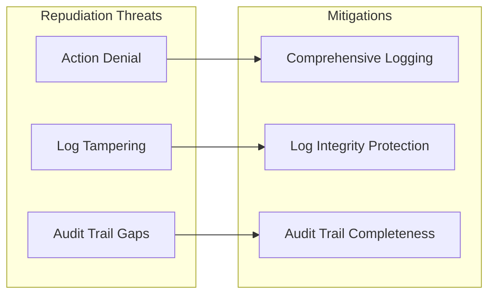
```mermaid
graph LR
    subgraph "Repudiation Threats"
        RT1[Action Denial]
        RT2[Log Tampering]
        RT3[Audit Trail Gaps]
    end

    subgraph "Mitigations"
        RM1[Comprehensive Logging]
        RM2[Log Integrity Protection]
        RM3[Audit Trail Completeness]
    end

    RT1 --> RM1
    RT2 --> RM2
    RT3 --> RM3
```

#### Information Disclosure Threats

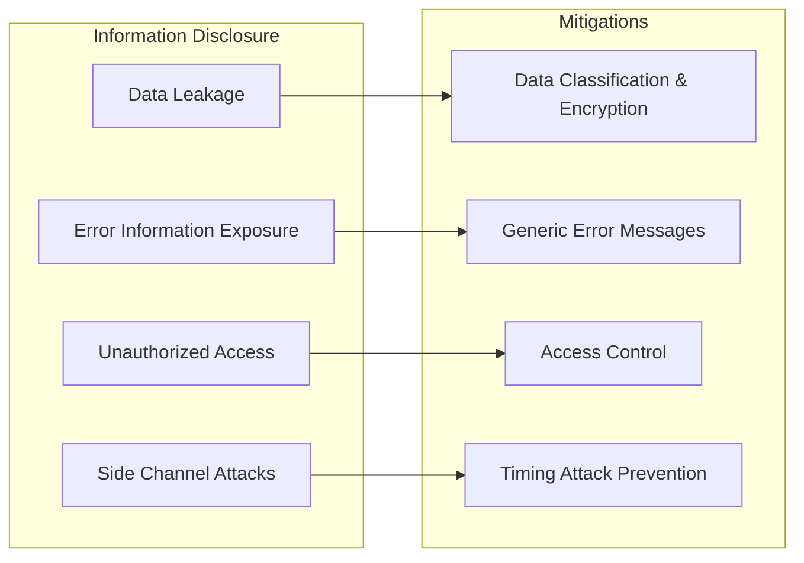
```mermaid
graph LR
    subgraph "Information Disclosure"
        IT1[Data Leakage]
        IT2[Error Information Exposure]
        IT3[Unauthorized Access]
        IT4[Side Channel Attacks]
    end

    subgraph "Mitigations"
        IM1[Data Classification & Encryption]
        IM2[Generic Error Messages]
        IM3[Access Control]
        IM4[Timing Attack Prevention]
    end

    IT1 --> IM1
    IT2 --> IM2
    IT3 --> IM3
    IT4 --> IM4
```

#### Denial of Service Threats

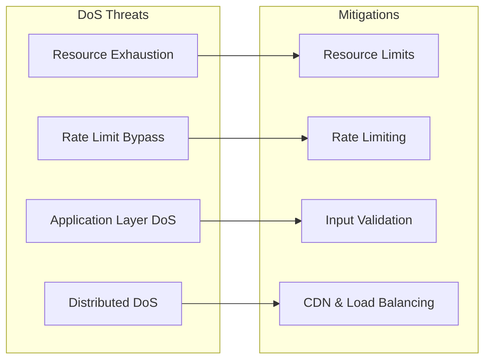
```mermaid
graph LR
    subgraph "DoS Threats"
        DT1[Resource Exhaustion]
        DT2[Rate Limit Bypass]
        DT3[Application Layer DoS]
        DT4[Distributed DoS]
    end

    subgraph "Mitigations"
        DM1[Resource Limits]
        DM2[Rate Limiting]
        DM3[Input Validation]
        DM4[CDN & Load Balancing]
    end

    DT1 --> DM1
    DT2 --> DM2
    DT3 --> DM3
    DT4 --> DM4
```

#### Elevation of Privilege Threats

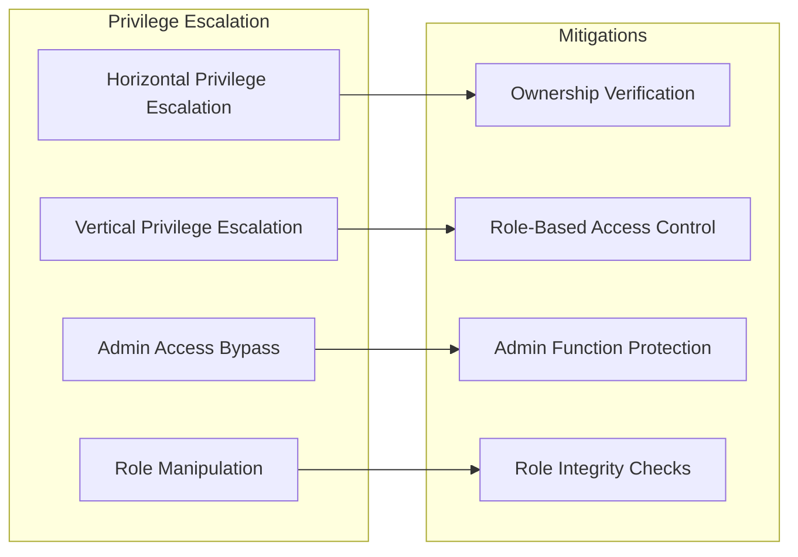
```mermaid
graph LR
    subgraph "Privilege Escalation"
        ET1[Horizontal Privilege Escalation]
        ET2[Vertical Privilege Escalation]
        ET3[Admin Access Bypass]
        ET4[Role Manipulation]
    end

    subgraph "Mitigations"
        EM1[Ownership Verification]
        EM2[Role-Based Access Control]
        EM3[Admin Function Protection]
        EM4[Role Integrity Checks]
    end

    ET1 --> EM1
    ET2 --> EM2
    ET3 --> EM3
    ET4 --> EM4
```

### Risk Assessment Matrix

| Threat Category        | Likelihood | Impact   | Risk Level | Mitigation Priority |
| ---------------------- | ---------- | -------- | ---------- | ------------------- |
| XSS Attacks            | High       | High     | Critical   | Immediate           |
| SQL Injection          | Medium     | High     | High       | Immediate           |
| CSRF Attacks           | Medium     | Medium   | Medium     | High                |
| Session Hijacking      | Low        | High     | Medium     | High                |
| Data Breaches          | Low        | Critical | High       | Immediate           |
| DoS Attacks            | Medium     | Medium   | Medium     | Medium              |
| Privilege Escalation   | Low        | High     | Medium     | High                |
| Information Disclosure | Medium     | High     | High       | High                |

## Input Validation and Sanitization

### Comprehensive Input Validation Strategy

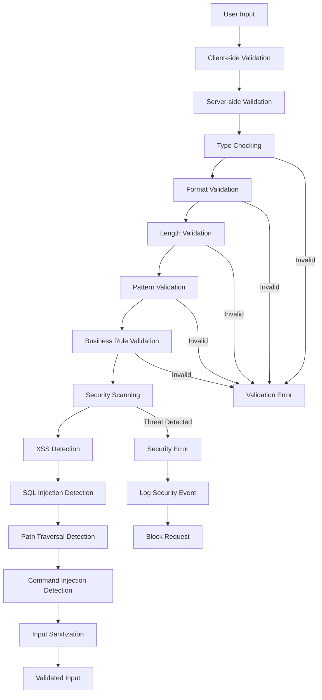
```mermaid
flowchart TD
    UserInput[User Input] --> ClientValidation[Client-side Validation]
    ClientValidation --> ServerValidation[Server-side Validation]

    ServerValidation --> TypeCheck[Type Checking]
    TypeCheck --> FormatValidation[Format Validation]
    FormatValidation --> LengthValidation[Length Validation]
    LengthValidation --> PatternValidation[Pattern Validation]
    PatternValidation --> BusinessValidation[Business Rule Validation]

    BusinessValidation --> SecurityScan[Security Scanning]
    SecurityScan --> XSSDetection[XSS Detection]
    XSSDetection --> SQLInjectionDetection[SQL Injection Detection]
    SQLInjectionDetection --> PathTraversalDetection[Path Traversal Detection]
    PathTraversalDetection --> CommandInjectionDetection[Command Injection Detection]

    CommandInjectionDetection --> InputSanitization[Input Sanitization]
    InputSanitization --> ValidatedInput[Validated Input]

    TypeCheck -->|Invalid| ValidationError[Validation Error]
    FormatValidation -->|Invalid| ValidationError
    LengthValidation -->|Invalid| ValidationError
    PatternValidation -->|Invalid| ValidationError
    BusinessValidation -->|Invalid| ValidationError

    SecurityScan -->|Threat Detected| SecurityError[Security Error]
    SecurityError --> SecurityLog[Log Security Event]
    SecurityLog --> BlockRequest[Block Request]
```

### Zod Schema Validation Implementation

```typescript
// Security-enhanced validation schemas
export const secureSchemas = {
  // Email with additional security checks
  email: z
    .string()
    .min(1, "Email is required")
    .email("Invalid email format")
    .max(254, "Email too long")
    .refine((email) => validator.isEmail(email), "Invalid email format")
    .refine((email) => !email.includes("<"), "Invalid characters in email"),

  // Password with complexity requirements
  password: z
    .string()
    .min(8, "Password must be at least 8 characters")
    .max(128, "Password too long")
    .regex(
      /^(?=.*[a-z])(?=.*[A-Z])(?=.*\d).*$/,
      "Password must contain uppercase, lowercase, and number"
    )
    .refine(
      (pwd) => !/<script|javascript:|on\w+=/i.test(pwd),
      "Invalid characters in password"
    ),

  // XSS-safe text validation
  safeText: z
    .string()
    .max(1000, "Text too long")
    .refine(
      (text) => !validator.contains(text, "<script"),
      "Script tags not allowed"
    )
    .refine(
      (text) => !validator.contains(text, "javascript:"),
      "JavaScript protocol not allowed"
    )
    .refine(
      (text) => !/<[^>]*on\w+\s*=/i.test(text),
      "Event handlers not allowed"
    ),
};
```

### Input Sanitization Process

```typescript
class InputSanitizer {
  static sanitize(input: string): SanitizationResult {
    let sanitized = input;
    const issues: string[] = [];

    // Remove null bytes and control characters
    sanitized = sanitized.replace(/[\x00-\x08\x0B-\x0C\x0E-\x1F\x7F]/g, "");

    // HTML entity encoding
    sanitized = sanitized
      .replace(/&/g, "&amp;")
      .replace(/</g, "&lt;")
      .replace(/>/g, "&gt;")
      .replace(/"/g, "&quot;")
      .replace(/'/g, "&#x27;");

    // Remove JavaScript protocols
    if (/javascript:/gi.test(sanitized)) {
      sanitized = sanitized.replace(/javascript:/gi, "");
      issues.push("JavaScript protocol removed");
    }

    // Remove event handlers
    if (/on\w+\s*=/gi.test(sanitized)) {
      sanitized = sanitized.replace(/on\w+\s*=/gi, "");
      issues.push("Event handlers removed");
    }

    return {
      sanitized,
      isSecure: issues.length === 0,
      issues,
    };
  }
}
```

## Authentication and Authorization

### Firebase Authentication Security

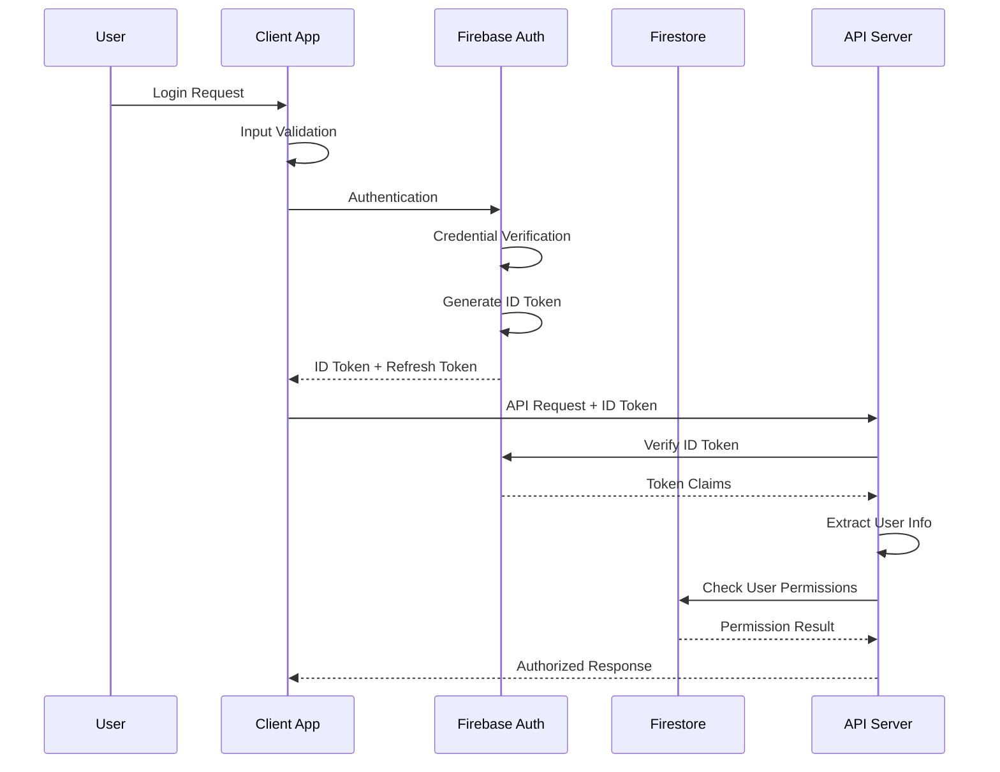
```mermaid
sequenceDiagram
    participant User as User
    participant Client as Client App
    participant Firebase as Firebase Auth
    participant Firestore as Firestore
    participant API as API Server

    User->>Client: Login Request
    Client->>Client: Input Validation
    Client->>Firebase: Authentication
    Firebase->>Firebase: Credential Verification
    Firebase->>Firebase: Generate ID Token
    Firebase-->>Client: ID Token + Refresh Token

    Client->>API: API Request + ID Token
    API->>Firebase: Verify ID Token
    Firebase-->>API: Token Claims
    API->>API: Extract User Info
    API->>Firestore: Check User Permissions
    Firestore-->>API: Permission Result
    API-->>Client: Authorized Response
```

### Role-Based Access Control (RBAC)

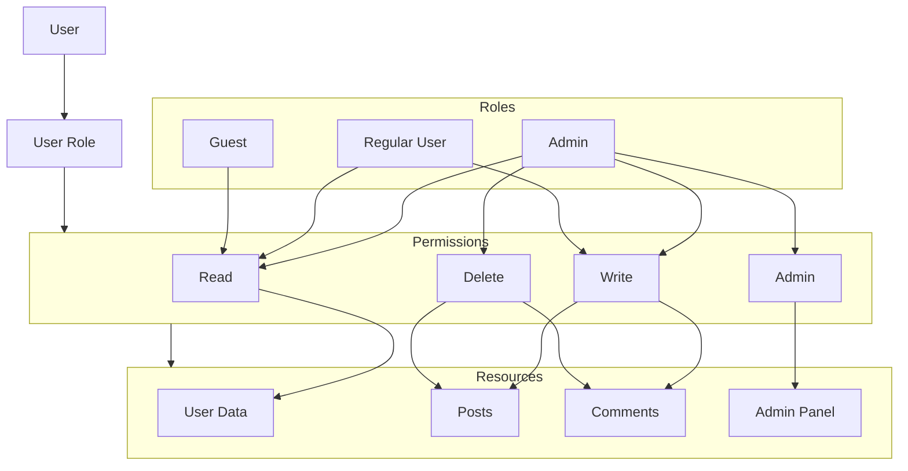
```mermaid
graph TD
    User[User] --> Role[User Role]
    Role --> Permissions[Permissions]
    Permissions --> Resources[Protected Resources]

    subgraph "Roles"
        AdminRole[Admin]
        UserRole[Regular User]
        GuestRole[Guest]
    end

    subgraph "Permissions"
        ReadPerm[Read]
        WritePerm[Write]
        DeletePerm[Delete]
        AdminPerm[Admin]
    end

    subgraph "Resources"
        UserData[User Data]
        Posts[Posts]
        Comments[Comments]
        AdminPanel[Admin Panel]
    end

    AdminRole --> AdminPerm
    AdminRole --> WritePerm
    AdminRole --> ReadPerm
    AdminRole --> DeletePerm

    UserRole --> WritePerm
    UserRole --> ReadPerm

    GuestRole --> ReadPerm

    AdminPerm --> AdminPanel
    WritePerm --> Posts
    WritePerm --> Comments
    ReadPerm --> UserData
    DeletePerm --> Posts
    DeletePerm --> Comments
```

## Data Protection and Privacy

### Data Classification and Handling

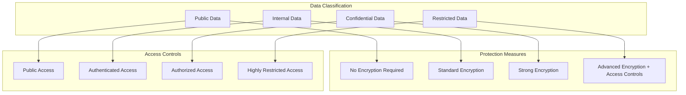
```mermaid
graph TD
    subgraph "Data Classification"
        PublicData[Public Data]
        InternalData[Internal Data]
        ConfidentialData[Confidential Data]
        RestrictedData[Restricted Data]
    end

    subgraph "Protection Measures"
        NoEncryption[No Encryption Required]
        StandardEncryption[Standard Encryption]
        StrongEncryption[Strong Encryption]
        AdvancedEncryption[Advanced Encryption + Access Controls]
    end

    subgraph "Access Controls"
        PublicAccess[Public Access]
        AuthenticatedAccess[Authenticated Access]
        AuthorizedAccess[Authorized Access]
        RestrictedAccess[Highly Restricted Access]
    end

    PublicData --> NoEncryption
    PublicData --> PublicAccess

    InternalData --> StandardEncryption
    InternalData --> AuthenticatedAccess

    ConfidentialData --> StrongEncryption
    ConfidentialData --> AuthorizedAccess

    RestrictedData --> AdvancedEncryption
    RestrictedData --> RestrictedAccess
```

### Data Encryption Strategy

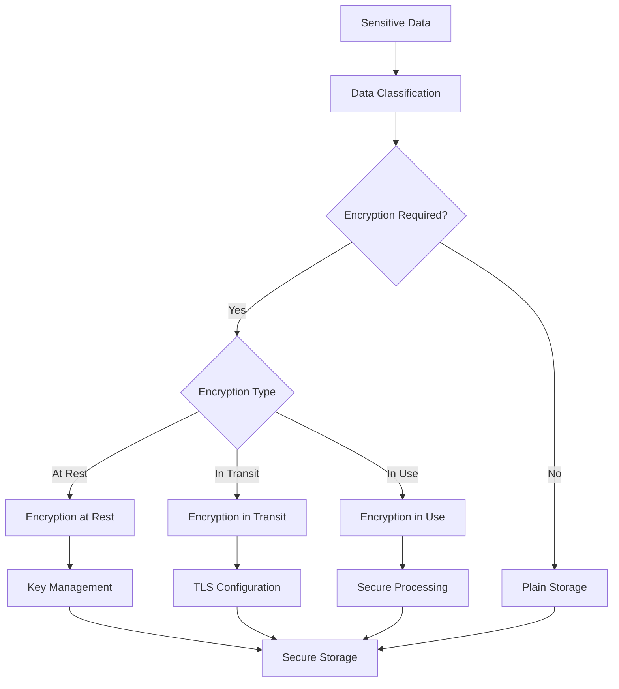
```mermaid
flowchart TD
    Data[Sensitive Data] --> Classification[Data Classification]
    Classification --> EncryptionDecision{Encryption Required?}

    EncryptionDecision -->|Yes| EncryptionType{Encryption Type}
    EncryptionDecision -->|No| PlainStorage[Plain Storage]

    EncryptionType -->|At Rest| RestEncryption[Encryption at Rest]
    EncryptionType -->|In Transit| TransitEncryption[Encryption in Transit]
    EncryptionType -->|In Use| UseEncryption[Encryption in Use]

    RestEncryption --> KeyManagement[Key Management]
    TransitEncryption --> TLSConfig[TLS Configuration]
    UseEncryption --> SecureProcessing[Secure Processing]

    KeyManagement --> SecureStorage[Secure Storage]
    TLSConfig --> SecureStorage
    SecureProcessing --> SecureStorage
    PlainStorage --> SecureStorage
```

## Network Security

### HTTPS and TLS Configuration

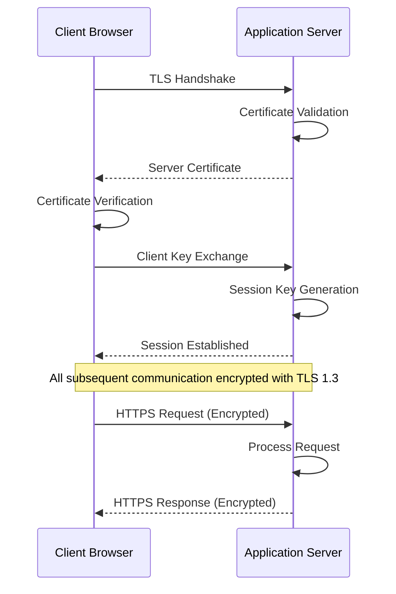
```mermaid
sequenceDiagram
    participant Client as Client Browser
    participant Server as Application Server

    Client->>Server: TLS Handshake
    Server->>Server: Certificate Validation
    Server-->>Client: Server Certificate
    Client->>Client: Certificate Verification
    Client->>Server: Client Key Exchange
    Server->>Server: Session Key Generation
    Server-->>Client: Session Established

    Note over Client,Server: All subsequent communication encrypted with TLS 1.3

    Client->>Server: HTTPS Request (Encrypted)
    Server->>Server: Process Request
    Server-->>Client: HTTPS Response (Encrypted)
```

### CORS Security Configuration

```typescript
const corsConfig = {
  origin: (origin, callback) => {
    const allowedOrigins = [
      "https://yourdomain.com",
      "https://www.yourdomain.com",
      process.env.NODE_ENV === "development" ? "http://localhost:3000" : null,
    ].filter(Boolean);

    if (!origin || allowedOrigins.includes(origin)) {
      callback(null, true);
    } else {
      callback(new Error("Not allowed by CORS"));
    }
  },
  credentials: true,
  methods: ["GET", "POST", "PUT", "DELETE", "OPTIONS"],
  allowedHeaders: ["Content-Type", "Authorization", "X-Requested-With"],
  exposedHeaders: ["X-Rate-Limit-Remaining", "X-Rate-Limit-Reset"],
};
```

## Security Configuration

### Environment-Specific Security Settings

```typescript
interface SecurityConfig {
  development: {
    enableLogging: true;
    strictValidation: false;
    allowInsecureConnections: true;
    debugMode: true;
  };
  production: {
    enableLogging: false;
    strictValidation: true;
    allowInsecureConnections: false;
    debugMode: false;
  };
  testing: {
    enableLogging: true;
    strictValidation: true;
    allowInsecureConnections: false;
    debugMode: false;
  };
}
```

### Security Headers Configuration

```typescript
const securityHeaders = {
  // Prevent MIME type sniffing
  "X-Content-Type-Options": "nosniff",

  // Prevent clickjacking
  "X-Frame-Options": "DENY",

  // XSS protection (legacy browsers)
  "X-XSS-Protection": "1; mode=block",

  // HTTPS enforcement
  "Strict-Transport-Security": "max-age=31536000; includeSubDomains; preload",

  // Content Security Policy
  "Content-Security-Policy": [
    "default-src 'self'",
    "script-src 'self' 'unsafe-inline'",
    "style-src 'self' 'unsafe-inline'",
    "img-src 'self' data: https:",
    "connect-src 'self' https://api.figma.com",
    "frame-ancestors 'none'",
    "base-uri 'self'",
    "form-action 'self'",
  ].join("; "),

  // Referrer policy
  "Referrer-Policy": "strict-origin-when-cross-origin",

  // Permissions policy
  "Permissions-Policy": [
    "camera=()",
    "microphone=()",
    "geolocation=()",
    "payment=()",
    "usb=()",
  ].join(", "),
};
```

## Security Monitoring and Logging

### Security Event Logging Architecture

```mermaid
flowchart TD
    SecurityEvent[Security Event] --> EventClassification[Event Classification]
    EventClassification --> SeverityAssignment[Severity Assignment]
    SeverityAssignment --> LogFormatting[Log Formatting]
    LogFormatting --> LogStorage[Log Storage]

    LogStorage --> LogAnalysis[Log Analysis]
    LogAnalysis --> ThreatDetection[Threat Detection]
    ThreatDetection --> AlertGeneration[Alert Generation]
    AlertGeneration --> IncidentResponse[Incident Response]

    subgraph "Event Types"
        XSSAttempt[XSS Attempt]
        SQLInjection[SQL Injection]
        CSRFAttack[CSRF Attack]
        RateLimitExceeded[Rate Limit Exceeded]
        AuthFailure[Authentication Failure]
        PrivilegeEscalation[Privilege Escalation]
    end

    subgraph "Severity Levels"
        Low[Low]
        Medium[Medium]
        High[High]
        Critical[Critical]
    end

    XSSAttempt --> High
    SQLInjection --> Critical
    CSRFAttack --> High
    RateLimitExceeded --> Medium
    AuthFailure --> Medium
    PrivilegeEscalation --> Critical
```

### Security Metrics and KPIs

```mermaid
graph TD
    subgraph "Security Metrics"
        AttackAttempts[Attack Attempts]
        BlockedRequests[Blocked Requests]
        FailedLogins[Failed Login Attempts]
        SecurityAlerts[Security Alerts]
        VulnerabilityCount[Vulnerability Count]
        PatchTime[Time to Patch]
    end

    subgraph "KPIs"
        SecurityScore[Security Score]
        IncidentResponseTime[Incident Response Time]
        ComplianceRate[Compliance Rate]
        UserSecurityAwareness[User Security Awareness]
    end

    AttackAttempts --> SecurityScore
    BlockedRequests --> SecurityScore
    FailedLogins --> IncidentResponseTime
    SecurityAlerts --> IncidentResponseTime
    VulnerabilityCount --> ComplianceRate
    PatchTime --> ComplianceRate
```

## Security Best Practices

### Development Security Guidelines

#### Secure Coding Practices

1. **Input Validation**: Always validate and sanitize all inputs
2. **Output Encoding**: Encode all outputs for the target context
3. **Authentication**: Use strong authentication mechanisms
4. **Authorization**: Implement proper access controls
5. **Error Handling**: Don't expose sensitive information in errors
6. **Logging**: Log security events for monitoring and analysis
7. **Encryption**: Encrypt sensitive data at rest and in transit
8. **Session Management**: Implement secure session handling

#### Security Testing Checklist

- [ ] Input validation testing
- [ ] XSS vulnerability testing
- [ ] SQL injection testing
- [ ] Authentication bypass testing
- [ ] Authorization testing
- [ ] Session management testing
- [ ] CSRF protection testing
- [ ] Security header verification
- [ ] Error handling testing
- [ ] Logging verification

#### Deployment Security Checklist

- [ ] Environment variables secured
- [ ] HTTPS enforced
- [ ] Security headers configured
- [ ] Database access restricted
- [ ] API rate limiting enabled
- [ ] Monitoring and alerting configured
- [ ] Backup and recovery tested
- [ ] Incident response plan ready

### Security Maintenance

#### Regular Security Tasks

1. **Security Updates**: Keep all dependencies updated
2. **Vulnerability Scanning**: Regular automated scans
3. **Penetration Testing**: Periodic professional testing
4. **Security Reviews**: Code and architecture reviews
5. **Compliance Audits**: Regular compliance checks
6. **Incident Response Drills**: Practice incident response
7. **Security Training**: Keep team updated on threats
8. **Documentation Updates**: Maintain security documentation

This comprehensive security architecture documentation provides a complete overview of the security measures implemented in the AI Development Template, ensuring robust protection against various threats and attack vectors.
