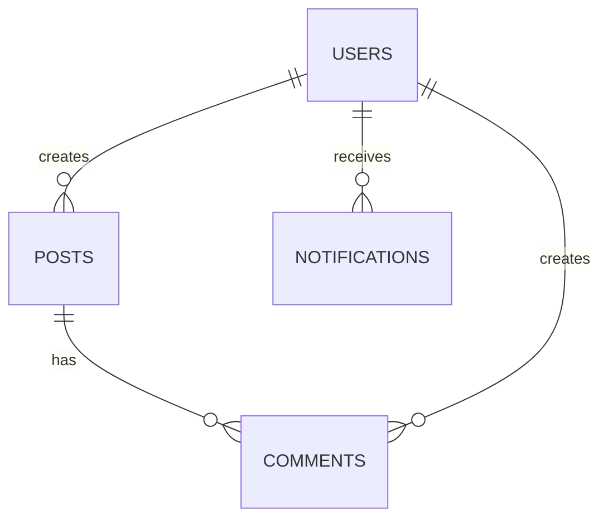
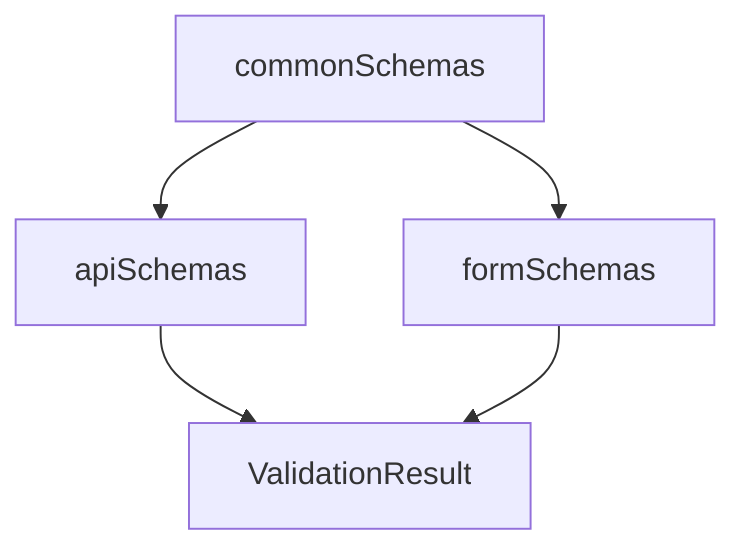
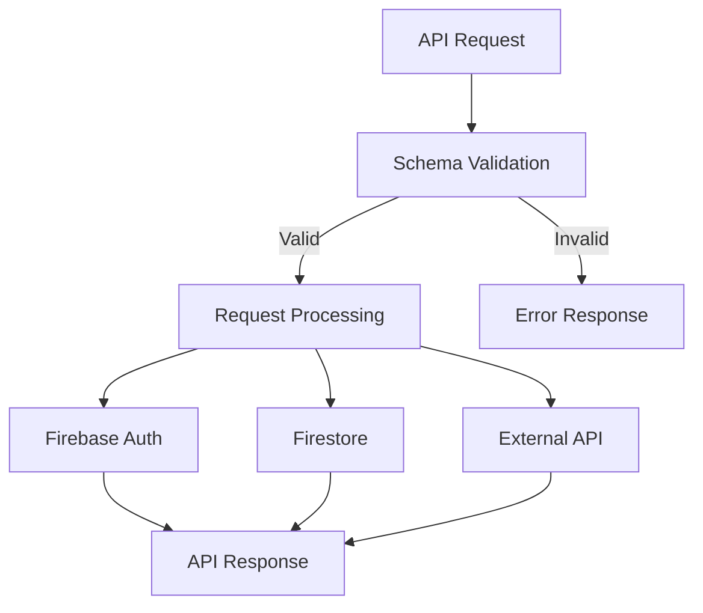

# Data Models and Schemas

## Overview

This document provides a comprehensive catalog of data models and validation schemas used throughout the AI Development Template. It includes Zod schemas, Firebase data models, and API request/response type definitions, along with their relationships and usage patterns.

## Table of Contents

1. [Zod Validation Schemas](#zod-validation-schemas)
2. [Firebase Data Models](#firebase-data-models)
3. [API Request/Response Models](#api-requestresponse-models)
4. [Data Model Relationships](#data-model-relationships)
5. [Schema Validation Patterns](#schema-validation-patterns)

## Zod Validation Schemas

The application uses [Zod](https://github.com/colinhacks/zod) for runtime type validation and schema definition. These schemas provide both type safety and runtime validation.

### Common Schemas

**File:** `src/lib/validation.ts`

These schemas define reusable validation rules for common data types:

```typescript
export const commonSchemas = {
  // Email validation with multiple rules
  email: z
    .string()
    .min(1, "メールアドレスは必須です")
    .email("有効なメールアドレスを入力してください")
    .max(254, "メールアドレスが長すぎます")
    .refine(
      (email) => validator.isEmail(email),
      "メールアドレスの形式が無効です"
    ),

  // Password with complexity requirements
  password: z
    .string()
    .min(8, "パスワードは8文字以上で入力してください")
    .max(128, "パスワードが長すぎます")
    .regex(
      /^(?=.*[a-z])(?=.*[A-Z])(?=.*\d).*$/,
      "パスワードは大文字、小文字、数字を含む必要があります"
    ),

  // Figma ID validations
  figmaFileId: z
    .string()
    .min(1, "ファイルIDは必須です")
    .regex(/^[A-Za-z0-9_-]+$/, "ファイルIDの形式が無効です")
    .max(100, "ファイルIDが長すぎます"),

  figmaNodeId: z
    .string()
    .min(1, "ノードIDは必須です")
    .regex(/^[A-Za-z0-9:_-]+$/, "ノードIDの形式が無効です")
    .max(100, "ノードIDが長すぎます"),

  // URL validation with protocol requirements
  url: z
    .string()
    .url("有効なURLを入力してください")
    .refine(
      (url) =>
        validator.isURL(url, {
          protocols: ["http", "https"],
          require_protocol: true,
        }),
      "URLの形式が無効です"
    ),

  // XSS-safe text validation
  safeText: z
    .string()
    .max(1000, "テキストが長すぎます")
    .refine(
      (text) => !validator.contains(text, "<script"),
      "スクリプトタグは使用できません"
    )
    .refine(
      (text) => !validator.contains(text, "javascript:"),
      "JavaScriptプロトコルは使用できません"
    ),

  // Numeric validation
  positiveInteger: z
    .number()
    .int("整数を入力してください")
    .positive("正の数を入力してください")
    .max(Number.MAX_SAFE_INTEGER, "数値が大きすぎます"),

  // Date string validation
  dateString: z
    .string()
    .refine(
      (date) => validator.isISO8601(date),
      "有効な日付形式を入力してください"
    ),
};
```

### API Request Schemas

**File:** `src/lib/validation.ts`

These schemas define the structure and validation rules for API requests:

```typescript
export const apiSchemas = {
  // Figma file request schema
  figmaFileRequest: z.object({
    fileId: commonSchemas.figmaFileId,
  }),

  // Figma MCP request schema
  figmaMcpRequest: z.object({
    fileId: commonSchemas.figmaFileId,
    nodeId: commonSchemas.figmaNodeId,
  }),

  // Authentication request schema
  authRequest: z.object({
    email: commonSchemas.email,
    password: commonSchemas.password,
  }),

  // Pagination query parameters schema
  paginationQuery: z.object({
    page: z.number().int().positive().optional().default(1),
    limit: z.number().int().positive().max(100).optional().default(20),
  }),
};
```

### Form Schemas

**File:** `src/lib/validation.ts`

These schemas define validation rules for form submissions:

```typescript
export const formSchemas = {
  // Login form schema
  loginForm: z.object({
    email: commonSchemas.email,
    password: z.string().min(1, "パスワードは必須です"),
  }),

  // Registration form schema with password confirmation
  registerForm: z
    .object({
      email: commonSchemas.email,
      password: commonSchemas.password,
      confirmPassword: z.string(),
    })
    .refine((data) => data.password === data.confirmPassword, {
      message: "パスワードが一致しません",
      path: ["confirmPassword"],
    }),

  // Profile update form schema
  profileUpdateForm: z.object({
    displayName: z
      .string()
      .min(1, "表示名は必須です")
      .max(50, "表示名が長すぎます")
      .regex(
        /^[a-zA-Z0-9\u3040-\u309F\u30A0-\u30FF\u4E00-\u9FAF\s_-]+$/,
        "表示名に使用できない文字が含まれています"
      ),
    bio: z.string().max(500, "自己紹介が長すぎます").optional(),
  }),
};
```

## Firebase Data Models

The application uses Firebase for authentication, data storage, and file storage. The following models represent the data structures used in Firebase services.

### Firestore Collections

Based on the security rules in `firestore.rules`, the following collections are defined:

#### Users Collection

**Path:** `/users/{userId}`

**Required Fields:**

- `email`: String - User's email address
- `displayName`: String - User's display name (max 50 chars)
- `createdAt`: Timestamp - Account creation timestamp

**Optional Fields:**

- `bio`: String - User biography (max 500 chars)
- `avatar`: String - URL to user's avatar image
- `preferences`: Object - User preferences
- `updatedAt`: Timestamp - Last update timestamp

**Security Rules:**

- Read: Only the user can read their own data
- Create: Only email-verified users can create their own data
- Update: Only email-verified users can update specific fields of their own data
- Delete: Not allowed (data protection)

#### Posts Collection

**Path:** `/posts/{postId}`

**Required Fields:**

- `userId`: String - ID of the user who created the post
- `title`: String - Post title (max 100 chars)
- `content`: String - Post content (max 5000 chars)
- `createdAt`: Timestamp - Post creation timestamp

**Optional Fields:**

- `tags`: Array - List of tags (max 10)
- `category`: String - Post category (one of: 'general', 'tech', 'lifestyle', 'business')
- `updatedAt`: Timestamp - Last update timestamp

**Security Rules:**

- Read: Any authenticated user
- Create: Only email-verified users can create posts with their own userId
- Update: Only the post creator can update specific fields
- Delete: Only the post creator can delete

#### Comments Collection

**Path:** `/posts/{postId}/comments/{commentId}`

**Required Fields:**

- `userId`: String - ID of the user who created the comment
- `content`: String - Comment content (max 1000 chars)
- `createdAt`: Timestamp - Comment creation timestamp

**Optional Fields:**

- `updatedAt`: Timestamp - Last update timestamp

**Security Rules:**

- Read: Any authenticated user
- Create: Only email-verified users can create comments
- Update: Only the comment creator can update the content
- Delete: Comment creator or post creator can delete

#### Notifications Collection

**Path:** `/users/{userId}/notifications/{notificationId}`

**Fields:**

- `read`: Boolean - Whether the notification has been read
- `readAt`: Timestamp - When the notification was marked as read

**Security Rules:**

- Read: Only the user can read their own notifications
- Create: Only through Cloud Functions (system-generated)
- Update: Only the user can mark notifications as read
- Delete: Only the user can delete their own notifications

#### Admin Collection

**Path:** `/admin/{document}`

**Security Rules:**

- All operations restricted to Cloud Functions (admin access)

#### Security Logs Collection

**Path:** `/security_logs/{logId}`

**Security Rules:**

- All operations restricted to Cloud Functions (admin access)

### Firebase Authentication Models

**User Model:**

```typescript
interface User {
  uid: string;
  email: string | null;
  displayName: string | null;
  photoURL: string | null;
  emailVerified: boolean;
}
```

**Authentication Result:**

```typescript
interface AuthResult {
  success: boolean;
  user?: User;
  error?: string;
  code?: string;
}
```

### Firebase Storage Structure

Based on the security rules in `storage.rules`, the following storage structure is defined:

#### User Files

**Path:** `/users/{userId}/*`

**Access Rules:**

- Read/Write: Only the user can access their own files

#### Post Images

**Path:** `/posts/{postId}/*`

**Access Rules:**

- Read: Any authenticated user
- Write: Any authenticated user, with restrictions:
  - File size limit: 10MB
  - Content type: Only images

#### Public Files

**Path:** `/public/*`

**Access Rules:**

- Read: Public access
- Write: Only through Cloud Functions (admin access)

## API Request/Response Models

### Figma API Models

**Figma File Response:**

```typescript
interface FigmaFileResponse {
  name: string;
  lastModified: string;
  version: string;
  document?: {
    id: string;
    name: string;
    type: string;
  };
  [key: string]: unknown;
}
```

**Sanitized Figma Response:**

```typescript
interface SanitizedFigmaResponse {
  name: string;
  lastModified: string;
  version: string;
  document?: {
    id: string;
    name: string;
    type: string;
  };
  metadata: {
    timestamp: string;
    requestId: string;
    status: string;
  };
}
```

### API Client Models

**API Client Configuration:**

```typescript
interface ApiClientConfig {
  baseURL?: string;
  timeout?: number;
  retryAttempts?: number;
  retryDelay?: number;
  enableLogging?: boolean;
  customHeaders?: Record<string, string>;
  authConfig?: {
    type: "bearer" | "apikey" | "custom";
    token?: string;
    apiKeyHeader?: string;
    customAuth?: (
      config: InternalAxiosRequestConfig
    ) => InternalAxiosRequestConfig;
  };
}
```

**API Response:**

```typescript
interface ApiResponse<T = unknown> {
  data: T;
  status: number;
  message?: string;
  timestamp: string;
}
```

**API Error:**

```typescript
interface ApiError {
  code: string;
  message: string;
  details?: unknown;
  timestamp: string;
  requestId?: string;
}
```

**Error Response:**

```typescript
interface ErrorResponse {
  error: string;
  code?: string;
  details?: unknown;
  timestamp: string;
  requestId?: string;
}
```

### Validation Models

**Validation Error:**

```typescript
interface ValidationError {
  field: string;
  message: string;
  code?: string;
}
```

**Validation Result:**

```typescript
interface ValidationResult<T> {
  success: boolean;
  data?: T;
  errors?: ValidationError[];
}
```

### Cache Models

**Cache Entry:**

```typescript
interface CacheEntry {
  data: FigmaData;
  timestamp: number;
  expiry: number;
}
```

**Rate Limit Info:**

```typescript
interface RateLimitInfo {
  remaining: number;
  reset: number;
  limit: number;
}
```

## Data Model Relationships

### Firestore Collection Relationships



### Schema Inheritance and Composition



### API Data Flow



## Schema Validation Patterns

### Validation Pipeline

The application uses a consistent validation pipeline for all data:

1. **Schema Definition:** Define Zod schemas for data structures
2. **Validation Function Creation:** Create type-safe validator functions
3. **Validation Execution:** Apply validators to incoming data
4. **Result Handling:** Process success or error results

**Example:**

```typescript
// 1. Schema Definition
const userSchema = z.object({
  email: commonSchemas.email,
  displayName: z.string().min(1).max(50),
});

// 2. Validation Function Creation
const validateUser = createValidator(userSchema);

// 3. Validation Execution
const result = validateUser(userData);

// 4. Result Handling
if (result.success) {
  // Use validated data
  const user = result.data;
  // Process user...
} else {
  // Handle validation errors
  const errors = result.errors;
  // Process errors...
}
```

### Security Validation Patterns

Beyond schema validation, the application implements additional security validations:

1. **XSS Prevention:** Sanitize input and output to prevent cross-site scripting
2. **Input Sanitization:** Remove potentially dangerous content from user input
3. **Output Encoding:** Encode data before rendering to prevent injection attacks

**Example:**

```typescript
// Input validation and sanitization
const validationResult = validators.figmaFileRequest({ fileId });
if (!validationResult.success) {
  // Handle validation error
  return errorResponse;
}

// Additional security check
const securityCheck = security.api.validateAndSanitize(fileId);
if (!securityCheck.isValid) {
  // Handle security error
  return errorResponse;
}

// Use sanitized value
const sanitizedFileId = securityCheck.sanitized!;
```

### Environment Configuration Validation

The application validates environment variables using Zod schemas:

```typescript
// Firebase configuration schema
const FirebaseConfigSchema = z.object({
  apiKey: z.string().min(1, "Firebase API key is required"),
  authDomain: z.string().min(1, "Firebase auth domain is required"),
  projectId: z.string().min(1, "Firebase project ID is required"),
  storageBucket: z.string().min(1, "Firebase storage bucket is required"),
  messagingSenderId: z
    .string()
    .min(1, "Firebase messaging sender ID is required"),
  appId: z.string().min(1, "Firebase app ID is required"),
});

// Validate configuration
const firebaseConfigResult = validateFirebaseConfig();
if (firebaseConfigResult.success) {
  // Use validated configuration
  app = initializeApp(firebaseConfigResult.config);
} else {
  // Handle validation error
  console.warn(
    "Firebase configuration validation failed:",
    firebaseConfigResult.error
  );
}
```
