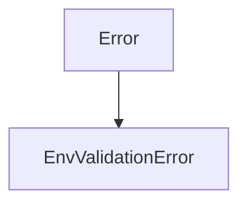
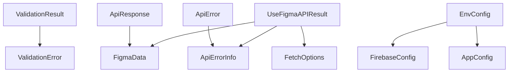
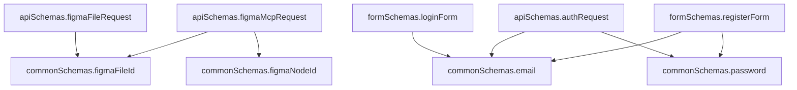

# TypeScript Type Definitions Catalog

## Overview

This document provides a comprehensive catalog of all TypeScript interfaces, types, enums, and other type definitions used throughout the AI Development Template. The catalog includes type relationships, inheritance hierarchies, and usage examples.

## Table of Contents

1. [Validation Types](#validation-types)
2. [API Types](#api-types)
3. [Authentication Types](#authentication-types)
4. [Security Types](#security-types)
5. [Environment Configuration Types](#environment-configuration-types)
6. [Component Props Types](#component-props-types)
7. [Hook Return Types](#hook-return-types)
8. [Type Relationships](#type-relationships)
9. [Type Usage Examples](#type-usage-examples)

## Validation Types

### Interfaces

#### `ValidationError`

**File:** `src/lib/validation.ts`

**Description:** Represents a validation error with field, message, and optional code.

```typescript
interface ValidationError {
  field: string;
  message: string;
  code?: string;
}
```

**Usage:**

```typescript
const errors: ValidationError[] = [
  { field: "email", message: "Invalid email format" },
];
```

#### `ValidationResult<T>`

**File:** `src/lib/validation.ts`

**Description:** Generic interface representing the result of a validation operation.

```typescript
interface ValidationResult<T> {
  success: boolean;
  data?: T;
  errors?: ValidationError[];
}
```

**Usage:**

```typescript
const result: ValidationResult<User> = validateData(userSchema, userData);
if (result.success) {
  // Use result.data
} else {
  // Handle result.errors
}
```

### Types

#### `ValidatorFunction<T>`

**File:** `src/lib/validation.ts`

**Description:** Type for validator functions that validate data against a schema.

```typescript
type ValidatorFunction<T> = (data: unknown) => ValidationResult<T>;
```

#### `SchemaType<T>`

**File:** `src/lib/validation.ts`

**Description:** Utility type for extracting the inferred type from a validator function.

```typescript
type SchemaType<T extends ValidatorFunction<unknown>> =
  T extends ValidatorFunction<infer U> ? U : never;
```

### Zod Schemas

#### Common Schemas

**File:** `src/lib/validation.ts`

```typescript
export const commonSchemas = {
  email: z
    .string()
    .min(1, "メールアドレスは必須です")
    .email("有効なメールアドレスを入力してください")
    .max(254, "メールアドレスが長すぎます")
    .refine(
      (email) => validator.isEmail(email),
      "メールアドレスの形式が無効です"
    ),

  password: z
    .string()
    .min(8, "パスワードは8文字以上で入力してください")
    .max(128, "パスワードが長すぎます")
    .regex(
      /^(?=.*[a-z])(?=.*[A-Z])(?=.*\d).*$/,
      "パスワードは大文字、小文字、数字を含む必要があります"
    ),

  figmaFileId: z
    .string()
    .min(1, "ファイルIDは必須です")
    .regex(/^[A-Za-z0-9_-]+$/, "ファイルIDの形式が無効です")
    .max(100, "ファイルIDが長すぎます"),

  figmaNodeId: z
    .string()
    .min(1, "ノードIDは必須です")
    .regex(/^[A-Za-z0-9:_-]+$/, "ノードIDの形式が無効です")
    .max(100, "ノードIDが長すぎます"),

  url: z
    .string()
    .url("有効なURLを入力してください")
    .refine(
      (url) =>
        validator.isURL(url, {
          protocols: ["http", "https"],
          require_protocol: true,
        }),
      "URLの形式が無効です"
    ),

  safeText: z
    .string()
    .max(1000, "テキストが長すぎます")
    .refine(
      (text) => !validator.contains(text, "<script"),
      "スクリプトタグは使用できません"
    )
    .refine(
      (text) => !validator.contains(text, "javascript:"),
      "JavaScriptプロトコルは使用できません"
    ),

  positiveInteger: z
    .number()
    .int("整数を入力してください")
    .positive("正の数を入力してください")
    .max(Number.MAX_SAFE_INTEGER, "数値が大きすぎます"),

  dateString: z
    .string()
    .refine(
      (date) => validator.isISO8601(date),
      "有効な日付形式を入力してください"
    ),
};
```

#### API Schemas

**File:** `src/lib/validation.ts`

```typescript
export const apiSchemas = {
  figmaFileRequest: z.object({
    fileId: commonSchemas.figmaFileId,
  }),

  figmaMcpRequest: z.object({
    fileId: commonSchemas.figmaFileId,
    nodeId: commonSchemas.figmaNodeId,
  }),

  authRequest: z.object({
    email: commonSchemas.email,
    password: commonSchemas.password,
  }),

  paginationQuery: z.object({
    page: z.number().int().positive().optional().default(1),
    limit: z.number().int().positive().max(100).optional().default(20),
  }),
};
```

#### Form Schemas

**File:** `src/lib/validation.ts`

```typescript
export const formSchemas = {
  loginForm: z.object({
    email: commonSchemas.email,
    password: z.string().min(1, "パスワードは必須です"),
  }),

  registerForm: z
    .object({
      email: commonSchemas.email,
      password: commonSchemas.password,
      confirmPassword: z.string(),
    })
    .refine((data) => data.password === data.confirmPassword, {
      message: "パスワードが一致しません",
      path: ["confirmPassword"],
    }),

  profileUpdateForm: z.object({
    displayName: z
      .string()
      .min(1, "表示名は必須です")
      .max(50, "表示名が長すぎます")
      .regex(
        /^[a-zA-Z0-9\u3040-\u309F\u30A0-\u30FF\u4E00-\u9FAF\s_-]+$/,
        "表示名に使用できない文字が含まれています"
      ),
    bio: z.string().max(500, "自己紹介が長すぎます").optional(),
  }),
};
```

## API Types

### Interfaces

#### `ApiClientConfig`

**File:** `src/lib/api-client.ts`

**Description:** Configuration options for the API client.

```typescript
interface ApiClientConfig {
  baseURL?: string;
  timeout?: number;
  retryAttempts?: number;
  retryDelay?: number;
  enableLogging?: boolean;
  customHeaders?: Record<string, string>;
  authConfig?: {
    type: "bearer" | "apikey" | "custom";
    token?: string;
    apiKeyHeader?: string;
    customAuth?: (
      config: InternalAxiosRequestConfig
    ) => InternalAxiosRequestConfig;
  };
}
```

#### `ApiResponse<T>`

**File:** `src/lib/api-client.ts`

**Description:** Generic interface for API responses.

```typescript
interface ApiResponse<T = unknown> {
  data: T;
  status: number;
  message?: string;
  timestamp: string;
}
```

#### `ApiError`

**File:** `src/lib/api-client.ts`

**Description:** Interface for API error responses.

```typescript
interface ApiError {
  code: string;
  message: string;
  details?: unknown;
  timestamp: string;
  requestId?: string;
}
```

#### `FigmaData`

**File:** `src/hooks/useFigmaAPI.ts`

**Description:** Interface for Figma API response data.

```typescript
interface FigmaData {
  name: string;
  lastModified: string;
  version: string;
  document?: {
    id: string;
    name: string;
    type: string;
  };
  metadata: {
    timestamp: string;
    requestId: string;
    status: string;
  };
}
```

#### `ApiErrorInfo`

**File:** `src/hooks/useFigmaAPI.ts`

**Description:** Interface for API error information.

```typescript
interface ApiErrorInfo {
  code: string;
  message: string;
  details?: unknown;
  timestamp: string;
  requestId?: string;
}
```

#### `FetchOptions`

**File:** `src/hooks/useFigmaAPI.ts`

**Description:** Options for fetching Figma data.

```typescript
interface FetchOptions {
  useCache?: boolean;
  timeout?: number;
  skipValidation?: boolean;
}
```

#### `CacheEntry`

**File:** `src/hooks/useFigmaAPI.ts`

**Description:** Interface for cache entries.

```typescript
interface CacheEntry {
  data: FigmaData;
  timestamp: number;
  expiry: number;
}
```

#### `FigmaFileResponse`

**File:** `src/app/api/figma/[fileId]/route.ts`

**Description:** Interface for Figma file API responses.

```typescript
interface FigmaFileResponse {
  name: string;
  lastModified: string;
  version: string;
  document?: {
    id: string;
    name: string;
    type: string;
  };
  [key: string]: unknown;
}
```

#### `ErrorResponse`

**File:** `src/app/api/figma/[fileId]/route.ts`

**Description:** Interface for error responses.

```typescript
interface ErrorResponse {
  error: string;
  code?: string;
  details?: unknown;
  timestamp: string;
  requestId?: string;
}
```

## Authentication Types

### Interfaces

#### `AuthContextType`

**File:** `src/lib/auth-context.tsx`

**Description:** Interface for authentication context.

```typescript
interface AuthContextType {
  user: User | null;
  loading: boolean;
  error: string | null;
  signOut: () => Promise<void>;
}
```

#### `AuthProviderProps`

**File:** `src/lib/auth-context.tsx`

**Description:** Props for the AuthProvider component.

```typescript
interface AuthProviderProps {
  children: ReactNode;
}
```

## Security Types

### Interfaces

#### `SecurityEvent`

**File:** `src/lib/security.ts`

**Description:** Interface for security event logging.

```typescript
interface SecurityEvent {
  type: "XSS_ATTEMPT" | "SQL_INJECTION" | "CSRF_ATTACK" | "RATE_LIMIT_EXCEEDED";
  ip?: string;
  userAgent?: string;
  input?: string;
  timestamp?: Date;
}
```

## Environment Configuration Types

### Interfaces

#### `FirebaseConfig`

**File:** `src/lib/env.ts`

**Description:** Interface for Firebase configuration.

```typescript
interface FirebaseConfig {
  apiKey: string;
  authDomain: string;
  projectId: string;
  storageBucket: string;
  messagingSenderId: string;
  appId: string;
}
```

#### `AppConfig`

**File:** `src/lib/env.ts`

**Description:** Interface for application configuration.

```typescript
interface AppConfig {
  nodeEnv: "development" | "production" | "test";
  port: number;
}
```

#### `EnvConfig`

**File:** `src/lib/env.ts`

**Description:** Interface for environment configuration.

```typescript
interface EnvConfig {
  firebase: FirebaseConfig;
  app: AppConfig;
}
```

### Classes

#### `EnvValidationError`

**File:** `src/lib/env.ts`

**Description:** Error class for environment validation errors.

```typescript
class EnvValidationError extends Error {
  constructor(
    message: string,
    public readonly issues: z.ZodIssue[],
    public readonly envVars: Record<string, unknown>
  ) {
    super(message);
    this.name = "EnvValidationError";
  }

  getDetailedMessage(): string {
    // Implementation
  }

  getMissingVars(): string[] {
    // Implementation
  }
}
```

## Component Props Types

### Interfaces

#### `AuthFormProps`

**File:** `src/components/AuthForm.tsx`

**Description:** Props for the AuthForm component.

```typescript
interface AuthFormProps {
  onSuccess?: () => void;
}
```

#### `PomodoroTimerProps`

**File:** `src/components/PomodoroTimer.tsx`

**Description:** Props for the PomodoroTimer component.

```typescript
interface PomodoroTimerProps {
  className?: string;
}
```

## Hook Return Types

### Interfaces

#### `UseFigmaAPIResult`

**File:** `src/hooks/useFigmaAPI.ts`

**Description:** Return type for the useFigmaAPI hook.

```typescript
interface UseFigmaAPIResult {
  data: FigmaData | null;
  loading: boolean;
  error: ApiErrorInfo | null;
  rateLimitInfo: {
    remaining: number;
    reset: number;
    limit: number;
  } | null;
  fetchFigmaFile: (fileId: string, options?: FetchOptions) => Promise<void>;
  clearError: () => void;
  clearData: () => void;
  retry: () => Promise<void>;
}
```

## Type Relationships

### Inheritance Hierarchies



### Type Dependencies



### Schema Relationships



## Type Usage Examples

### Validation Types

```typescript
// Creating a validator
const emailValidator = createValidator(commonSchemas.email);

// Using a validator
const result = emailValidator("user@example.com");
if (result.success) {
  console.log("Valid email:", result.data);
} else {
  console.error("Validation errors:", result.errors);
}

// Form validation
const loginFormValidator = validators.loginForm({
  email: "user@example.com",
  password: "password123",
});
```

### API Types

```typescript
// Creating an API client
const apiClient = createApiClient({
  baseURL: "https://api.example.com",
  timeout: 5000,
  retryAttempts: 3,
});

// Making an API request
const response = await apiClient.get<UserData>("/users/123");
console.log("User data:", response.data);

// Handling API errors
try {
  await apiClient.post("/users", userData);
} catch (error) {
  const apiError = error as ApiError;
  console.error(`API Error (${apiError.code}): ${apiError.message}`);
}
```

### Authentication Types

```typescript
// Using the auth context
const { user, loading, error, signOut } = useAuth();

if (loading) {
  return <LoadingSpinner />;
}

if (error) {
  return <ErrorMessage message={error} />;
}

if (user) {
  return (
    <div>
      <p>Welcome, {user.email}</p>
      <button onClick={signOut}>Sign Out</button>
    </div>
  );
}
```

### Environment Configuration Types

```typescript
// Getting environment configuration
try {
  const config = getEnvConfig();
  console.log("Firebase project ID:", config.firebase.projectId);
  console.log("Application environment:", config.app.nodeEnv);
} catch (error) {
  if (error instanceof EnvValidationError) {
    console.error("Environment validation failed:", error.getDetailedMessage());
    console.error("Missing variables:", error.getMissingVars());
  }
}

// Safe environment access
const result = safeGetEnvConfig();
if (result.success) {
  // Use result.config
} else {
  // Handle result.error
}
```

### Component Props Types

```typescript
// AuthForm component with props
<AuthForm onSuccess={() => navigate('/dashboard')} />

// PomodoroTimer component with props
<PomodoroTimer className="my-custom-class" />
```

### Hook Usage Types

```typescript
// Using the Figma API hook
const { data, loading, error, fetchFigmaFile, clearError, retry } =
  useFigmaAPI();

useEffect(() => {
  fetchFigmaFile("abc123", { useCache: true });
}, [fetchFigmaFile]);

if (loading) {
  return <LoadingSpinner />;
}

if (error) {
  return <ErrorDisplay error={error} onRetry={retry} onDismiss={clearError} />;
}

if (data) {
  return <FigmaFileViewer data={data} />;
}
```
